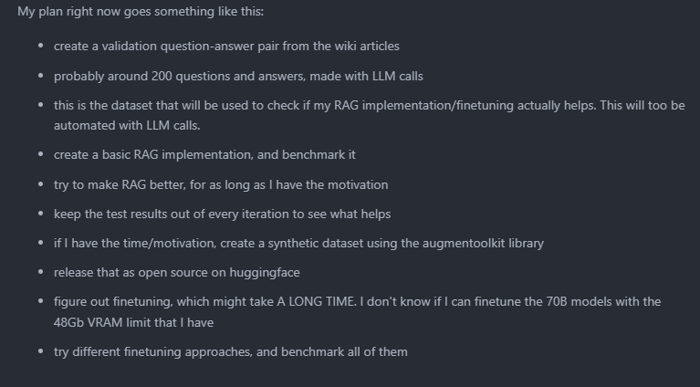

This repo is for my summer project, where I'll be taking a look at the performance of RAG (Retrieval, Augmentation, Generation) with Llama-3 open source language models.

### Update 18.08:

#### What was accomplished

- **OSRS Wiki Scraping**: Successfully scraped the entire OSRS wiki (approximately 29,000 pages) using a modified [parsed-osrs](https://github.com/Flipping-Utilities/parsed-osrs) tool. The data was scraped in HTML format to preserve dynamically rendered tables, which would otherwise be lost if scraped via the MediaWiki API. 
  
- **Data Conversion**: Converted the scraped HTML/WikiText pages to Markdown format, ensuring the data is more accessible and easier to manipulate for downstream tasks. For an example, go look [at raw pages](./data-example-wiki-pages), and compare them [to converted pages](./data-example-wiki-pages-md)
  
- **Project Planning**: Made a project plan for the remainder of the project:

Because I don't need any credits for the optional courses, this was rather low on my priority list, and thus did not end up getting completed in time for credits.

### Documentation

For a more detailed account of what has been accomplished so far, please refer to the [research learning diary](./docs/docs/learning_diary/research.md).

### Notes for my future-self

There are several key areas that would be interesting to explore further once my self-hosted LLM server is operational:

- **Data Engineering**: 
  - Develop a data pipeline to automate the ingestion of updated articles from the OSRS wiki into the RAG vector database.
  - Use the `revision` key to detect and handle article updates.
  - Could get familiar with dbt/dagster here.

- **MLOps**:
  - Automate the process of generating embeddings for updated articles.
  - If finetuning is implemented, automate the finetuning process based on how outdated the articles have become.

