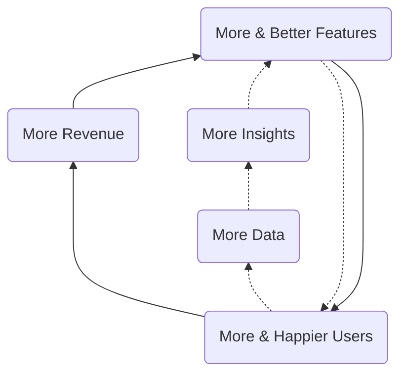
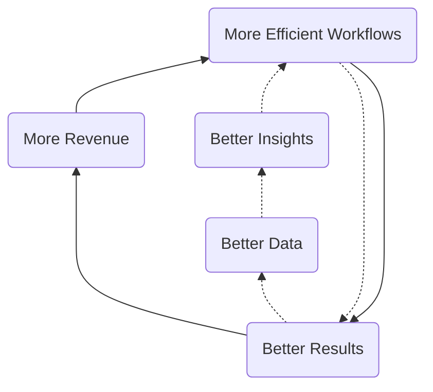
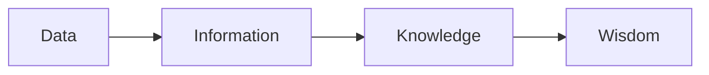

`This page contains forward-looking content and may not accurately reflect current-state or planned feature sets or capabilities.`

## Strategy

As an important step towards achieving our [mission](/handbook/business-technology/data-team/#mission), meeting our [responsibilities](/handbook/business-technology/data-team/#responsibilities), and helping GitLab [become a successful public company](/handbook/company/being-a-public-company/), we are creating an Enterprise Data Platform (EDP), a single unified data and analytics stack, along with a broad suite of Data Programs such as Self-Serve Data and Data Quality. The EDP will power GitLab's KPIs, cross-functional reporting and analysis, and in general, allow all team members to make better decisions with trusted data. Over time, the EDP will further accelerate GitLab's analytics capabilities with features such as data publishing and products - enriched and aggregated data integrated into business systems or into the GitLab product for use by our customers. This acceleration happens through the development of "Data Flywheels", much like GitLab's [Open Core and Development Spend](/handbook/company/strategy/#dual-flywheels) flywheels.

### 1) Customer Centricity

Definition:

1. Visibility and deep understanding of how our customers use our product and interact with our teams
1. Focus on the Customer Journey Lifecycle & Related Analytics
1. Build a Better GitLab for our Customers. Be customer zero.

### 2) Data Community

Definition:

1. Create a community where everyone can make their best decisions with data built on SSOT Data Architecture and One Data Warehouse
1. Best-in Class Talent, Tenure, and Growth

### 3) GitLab Culture of Data First

Definition:

1. All product features logged for analysis in a centrally governed way
1. Iteration and experimentation to drive business value
1. Strong visibility into key business results, business processes, product behavior and programs
1. Data Governance across business systems, product, and warehouse so we all speak the same language
1. Be customer zero for ML Ops

### 4) World class data and analytics capabilities

Definition:

1. Scalable data platform, data collection, modeling, and visualization
1. Master data management
1. Create unified data models with robust governance
1. Cutting-edge data and analytics tools available to team members
1. Integrate advanced analytics with our business processes

## Data Capability Model

The Data Capability Model lists five levels (1-5) that correspond to the data & analytics maturity of a company.

It is used to identify target state requirements to support [GitLab's Company Strategy](/handbook/company/strategy).

**To help GitLab become a public company, we need our lead-to-cash and public-facing metrics to reach Level 2 of the capability model.**

| Level                                                                                   | Characteristics                                                                                                                                                                        | Benefits                                                                                              |
| --------------------------------------------------------------------------------------- | -------------------------------------------------------------------------------------------------------------------------------------------------------------------------------------- | ----------------------------------------------------------------------------------------------------- |
| (5)Optimized                                                                         | Real-time complex analysis embedded in products, shape actions and perceptions; data analytics is a strategic differentiator.                                                           | New data products, improved decision ROI, data driven recommendations embedded in the experiences of customers.                                                              |
| (4)Managed                                                                           | Data influencing all aspects of the business, data science” insight into what is likely to happen, widespread and effortless analytics production, enterprise data quality and governance is a critical enabler.                                            | Reliable customer lifetime value, expansion & churn prediction, product embedded analytics.            |
| (3)Proactive                                                                            | Widespread & effortless drillable analysis, Drillable cross-functional scorecards, dashboards, enterprise data ecosystem.                                                               | Customer 360 & health score, predictable & trusted data reporting, robust self-service & data @ scale, enterprise data quality and governance established. |
| **(2)Reactive** | Operational automated reports and dashboards, reliable and validated data with automated tests, mixture of manual and automated integration, core integrated data with some data silos. | Trusted data, self-service data, key performance indicators, stable platform for expansion, implementation of some data quality initiatives [Reference Solution](/handbook/business-technology/data-team/direction/reference/).            |
| (1)Aware                                                                         | Static lists and reports, highly focused on history/lagging - last 30/90/365 days, unpredictable velocity, no systematic approach to data analysis and data management, data silos, very basic data quality controls.                             | Historical tabular reports, data visualization.                                                        |

### Data Flywheels

#### Customer & Analytics Instrumentation Flywheel

The Customer & Analytics Instrumentation Flywheel is focused on improving the Customer Experience and encompasses the data and analytics involved in user-product interactions, customer use cases, product development, product adoption, and most aspects of the [Customer Journey](/handbook/customer-success/vision/).

#### Corporate Intelligence

The Corporate Intelligence Flywheel is focused on improving (internal) Business Efficiency and this is accomplished by instrumenting, monitoring, and improving business workflows. Common outputs of Corporate Intelligence teams include performance dashboards, balanced scorecards, KPIs, MBOs, and related data-enabled frameworks.

## Our Data Platform Vision

These ambitions are set to be a guiding vision for GitLab's data platform.

### Makes it Easier to Contribute

Contributing to GitLab's Data Platform is easy and using the platform is intuitive

* Documentation is complete and relevant for users and contributors
* All data transformations are implemented in dbt
* CI/CD is seamless, intuitive, automated for contributors and reviewers
* Data state is derivative from sources and transformations
* Data pipelines are idempotent

### Is Reliable

The data plaform along with the data it delivers is consitent in availability and accuracy

* All breaking changes are testable in Dev and/or Staging Environments
* Automated tests are implemented at every stage of the data delivery process
* Every component of the platform can and should be defined in code and version controlled

### Is Secure

The Data Platform doesn't put people at risk

* Data is only accisible to those authorized by documented approvals
* The GitLab data team will stick with the [Principle of Least Privilege](/handbook/security/access-management-policy/#principle-of-least-privilege) regarding the authorization and authentication

### Is Maintainable

* The Data Platform component will be created with considering the good engineering practices for the [ease of maintainability](https://en.wikipedia.org/wiki/Maintainability). It means tracking of maintainability is intended to help reduce or reverse a system's tendency toward "code entropy" or degraded integrity

### Benefits a Larger Community

GitLab's Data Platform is relevant to a community larger than GitLab's and depends on a larger community of engineers.

* Relevant Platform code is open sourced
* Platform enhancements are contributed back into community projects
* We prefer generalizable specifications and standards over idiosyncratic custom development

### Data Platform FY25 initiatives

The following sections describe the Data Platform FY25 initiatives.

## Data Value Pyramid

We want to help all GitLab teams move up (or left-to-right in the diagram below) the [Data Value Pyramid](https://en.wikipedia.org/wiki/DIKW_pyramid) and turn basic metrics and counts into wisdom that helps them create better products for our customers, run our business more efficiently, and add new capabilities to our business model. Relative to the Data Value Pyramid, we are currently working primarily within the Data and Information stages.

