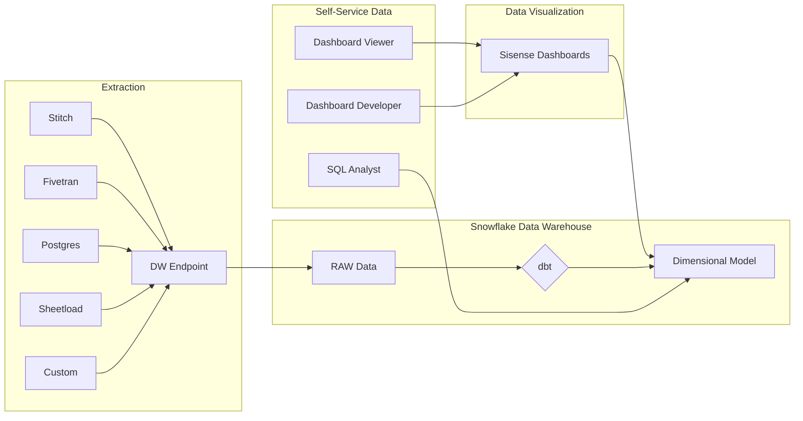
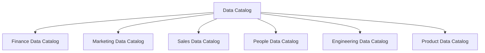
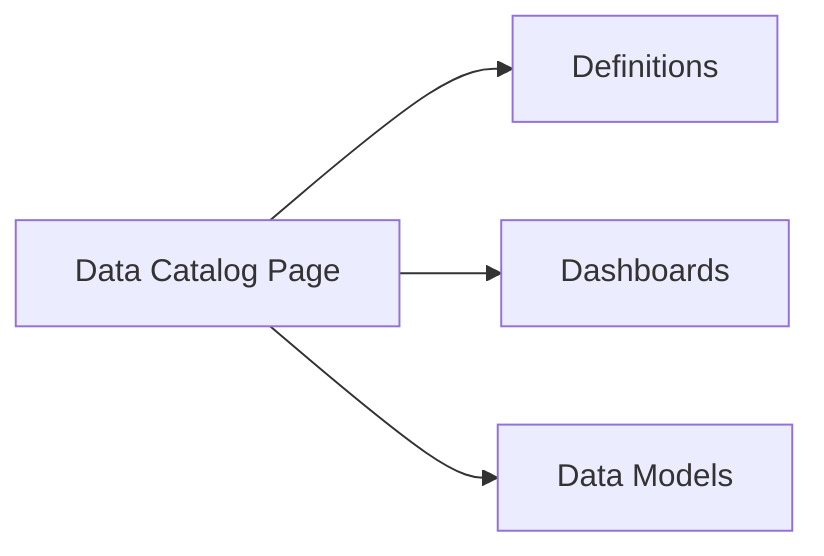

---

title: "Self-Service Data"
---

---

## Overview

`This page contains forward-looking content and may not accurately reflect current-state or planned feature sets or capabilities.`

[Data Democratization](https://www.alation.com/what-is-data-democratization/) is a common goal for Data Teams and can be difficult to achieve given the [variety, volume, velocity, and veracity](https://www.ibmbigdatahub.com/infographic/four-vs-big-data) of data to manage. Ultimately, all effective data democratization solutions must focus on the Data Customer and provide solutions that make data easy to find, easy to understand, and actionable:

- *easy to find*: Data Customers must be able to easily find data relevant to them
- *easy to understand*: Data must be labeled and organized in a consistent way using business-friendly terms and concepts
- *actionable*: Data must provide or help provide insights that support [decisions or action](http://www.onstartups.com/tabid/3339/bid/96738/Measuring-What-Matters-How-To-Pick-A-Good-Metric.aspx), towards delivering results

### GitLab Self-Service Data Program

The GitLab Self-Service Data program helps GitLab move faster with trusted data and helps the Data Team scale by providing four distinct, but complimentary capabilities:

- **[Data Catalog](/handbook/business-technology/data-team/direction/self-service/#data-catalog)** - the Data Catalog helps Data Customers find data definitions, dashboards, and models based on a subject area
- **[Dashboard Viewer](/handbook/business-technology/data-team/direction/self-service/#self-service-dashboard-viewer)** - all GitLab team members have *access* to pre-build Dashboards through an always-on portal accessible from Okta
- **[Dashboard Developer](/handbook/business-technology/data-team/direction/self-service/#self-service-dashboard-developer)** - for GitLab team members who want to build their own data visualization charts or dashboards
- **[SQL Developer](/handbook/business-technology/data-team/direction/self-service/#self-service-sql-developer)** - for GitLab team members who are familiar with SQL and want to conduct their own SQL-based analysis

#### Summary of Self-Service Capabilities

|                                                                                          | [Dashboard Viewer](/handbook/business-technology/data-team/direction/self-service/#self-service-dashboard-viewer) | [Dashboard Developer](/handbook/business-technology/data-team/direction/self-service/#self-service-dashboard-developer) | [SQL Developer](/handbook/business-technology/data-team/direction/self-service/#self-service-sql-developer) |
| :--------------------------------------------------------------------------------------- | :--------------------------------------------------------------------------------------------------------: | :--------------------------------------------------------------------------------------------------------------: | :--------------------------------------------------------------------------------------------------: |
| Access Data Catalog                                                                      |                                                     Yes                                                    |                                                        Yes                                                       |                                                  Yes                                                 |
| Access Pre-Built Sisense Dashboards                                                      |                                                     Yes                                                    |                                                        Yes                                                       |                                                  Yes                                                 |
| Build New Sisense Dashboards                                                             |                                                     No                                                     |                                                        Yes                                                       |                                                  No                                                  |
| Write SQL to Explore Data                                                                |                                                     No                                                     |                                                        No                                                        |                                                  Yes                                                 |
| Requires [Certification](https://about.gitlab.com/learn/certifications/public/) |                                                     No                                                     |                                                        Yes                                                       |                                                  Yes                                                 |

### Data Catalog

The Data Catalog is published in the internal handbook and contains an index of data dashboards, models, and definitions organized by function. As part of the handbook, the Data Catalog helps drive alignment to common standards and single-source-of-truth data. As part of the Data Team handbook section, the Data Catalog is regularly updated with relevant content.

#### Data Catalog Structure

#### Data Catalog Handbook Page Contents

### Self-Service Dashboard Viewer

Self-Service Dashboard Viewer enables GitLab team members access to any pre-built dashboard published in Sisense.

Prerequisites:

- [ ] None

Access Requests:

- [ ] None Required - all GitLab team members are provided access during onboarding

### Self-Service Dashboard Developer

Self-Service Dashboard Developer provides Certified GitLab team members the ability to build their own dashboards using [Sisense Data Discovery](https://dtdocs.sisense.com/article/data-discovery) based on well-defined and validated [Kimball-standard](https://www.kimballgroup.com/data-warehouse-business-intelligence-resources/books/data-warehouse-dw-toolkit/) data models powered by the [Enterprise Dimensional Model](/handbook/business-technology/data-team/platform/edw/).

Prerequisites:

- [ ] Ability to read [data models](https://www.lucidchart.com/pages/er-diagrams)
- [ ] Prior experience developing reports and chart [data visualizations](https://datavizcatalogue.com/index.html)
- [ ] [Review Tableau Handbook Page](/handbook/business-technology/data-team/platform/tableau/)
- [ ] Pass a [Self-Service Dashboard Developer Knowledge Assessment](https://about.gitlab.com/learn/certifications/public/) from one of the Self-Service-ready Data Subject Areas published in the handbook

Access Requests:

- [ ] Open a [New Access Request](https://gitlab.com/gitlab-com/team-member-epics/access-requests/-/issues/new?issuable_template=New+Access+Request) and use the `Single Person Access Request`
- [ ] Include a link to the completed Knowledge Assessment
- [ ] Request Access to Snowflake

### Self-Service SQL Developer

Self-Service SQL Developer provides Certified GitLab team members a SQL prompt into the Snowflake Data Warehouse. Because not all of the data is currently modeled in a standard form, additional time may be required to perform research, read "RAW" data and unmodeled data, and learn from teams with more experience. As the Data Team builds the Enterprise Dimensional Model and delivers additional [Level 2 Solutions](/handbook/business-technology/data-team/direction/reference/) with SQL examples and data models, SQL Developer productivity will increase and SQL analysis will become easier and faster.

Prerequisites:

- [ ] [Intermediate SQL](https://softwareengineering.stackexchange.com/questions/181651/are-these-sql-concepts-for-beginners-intermediate-or-advanced-developers)
- [ ] Ability to navigate a [data dictionary](https://docs.snowflake.com/en/sql-reference/info-schema.html)
- [ ] Ability to read [data models](https://www.lucidchart.com/pages/er-diagrams) to write SQL
- [ ] Adhere to the [Data Team SQL Style Guide](/handbook/business-technology/data-team/platform/sql-style-guide/)
- [ ] Pass a [Self-Service SQL Developer Knowledge Assessment](https://about.gitlab.com/learn/certifications/public/) from one of the Self-Service-ready Data Subject Areas published in the handbook

Access Requests:

- [ ] Open a [New Access Request](https://gitlab.com/gitlab-com/team-member-epics/access-requests/-/issues/new?issuable_template=New+Access+Request) and use the `Single Person Access Request`
- [ ] Include a link to the completed Knowledge Assessment
- [ ] Request Access to Snowflake
