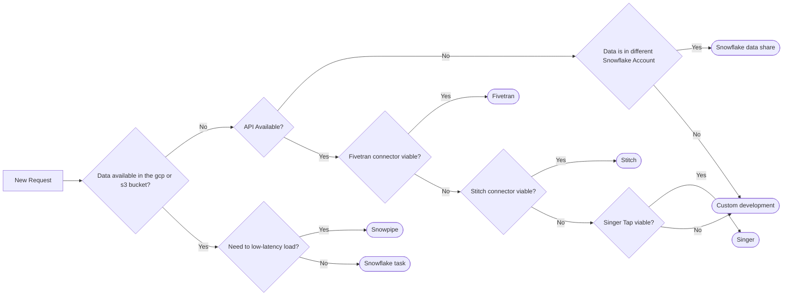

---

title: "New Data Source"
description: "How to add a new data source"
---
 


 


---

This page describes in detail the process of adding new data sources to the data warehouse. The Data Team embraces any initiative of adding new data sources towards the data warehouse. We envision that data could lead towards value, but adding new data towards the data warehouse does not go with no costs.

Both the development (assigning resources from the Data Team, from other teams involved to support and also you as requestor) and keeping the data pipeline up and running (storage, compute resources, incident management, monitoring etc..) cost time and or money.

**Please, before request adding a new data source, take the following into account:**

- Is there a valid [business case](/handbook/business-technology/data-team/how-we-work/#data-team-value-calculator)?
   - Sometimes the business case is to comply with regulatory requirements.
   - Sometimes the business case is straightforward because value potential is clear above the investment costs.
   - Most of the time it’s hard to quantify, because either the value is unsure or the costs are unsure. Feel free to have an open and honest discussion with the Data Team. We have the experience and could help with the justification and this does not necessarily need to be a scientific calculation.
- The work is not done when data lands in the data warehouse. The data will 'just' land in the `raw` data layer, and this is not accessible by default for Sisense. Data need to be loaded downstream into the [Enterprise Dimensional Model](/handbook/business-technology/data-team/platform/edw/) (EDM) via dbt. Follow up needs to take place, and will come on top of the process described on this page.
   - Downstream modelling could be handled by the business team, because we embrace contribution on our data platform. Please note that extensive ([dbt-](/handbook/business-technology/data-team/platform/dbt-guide/), SQL- and data modelling knowledge is needed)
   - Downstream modelling could be handled by the Data Team, ideally by a [Data Fusion Team](/handbook/business-technology/data-team/organization/#data-fusion-team-organization). Planning needs to take place and priorities are set in line with company priorities. **This falls not within the scope of adding a new data source to the data warehouse**, thus this needs to be arranged subsequently.
   - If data is extracted in (complex) JSON format, a Data Engineer can support or can flatten the data to a tabular format and load this towards the `PREP` database.
   - There are 3 ways to follow up on the downstream [data development](/handbook/business-technology/data-team/data-development/).
- Adding a new data source to the data warehouse is not an 1 off exercise. As soon as the data is extracted to the data warehouse, on a regular cadence (once week, once a day, multiple times per day, etc..) data will be refreshed. This means something can happen or can go wrong after the implementation. We will need a DRI from the source side (business and technical) to support this process when needed.
- Data could be used, outside of the EDM. I.e. by a Function Analyst, in the `raw` data layer. Raise an AR to get access to the raw data.
- When data ends up in the EDM, work is to be performed in Sisense by creating a dashboard. Also for doing this, some technical knowledge is required.
- The data platform needs to get [access](/handbook/business-technology/data-team/platform/#data-team-access-to-data-sources) to the source system. Although this sounds obvious, this is not always straightforward.

## New data source

For adding a new data source, the workflow looks as follow (note, this is the [existing workflow](/handbook/business-technology/data-team/how-we-work/#workflow-summary) we use for all our work and made explicit here in the context of adding a new data source).

Process for adding a new data source:

| Stage (Label)               | Summery for new data source|
| --------------------------- | ------------------ |
| `workflow::1 - triage`      | All initial information will be provided by the requester and assessed by the Data Team |
| `workflow::2 - validation`  | A solution design and complete work breakdown for upcoming development will be created |
| `workflow::3 - scheduling`  | Once a quarter the Data Team OKRs are defined. Based on workload and priorities, new data sources could be incorporated in the next quarter OKRs |
| `workflow::4 - scheduled`   | Adding a new data source is on the list of next quarter OKRs. An epic will be created with all the work breakdown activities attached |
| `workflow::5 - development` | Development is in progress |
| `workflow::6 - review`      | Development is under review |
| `workflow::X - blocked`     | Development is blocked |

### workflow::1 - triage

Every new data source requests starts with an issue. This applies for data source that are already extracted, but needs to be extended and for completely new data sources. Please use the `New Data Source` [template](https://gitlab.com/gitlab-data/analytics/-/blob/master/.gitlab/issue_templates/%5BNew%20Request%5D%20New%20Data%20Source.md). Assign the new issue to the [Manager, Data Platform](https://gitlab.com/dvanrooijen) so that the Data Team can triage the issue in a timely manner. All initial information will be provided by the requestor and assessed by the Data Team. Cross check will be performed if the data doesn't already exist in the data warehouse.

### workflow::2 - validation

All details regarding the new data source will be flashed out, with the goal of creating a full work breakdown.

#### Data scope

Based on the requirements, the data points that need to be extracted (i.e. which tables) will be determined. A total data scope must be given.

##### Data minimisation

In the Data Platform we adopt the principle of data minimisation when extracting data, which means we only extract data that is needed to fulfill the scope/need. We do this for the following reasons:

- Less data is using less resources, reducing pressure on source systems, pipelines and our data platform.
- Less data means less maintenance, if a data source changes and we don't extract that particular data(set), we likely don't need to do anything.

This is all in the spirit of GitLabs value of efficiency.

Data minimisation is applied on the following levels:

- Data sources. We only extract data sources that are needed.
- Tables. We only extract the tables within an extraction that are needed.
- Columns. We only extract the columns in the tables that are needed.

Data minimisation is not applied on the following levels:

- Rows. We don't apply filtering on rows by default, unless there is a good reason (technical or functional). This is to avoid confusion about which data our data consumers are actually seeing.

##### Data minimisation use case

When you want to do a data minimization and specify one or more columns to the JSON file while loading the data, you can use the procedure [object_insert](https://docs.snowflake.com/en/sql-reference/functions/object_insert). Example for usage:

```sql
WITH base AS (
    SELECT try_parse_json('{"id":1, 
                            "name": "ABC"}'
                                       ) AS json_data)
SELECT object_insert(json_data,'email','test@gitlab.com')
  FROM base;

-- {
--   "email": "test@gitlab.com",
--   "id": 1,
--   "name": "ABC"
-- }
```

In the situation when you want to discard one or more columns from the JSON file while loading the data, you can use the procedure [object_delete](https://docs.snowflake.com/en/sql-reference/functions/object_delete). Example for using it:

```sql
WITH base AS (
    SELECT try_parse_json('{"id":1, 
                            "name": "ABC",
                            "address":{"add1":"1234",
                                       "add2":"XYZ",
                                       "city":"TN",
                                       "apt": 1 }}'
                                       ) AS json_data)
SELECT object_delete(json_data,'id','address')
  FROM base;

-- {"name": "ABC"}

```

In this situation, you can **exclude** the column that shouldn't be processed for various reasons ([RED data](https://handbook.gitlab.com/handbook/security/data-classification-standard/#red), PII data, no value for the data or other minimization principles).

#### Extraction solution

The Data Team has different instruments available to extract data out of source systems (randomly ordered):

- Custom made (via Python)
- Fivetran
- Meltano
- Snowflake data share
- Stitch
- [Snowpipe](https://docs.snowflake.com/en/user-guide/data-load-snowpipe-intro)
- [Snowflake task](https://docs.snowflake.com/en/user-guide/tasks-intro)

The decision for which instrument to use, is **always** based on the combination of:

1. Implementation effort.
2. Maintenance effort.
3. Ability to extend and adjust.

Its the Data Team that determines which instrument is used. The following decision diagram is used to determine the right extraction solution:



Custom development is a solution designed and developed by the GitLab Data Team. Examples of this are the current PGP and the Zuora Rev Pro extraction.

#### Access request

Although it could be helpful to already provide the Data Team access to the source system, its not mandatory to raise an Access Request right now.

#### Work breakdown

End goal of the validation is to have a solution design and a complete work breakdown, with DRI's and size estimation attached. All the work that needs to be performed is stated down. We aim to have it on a level, where every work action could be converted to an issue with no larger T-Shirt size than `M` / `5/8` issue poins.

#### MNPI Data

It needs to be determined if there is MNPI data in the data sources and if this data is about to be extracted towards the Data Warehouse. If the data source contains MNPI and this data is extracted, change the issue label of the issue to `new data source MNPI`.

### workflow::3 - scheduling

Based on the business case, effort to implement, workload in the Data Team and Data Team priorities, the implementation will be scheduled. For scheduling we follow the GitLab Data Team Planning [Drumbeat](/handbook/business-technology/data-team/how-we-work/planning). This means that for every quarter, the Data Team determines when a new data source request will be picked up. When a new data source request remains in `scheduling`, it does not mean that it isn't on the radar of the Data Team. It means that it isn't been scheduled yet, because:

1. Defining the OKRs for the upcoming quarter didn't take place. Once a quarter the Data Team sets the OKRs for the next quarter.
2. It didn't fit in the OKRs for next quarter because of business case, effort to implement, workload in the Data Team and Data Team priorities.

### workflow::4 - scheduled

When a request for implementing a new data source is in scope for next quarter OKRs, the request is `scheduled`. An epic will be created with the issue attached to it. Based on the work breakdown all issues are created with the corresponding issue weight, label assigned `workflow::4 - scheduled`, the right milestone (if known) and attached to the epic.

### workflow::5 - development

When the execution of the work starts, the issue is in development and follows the regular development life cycle.

During the development, the Data Engineer aligns with all the stakeholders, about access to the data. Data access can be provided to the `raw` schema, depending on the data and the use case.

#### Creating labels

When it is a complete new data pipeline that extracts data from a upstream system that is not yet extracted, create a new label on in the [GitLab Data](https://gitlab.com/groups/gitlab-data/) group. I.e: https://gitlab.com/groups/gitlab-data/-/labels/23453371/edit

### workflow::6 - review

When the execution of the work is finished, the issue is in review and follows the regular development life cycle.

### workflow::X - blocked

When the execution could not continue due to the need of external intervention, the issue is `blocked`. There must be a clear problem statement given and the right people need to be assigned on the shortest notice possible.

## Red Data

Red data (according to the GitLab [Data Classification Policy](/handbook/security/data-classification-standard/#data-classification-levels) is not allowed to be stored in our Data Platform (Snowflake). Therefore we will not bring in/connect new data sources that are listed in the [tech stack](https://gitlab.com/gitlab-com/www-gitlab-com/-/blob/master/data/tech_stack.yml) with `data_classification: Red` unless there is a mission critical business reason. There is an exception process available which will enable us to evaluate the needs on a case-by-case basis and this process will require approval from BT/Data VP-level, Security and Privacy. Evaluating the business reason and obtaining approvals are part of the triage process and are governed via the new data source [template](https://gitlab.com/gitlab-data/analytics/-/issues/new?issuable_template=[New%20Request]%20New%20Data%20Source).

**Note:** The exception process must be fulfilled to either **connect** a system with Red data and/or to **extract** Red data (fields) from that system.  However, the business case to extract Red data (fields) under the exception process will necessitate a higher standard of review than a business case that only requires connecting a Red data system without extraction of Red data (fields).  Where extraction of Red data (fields) is approved under the exception process, masking will be applied in the Data Platform (Snowflake) as described in the proceeding section.

### Exception process - connecting a not listed source or a Red data source

When extracting new data towards Snowflake and the data source is not listed or listed `data_classification: Red`;

- The team member must state a business case to connect the system to the Data Platform.
- The team member that requests the connection will perform an analysis of the data and confirm the data that is extracted is not Red data.
   - For instances where Red data (fields) must be ingested into Snowflake, [masking](/handbook/business-technology/data-team/platform/#data-masking) will be applied upon extraction.
- BT/Data VP-level, Legal and Security must sign off to start the implementation.

## Monte Carlo observability

When a new data source is extracted towards the `raw` layer there will be a new separate schema created for that data source in many cases. In order to make sure the new data source is observed by Monte Carlo follow the steps outlined in [Monte Carlo permission](https://internal.gitlab.com/handbook/enterprise-data/platform/monte-carlo/#note-on-dwh-permissions) handbook section.

## Documentation

The new data source will be documented in the handbook, following this [template](https://internal.gitlab.com/handbook/enterprise-data/platform/pipelines/template).
