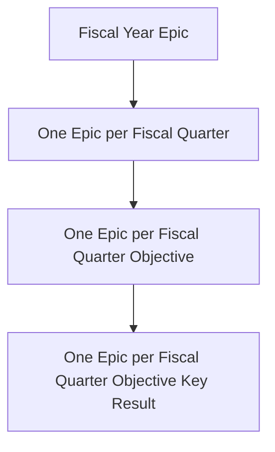

---

title: "Data Team - Planning Drumbeat"
description: "GitLab Data Team OKR and Iteration planning process"
---

---

GitLab Data follows a program to help align all teams towards the results that will help GitLab grow.

## Data Team Planning Drumbeat

Watch our [Planning Drumbeat Walkthrough Video](https://www.youtube.com/watch?v=esyP9AodVtk) on GitLab Unfiltered.

The Data Team Planning Drumbeat is a pre-set sequence that happens every quarter. The Planning Drumbeat adheres to GitLab's financial year/quarter schedule and [Quarterly Objective and Key Results](/handbook/company/okrs/#what-are-okrs) for prioritization and alignment. The Data Team Planning calendar is as follows:

  
[link to original](https://docs.google.com/spreadsheets/d/1hdJqCfDPR-LqTTRBy4JEQ-MbrL-RyNHzXaMzvsGWkSQ/edit#gid=0)

Iteration Cadence = Data Team  
LT = Leadership Team (`@amiebright`, `@iweeks`, `@dvanrooijen2`, `@nmcavinue`)  
DT = Data team (Product Fusion Team, GTM Fusion Team, BI Platform Team, or Data Platform Team)

The overall ambition is to **structure** why, when and what we are doing.

- OKRs will lead to **why**
- Work breakdown will lead to **what**
- Iteration planning will lead to **when**

This top-down approach is leading, but not fully limited to the way we work.

### Goal of the Planning Drumbeat

The goal of the Planning Drumbeat is to improve our ability to plan and estimate work through better understanding of our velocity.
During the iteration planning process, we assign [issue points](/handbook/business-technology/data-team/how-we-work/#issue-pointing), which are a good measure of consistency so we can calculate issue points per iteration on average.
Then we pull into the iteration based on when we think we can commit to the work being completed.
Then issues are prioritised according to our [standing priorities](/handbook/business-technology/data-team/how-we-work/#standing-priorities).

This approach has many benefits, including:

1. It helps ensure the highest priority projects are being completed
1. It can help leadership identify issues that are blocked
1. It provides leadership view into the work of the data team, including specialty analysts whose priorities are set from outside the data function
1. It encourages consistent throughput from team members
1. It makes clear to stakeholders where their ask is in priority
1. It makes clear to all team where their duty is in priority
1. It helps alleviate the pressure of planning the next iteration, as issues are already ranked

**The Planning drumbeat and the results it helps us deliver is a collaborative team-effort**

### Twice-Weekly Iteration Planning

The data team works in two-week intervals, called iterations. Iterations start on Wednesdays and end on Tuesdays. This discourages last-minute merging on Fridays and allows the team to have iteration planning meetings at the top of the iteration.

Iteration planning should take into consideration:

- vacation timelines
- conference schedules
- team member availability
- team member work preferences (specialties are different from preferences)

The timeline for Iteration planning is as follows:

- Meeting Preparation - Responsible Party: Iteration Planner
    - Investigate and flesh out open issues.
    - Assign issues to the iteration based on alignment with the Team Roadmap.
    - Note: Issues are not assigned to an individual at this stage, except where required.

| Day               | Current Iteration                                                                                                                                            | Next Iteration                                                                                                                                                                                                             |
| ----------------- | ------------------------------------------------------------------------------------------------------------------------------------------------------------ | -------------------------------------------------------------------------------------------------------------------------------------------------------------------------------------------------------------------------- |
| 0 - 1st Wednesday | **Iteration Start**                         | -                                                                                                                                                                                                                        |
| 7 - 1st Tuesday   | **Midpoint**   Any issues that are at risk of slipping from the iteration must be raised by the assignee                                               | -                                                                                                                                                                                                                        |
| 10 - 2nd Friday   | **The last day to submit MRs for review**   MRs must include documentation and testing to be ready to merge   MRs are preferably not to be merged on Fridays, or on Thursday in the case of Family and Friends Day, (unless there is urgency, i.e. P1-Ops related MRs or in cases with tight timelines) to minimise impact on days where there is limited team member availability. | **Iteration is roughly final**   Iteration Planner verifies issue priority and team capacity for next iteration.                                                                                                     |
| 13 - 2nd Monday   | **Last day of Iteration**   Ready MRs can be merged                                                                                                    | -                                                                                                                                                                                                                        |
| 14 - 2nd Tuesday  | **Meeting Day**    All unfinished issues either need to be removed from iterations or rolled to the next                                               | **Iteration Planning**    Sync-meeting to perform retro perspective on the current iteration and align/start on the next iteration according to the created iteration planning. All unfinished issues either need to be removed from iterations or will be automatically rolled to the next |

### Quarterly OKR Planning

Data Team OKRs aspire to align with divisional and company OKRs as well as GitLab Yearlies. The Data Team also creates OKRs for [Data Platform](/handbook/business-technology/data-team/platform/) infrastructure development and these OKRs may not always map to immediate term Business Partner OKRs. Overall, OKRs constitute 60-75% of the Data Team's Quarterly Capacity, with Production Operations as the only established higher priority.

Data Team OKRs are managed with [GitLab Plan](https://about.gitlab.com/direction/plan/) using a combination of Objectives, Key Results, Epics, and Issues using a standard naming scheme and structure and this approach:

- enables async contributions and planning
- clearly defines Data Team priorities
- helps to keep Epic and Issue description content to a manageable level
- leverages KR health statuses for progress reporting

OKRs across the Data Team are written using GitLab's [How to Write OKRs](/handbook/company/okrs/#how-to-write-okrs) handbook page. The below formulas are used to write OKRs:

- Objectives: Verb + What you want to do + In order to/for/so that (what you hope to achieve or rationale for objective). Objective Example: Increase awareness of company in the market in order to increase sales.

- Key Results: Verb + what you’re going to measure + from “x to y”. Key Result Example: 100% of employees certified on OKR expectations and process.

After OKRs have been drafted and shared across the Data Team, they are shared with Business Partner stakeholders for feedback. Once the draft process is complete, three summarized Objectives and KRs are published into the [Business Technology Group Project](https://gitlab.com/groups/gitlab-com/business-technology/) for sharing with the broader Business Technology Team, Finance Team, and company. These summarized Objectives and KRs attempt to capture the top OKRs in support of business results.

#### OKR Structure

#### OKR Setup

All Epics are part of the [GitLab Data Group](https://gitlab.com/groups/gitlab-data/) and are marked `Confidential` and all related Issues are stored in the [GitLab Data Analytics project](https://gitlab.com/gitlab-data/analytics).

1. Head the current Fiscal Year's `Data Team Objectives, Newsletters, and Report Cards` Epic.
1. From the Fiscal Year parent epic, create a new child **Fiscal Quarter Epic**
    - [ ] Create a title in the format `DRAFT: FYxx-Qx Data Team Objectives and Planning Drumbeat`
    - [ ] An example title is `DRAFT: FY23-Q1 Data Team Objectives and Planning Drumbeat`
    - [ ] Apply the `Planning_Drumbeat_FQ_Parent` Template
    - [ ] Mark the Epic `Confidential`
1. From the new Fiscal Quarter Epic just created, create 1 **Epic per Objective**
    - [ ] Give each new Epic a title in the format `FYxx-Qx Data Objective x: <name of objective>`
    - [ ] An example title is `FY23-Q1 Data Objective 1: Accelerate Growth and Product with Usage Analytics and Tooling`
1. For each Objective, add 1 **Epic per Key Result**
    - [ ] Give each new Key Result Epic a title in the format `FYxx-Qx Data Objective X, KR Y: <name of key result>`
    - [ ] An example title is `FY23-Q1 Data Objective 1, KR 1: Deliver a New Adoption Performance Dashboard to Product with 10 Users Trained`
    - [ ] Add detail to this Key Result Epic, including:
        - header bullets to support [weekly status roll-up reporting](/handbook/business-technology/data-team/how-we-work/#weekly-roll-up-reporting)
        - a description of the work
        - the expected business impact
        - objective measures and dates if available.
1. At this point, the structure is complete and the Team owners will work with their respective teams to develop **Work Breakdowns** for each KR Epic.
1. Once all of the Epics are created and defined, share the **Key Result Epic** with appropriate business partners and stakeholders through the #data channel and @ mentions of the business partners to solicit review and feedback. All feedback should be added as comments into the Key Result Issue.

#### End of Quarter OKR Review

During the OKR Review, the Data Leadership Team reviews the current status of the current FQ KRs. The results of the OKRs are evaluated and propagated to next FQ OKRs where applicable.

## T-Shirt Sizing Approach

We use a T-Shirt sizing approach for quickly sizing the work required to deliver new issues, epics, and longer-term initiatives. The T-Shirt sizing approach is designed to support work breakdowns towards the creation of detailed work plans, but also intended to provide a sufficient level of detail to manage overall scope.

| Size | Dedicated Person Time | Weight (issue points) | Examples |
| :--: | :--: | :-- | :-- |
| XS | 1/2 Day | 1 | Update existing handbook page. #data research/response. New Trusted Data Test. Opening AR to get access to a data source. |
| S | 1 Day | 2-3 | New handbook page; typical triage issue. New dashboard on top of existing models. Align on data scope for new data source. |
| M | 1 Week | 5-8 | New dashboard requiring new models. New data source with Stitch or Fivetran. |
| L | 2-3 Weeks | 13 | New fact table implementation & testing. Full XMAU solution. |
| XL | 1-2 Months | 26 | New Data Pump to new system. New Data Source with complex source API. |
| XXL | 2-4 Months | 52+ | New Dimensional Model subject area with New Data Sources. |

## Work Breakdowns

Work breakdowns are always developed as a part of the Quarterly OKR Planning Drumbeat, but can also be leveraged to help scope and plan new initiatives, infrastructure projects, and similar multi-person or multi-week projects. The outcome of the work breakdown is a detailed description of the work to be performed, deliverables and responsibilities, and a high-level timeline.

- As a part of the Quarterly OKR Planning Drumbeat, work breakdowns are embedded in the KR Description.
- As a part of a stand-alone or ad-hoc initiative, work breakdowns are embedded in the appropriate Epic Description.
- As an example of a Work Breakdown, see this [FY22-Q4 Data Platform Work Breakdown](https://gitlab.com/groups/gitlab-data/-/epics/372).

Work Breakdowns consider the following inputs:

1. Defined upcoming OKRs
2. OKR Reviews
3. New / forward looking insights
4. Team availability
5. Team member ambitions

**The work breakdown is team effort and everyone is encouraged to contribute.**
