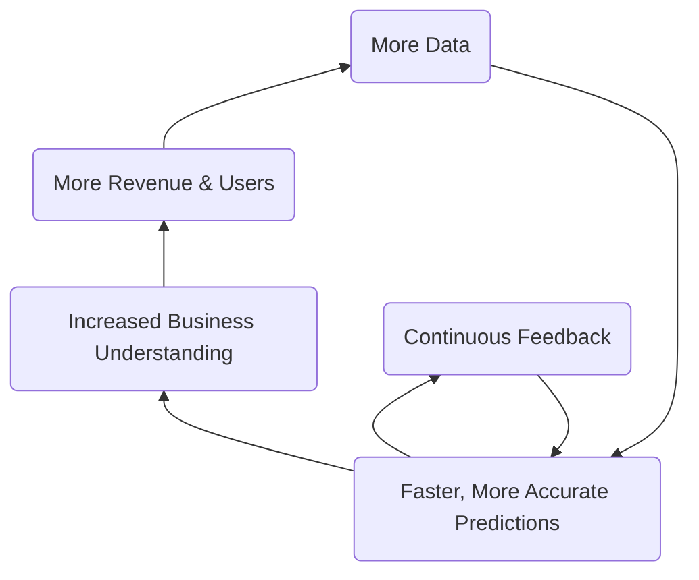
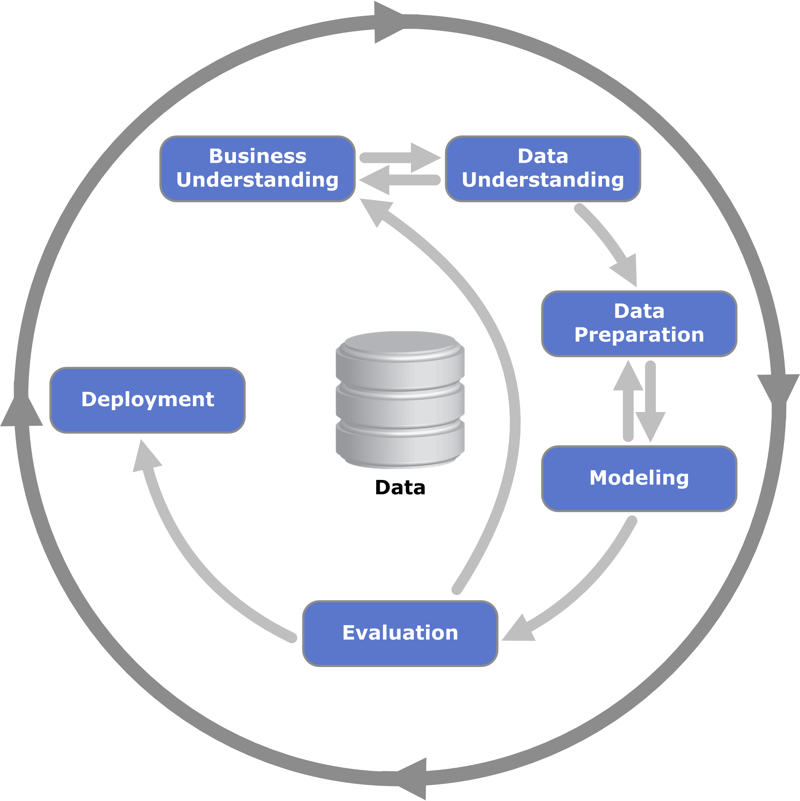
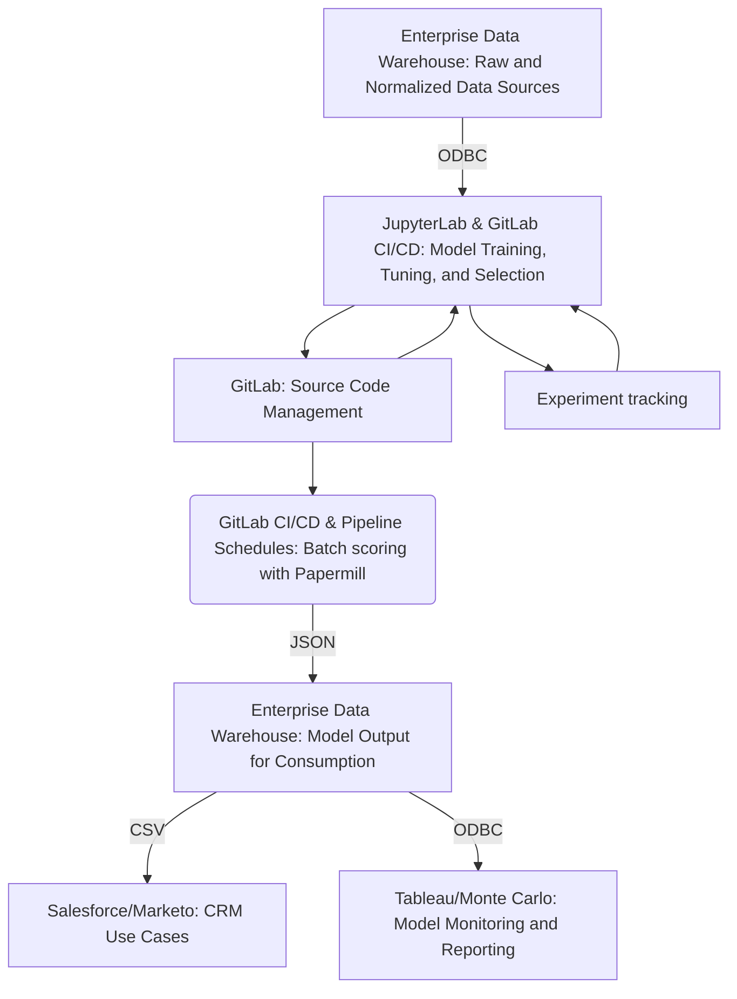

**PURPOSE: This page is focused on the operations of GitLab's internal *Data Science Team*. For information about GitLab's Product Data Science Capabilities, please visit [GitLab ModelOps](https://about.gitlab.com/direction/modelops/)**
{: .alert .alert-success}

`Last Updated At: 2023-12-22`

## The Internal Data Science Team at GitLab

The mission of the Data Science Team is to facilitate ***making better decisions faster*** using ***predictive analytics***.

## Handbook First

At GitLab we are [Handbook First](/handbook/about/handbook-usage/#why-handbook-first) and promote this concept by ensuring the data science team page remains updated with the most accurate information regarding data science objectives, processes, and projects. We also strive to keep the handbook updated with useful resources and our data science toolset.

## Learning About Data Science

Check out this brief overview of what data science is at GitLab:

<!-- blank line -->
<figure class="video_container">
  <iframe src="https://www.youtube.com/embed/wRbNExL0hv8" frameborder="0" allowfullscreen="true"> </iframe>
</figure>
<!-- blank line -->

([Corresponding slides](https://docs.google.com/presentation/d/1Y-V6bZ5w8Ms5yfMiuYCYZs9ald7Q5MxydYhSh9DWwwQ/edit?usp=sharing))

AMAs:

- 2021-09-15 AMA [Recording](https://youtu.be/wRbNExL0hv8), [Presentation](https://docs.google.com/presentation/d/1Y-V6bZ5w8Ms5yfMiuYCYZs9ald7Q5MxydYhSh9DWwwQ/edit#slide=id.g540caf0310_0_0),
- 2021-12-09 AMA [Recording](http://www.youtube.com/watch?v=46NEQDAz18I), [Presentation](https://docs.google.com/presentation/d/1aUIi52AW798KjmvexPIQ1AcXRKLcWlYd6yW-EW6Zqlo/edit#slide=id.g540caf0310_0_0)

**Want to Learn More?
[Become a Data Science Champion](/handbook/business-technology/data-team/direction/data-champion/), [visit Slack #bt-data-science](https://gitlab.slack.com/archives/C027285JQ4E), [watch a Data Team video](https://www.youtube.com/playlist?list=PL05JrBw4t0KrRVTZY33WEHv8SjlA_-keI). We want to hear from you!**
{: .alert .alert-success}

### Common Data Science Terms

- **Accuracy** - ability of a Data Science model to capture all correct data points out of all possible data points
- **Algorithm** - sequence of computer-implementable instructions used to solve specific problem
- **Classification** - process of predicting a category for each observation. For example, determining if a picture is of a cat or a dog
- **Clustering** - process of finding natural groupings of observations in dataset. Often used for segmentation of users or customers
- **Data Science (DS)** - interdisciplinary field that uses computer science, statistical techniques and domain expertise to extract insights from data
- **Exploratory Data Analysis (EDA)** - analysis of the data that summarises it's main characteristics (includes statistics and data visualisation)
- **Feature** - single column in dataset that can be used for analysis, such as country or age. Also referred to as variables or attributes
- **Feature Engineering** -  process of selecting, combining and transforming data into features that can be used by machine learning algorithms
- **Imputation** - process of replacing missing or incorrect data with statistical "best guesses" of the actual values
- **Machine Learning (ML)** - use and development of algorithms without being explicitly programmed to determine patterns in data
- **Model** - a complex set of mathematical formulas that generates predictions
- **Propensity modelling** - building models to predict specific events by analyzing past behaviors of a target audience.
- **Regression** - a statistical method for predicting an outcome. For example, predicting a person's income, or how likely a customer is to churn
- **Scoring** -  process of generating predictions for the new dataset
- **Training** -  process of applying an algorithm to data to create a model
- **Test Dataset** - deliberately excluding some observations from training the model so they can be used to verify how well the model predicts
- **Weight** - numerical value assigned to feature that determines it's strength

## Data Science Responsibilities

Of the [Data Team's Responsibilities](/handbook/business-technology/data-team/#responsibilities), the Data Science Team is **directly responsible** for:

- Delivering *descriptive*, *predictive*, and *prescriptive* solutions that promote and improve [GitLab's KPIs](/handbook/company/kpis/)
- Being a ***Center of Excellence*** for predictive analytics and supporting other teams in their data science endeavors
- Developing tooling, processes, and best practices for data science and machine learning

Additionally, the Data Science Team **supports** the following responsibilities:

- With **Data Leadership**:
  - Scoping and executing a data science strategy that directly impacts business KPIs
  - Broadcasting regular updates about deliverables, ongoing initiatives, and roadmap
- With the [**Data Platform Team**](/handbook/business-technology/data-team/organization/engineering/):
  - Defining and championing data quality best practices and programs for GitLab data systems
  - Deploying data science models, ensuring data quality and integrity, shaping datasets to be compatible with machine learning, and brining new datasets online
  - Creating data science pipelines that work natively with the GitLab platform and the Data Team tech stack
- With the [**Data Analytics Team**](/handbook/business-technology/data-team/organization/analytics/):
  - Incorporating data science into analytics initiatives
  - Designing dashboard to enhance the value and impact of the data science models

## How We Work

As a Center of Excellence, the data science team is focused on working collaboratively with other teams in the organization. This means our stakeholders and executive sponsors are usually in other parts of the business (e.g. Sales, Marketing). Working closely with these other teams, we craft a [project plan](/handbook/business-technology/data-team/organization/data-science/project_dev_approach/#3c-modeling--implementation-plan) that aligns to their business needs, objectives, and priorities. This usually involves working closely with functional analysts within those teams to understand the data, the insights from prior analyses, and implementation hurdles.

The Data Science flywheel is focused on improving business efficiency and KPIs by creating accurate and reliable predictions. This is done in collaboration with [Functional Analytics Center of Excellence](/handbook/business-technology/data-team/functional-analytics-center-of-excellence/) to ensure the most relevant data sources are utilized, business objectives are met, and results can be quantifiably measured. As business needs change, and as the user-base grows, this flywheel approach will allow the data science team to quickly adapt, iterate, and improve machine learning models.

## How to request Data Science project?

To request a new Data Science project, please fill out the [Opportunity Canvas](https://gitlab.com/gitlab-data/analytics/-/issues/new). In the description choose `[New Request] Create Opportunity Canvas`. The `Problem Statement` and `Stakeholders` sections should be completed. You can tag a data science team member with whom you discussed the project with or share an issue in #bt-data-science slack channel. During the quarterly planning process, requests will be reviewed and priortisied accordingly by the Data Leadership Forum.

## Work Streams

| Work Stream | Internally Known As | Maturity | Objective | Last Update | Next Update |
| ----- | -----| -----| ----- | ----- | ----- |
| Revenue Expansion | [Propensity to Expand](https://gitlab.com/gitlab-data/data-science-projects/propensity-to-expand) (PtE)  | Optimized | Determine which paid accounts are likely to increase in ARR via seat expansion or up-tier to Ultimate | FY23-Q4 | FY24-Q2 |
| Loss Prevention | [Propensity to Contract](https://gitlab.com/gitlab-data/data-science-projects/propensity-to-contract-and-churn) (PtC) | Optimized  | Determine which paid accounts are likely to decrease in ARR via seat expansion or down-tier to Premium  | FY24-Q3 | FY24-Q4 |
| Conversion  | [Propensity to Purchase](https://gitlab.com/gitlab-data/data-science-projects/propensity-to-purchase) (PtP)  | Viable  | Identify which non-paid users (free and trials accounts) are likely to become paid accounts  | FY24-Q1 | FY24-Q2 |
| Product Research  | [Namespace Segmentation](https://gitlab.com/gitlab-data/data-science-projects/namespace-segmentation)  | Optimized | Define groups for paid and free SaaS namespaces based on its product usage  |  FY23-Q3 | TBD |
| Lead Funnel Generation | Prospect/Lead Scoring  | Planned | Identify leads and prospects most likely to convert to closed won opportunities | | FY24-Q2 |
| MLOps | GitLab MLOps Product Development | In progress (Ongoing) | Dogfood new MLOps product features and enhancements | FY24-Q1 | FY24-Q2 |
| Backlog | Adoption Index | Planned | Define way to measure adoption and customer journey | | TBD |
| Backlog | Product Usage Event | Planned | - | | TBD |
| Backlog | Golden Journey | Planned | Identify optimal paths to increasing platform usage and adoption | | TBD |
| Backlog | Stage Adoption MRI | Planned | - | | TBD |
| Backlog | Community Sentiment Analysis | Unplanned | - | | TBD |
| Backlog | Feature $ARR Uplift Prediction | Unplanned | Attribute incremental ARR lift based on feature adoption | | TBD |

- For implementation details and where to find model predictions/scores, please see the [Propensity Models Internal Handbook Page](https://internal.gitlab.com/handbook/sales/propensity_models/)

**Maturity**

Maturity of data science projects is similar to the [GitLab product maturity model](https://about.gitlab.com/direction/maturity/):

- **Unplanned**: Not implemented, and not yet on our roadmap.
- **Planned**: Not implemented, but on our roadmap; executive sponsor attached to project.
- **In Progress**: Plan established, developing model.
- **Viable**: Available, but not fully productionalized yet; scores and insights manually generated; low adoption outside of immediate stakeholders.
- **Complete**: Fully implemented into Data Team cloud production infrastructure; increasing adoption of corresponding dashboards and scores within the intended organization.
- **Optimized**: Fine-tuned, fully automated, and self-service; continuous model monitoring and scoring; high adoption within intended organization.

### Revenue Expansion

- Organizational Sponsor: Sales
- Use Cases: [Issue](https://gitlab.com/gitlab-data/analytics/-/issues/14907)
- Plans for next iteration: Predicted ARR amount
- Slack Channel (internal only): [#data-propensity-projects](https://gitlab.slack.com/archives/C02172C5KH7)
- Repositories (internal only): [Propensity to Expand](https://gitlab.com/gitlab-data/data-science-projects/propensity-to-expand)
- Read-outs (internal only):
   - [Exec Summary](https://docs.google.com/presentation/d/1Aaf2HzFYrYDPgrZKDHxS9gzep4LHGMlwF5SxYs-her0/edit#slide=id.gf528ae95ed_0_0)
   - [Sales GTM](https://docs.google.com/presentation/d/1F_XSJrhemIbaffhvwx0byQ1mUvdo4X1ZcGsBa7VgVnU/edit#slide=id.g123a13deda8_0_405)
- Dashboards (internal only):
   - [PtE Inspector](https://10az.online.tableau.com/#/site/gitlab/workbooks/2344783)
   - [PtE Results Dashboard](https://10az.online.tableau.com/#/site/gitlab/workbooks/2146809)
- Data sources: Product usage: SaaS & Self-Managed - paid tiers; Product stage usage: SaaS & Self-Managed - paid tiers; Salesforce (account, opportunities, events, tasks); Zuora (billing); Bizible (marketing); Firmographics; ZenDesk (help tickets); prior expansion type (product change, seat licenses), amount, and time lapse; account health scores
   - Future sources: Buyer personas attached to opportunities

### Loss Prevention

- Organizational Sponsor: Customer Success
- Use Cases: [Issue](https://gitlab.com/gitlab-data/analytics/-/issues/14907)
- Plans for next iteration: Churn forecasting (in progress, Q2), Downtier Measure (Q3), PtC refresh (Q4)
- Slack Channel (internal only): [#data-propensity-projects](https://gitlab.slack.com/archives/C02172C5KH7)
- Repositories (internal only):
   - [Propensity to Contract](https://gitlab.com/gitlab-data/data-science-projects/propensity-to-contract-and-churn)
   - [Propensity to Downtier](https://gitlab.com/gitlab-data/data-science-projects/propensity-to-downtier)
   - [Churn Forecasting](https://gitlab.com/gitlab-data/data-science-projects/churn-forecasting)
- Read-outs (internal only):
   - [PtC slide deck](https://docs.google.com/presentation/d/1Gd-GhHhWHHc1N8zJtLGKtNF4W2T9d82Sv_fZ_j2236U/edit#slide=id.g29a70c6c35_0_68)
   - [Downtier Executive Read Out](https://docs.google.com/presentation/d/1kcTPP5NKnqTKnOTm2HGSSVsYP3x6TdeKGxv28U702yo/edit#slide=id.g1b861242c79_0_522)
   - [Downtier Read Out](https://docs.google.com/presentation/d/13xcuQE6G3alvHoklWvmDm-MOIb0V7QhckgXCd5IHHuc/edit#slide=id.g123a13deda8_0_405)
   - [Sales Leadership Readout - PtC for June - Aug 2022](https://docs.google.com/presentation/d/1eTG6U3EaxXK06P2-IsFUzwfesJKtDNZJQ37qKJYi-vM/edit#slide=id.g17b7d66f003_0_11)
   - [Sales Leadership Readout - PtC for Sep 2022 - Mar 2023](https://docs.google.com/presentation/d/1waIKnjnL6lA1UKH-Fc2BYdOw6gtjiBKkmlyl6F8YFEw/edit#slide=id.g218452df868_0_1099)
   - [Churn Forecasting - July 2023](https://docs.google.com/presentation/d/1hiukpYHzopsTWH0CWnS_2uah9G2TLq_JOMojQz4mZao/edit#slide=id.g25880664535_2_278)
- Dashboards (internal only):
   - [PtC Inspector](https://10az.online.tableau.com/t/gitlab/views/PtCInspector/About)
   - [PtC Results Dashboard](https://10az.online.tableau.com/#/site/gitlab/workbooks/2163169)
   - [Health of Ultimate Accounts Dashboard](https://10az.online.tableau.com/#/site/gitlab/workbooks/2272458)
- Data sources:  Product usage: SaaS & Self-Managed - paid tiers; Product stage usage: SaaS & Self-Managed - paid tiers; Salesforce (account, opportunities, events, tasks); Zuora (billing); Bizible (marketing); ZenDesk (help tickets); Firmographics, account health fields; security score
   - Future sources: # of answered emails, ratio sent/answered emails, sales activity (Gainsight)

### Conversion

- Organizational Sponsor: Sales & Marketing
- Use Cases: [Trails](https://gitlab.com/gitlab-data/data-science-projects/propensity-to-purchase/-/issues/28#note_1236345675); [Free Namespaces](https://gitlab.com/groups/gitlab-data/-/epics/673)
- Plans for next iteration: Self-managed free instances
- Slack Channel (internal only): [#data-propensity-projects](https://gitlab.slack.com/archives/C02172C5KH7)
- Repositories (internal only): [Propensity to Purchase](https://gitlab.com/gitlab-data/data-science-projects/propensity-to-purchase)
- Read-outs (internal only):
   - [SaaS Trials Model Readout](https://docs.google.com/presentation/d/1EyS9Wq6F0qlQwt5sj7x8VnSSGD1vIy3AcSpMGddZdbk/edit?usp=sharing)
   - [SaaS Free Namespaces Readout](https://docs.google.com/presentation/d/1UNfthItOOfT3L4v5PkZh4z4hVPKdCcn8aQg_raVflxg/edit#slide=id.g12e25a29994_0_0)
- Data sources: Product usage: SaaS Only - free tiers; Product stage usage and adoption: SaaS Only - Free Tiers; Registration; Namespace metadata; User-level
   - Future sources: Self-managed usage data

### Product Research

- Organizational Sponsor: Growth & Product Insights
- Use Cases: [Issue](https://gitlab.com/gitlab-data/analytics/-/issues/14907)
- Plans for next iteration: Self-managed segmentation
- Slack Channel (internal only): [#namespace-segmentation](https://app.slack.com/client/T02592416/C0341FPNB1C)
- Repositories (internal only): [Namespace Segmentation](https://gitlab.com/gitlab-data/data-science-projects/namespace-segmentation)
- Read-outs (internal only):
   - [Namespace Segmentation Deck](https://docs.google.com/presentation/d/1Pmm0g1mUquBR6P_aguGkOiGBVqO1ZtDzIyRrbR-r9jA/edit#slide=id.g29a70c6c35_0_68)
- Data sources: Product usage: SaaS & Self Managed - free and paid tiers; Product stage usage: SaaS & Self Managed - free and paid tiers; Salesforce (account); Zuora (billing); Bizible (marketing)
   - Future sources: # of consecutive days of product/stage usage

## Project Structure

The Data Science Team follows [Cross-Industry standard process for data mining (CRISP-DM)](https://en.wikipedia.org/wiki/Cross-industry_standard_process_for_data_mining), which consists of 6 iterative phases:

1. **Business Understanding**

    - Includes requirements gathering, stakeholders interviews, project definition, product user stories, and potential use cases in order to establish success criteria of the project.

1. **Data Understanding**

    - Requires determining the breadth and scope of existing relevant data sources. Data scientists work closely with data engineers and data analysts to determine where gaps may exist and to identify any data discrepancies or risks.

1. **Data Preparation**

    - Requires conducting data quality checks and exploratory data analysis (EDA) to develop a greater understanding of data and how different datapoints relate to solving the business need.

1. **Modeling**

    - Machine learning techniques are used to find a solution that addresses the business need. This often takes the form of predicting why/when/how future instances of a business outcome will occur.

1. **Evaluation**

    - Performance is generally measured by how *accurate*, *powerful*, and *explainable* the model is. Findings are presented to the stakeholders for feedback.

1. **Deployment**

    - Once the model has been approved it then gets deployed into the data science production pipeline. This process automatically updates, generates predictions, and monitors the model on a regular cadence.

### The GitLab approach

The [Data Science Team approach to model development](/handbook/business-technology/data-team/organization/data-science/project_dev_approach/) is centered around GitLab's value of [iteration](/handbook/values/#iteration) and the CRISP-DM standard. Our process expands on some of the 6 phrase outlined in CRISP-DM in order to best address the needs of our specific business objectives and data infrastructure.

## Data Science Platform

Our current platform consists of:

- the [Enterprise Data Warehouse](/handbook/business-technology/data-team/platform/) for storing raw and normalized source data as well as final model output for consumption by downstream consumers
- [JupyterLab](/handbook/business-technology/data-team/platform/jupyter-guide/) for model training, tuning, and selection
- [GitLab](https://gitlab.com/) for collaboration, project versioning, and score code management, [experiment tracking](/handbook/engineering/development/incubation/mlops/ml_experiment_tracking.html), and [CI/CD](https://docs.gitlab.com/ee/ci/)
-[GitLab CI](/handbook/business-technology/data-team/platform/ci-for-ds-pipelines/#our-approach-to-using-cicd-for-data-science) for automation and orchestration
- [Monte Carlo](https://getmontecarlo.com/) for drift detection
- Tableau Server for model monitoring and on-going performance evaluation
- [Feast](https://docs.feast.dev/) as a an open-source Feature Store for Machine Learning models

### Current State Data Flows

- For putting a model into production, please create an new [data issue](https://gitlab.com/gitlab-data/analytics/-/issues/new#) using the [Scheduling Notebook Request Template](https://gitlab.com/gitlab-data/analytics/-/blob/master/.gitlab/issue_templates/Data%20Science%3A%20Scheduling%20Notebook%20Request.md)

### Feast: Feature Store Implementation

We are using Feast as an open-source Feature Store for our machine learning models.
Configuration can be found on [the Feast project repository](https://gitlab.com/gitlab-data/data-science-projects/feast-poc), updating the feature store is done via GitLab CI/CD and the web UI is published in a VM on GCP.

You can use the following pages to find more details on:

1. How to use [Feast to fetch features to train and deploy Machine Learning models](/handbook/business-technology/data-team/platform/feast/).
1. [Feast - Feature Store Implementation](https://internal.gitlab.com/handbook/enterprise-data/platform/data-science/) Internal handbook section.

### CI/CD Pipelines for Data Science

We are in the process of fully moving over the training and scoring of our machine learning models to the native GitLab CI/CD capabilities. Please see [Getting Started With CI/CD for Data Science Pipelines](/handbook/business-technology/data-team/platform/ci-for-ds-pipelines/) for the most up-to-date information and instructions.

### Data Science Tools at GitLab

- **[Pre-configured JuypterLab Image](https://gitlab.com/gitlab-data/data-science)**: The data science team uses JupyterLab pre-configured with common python modules (pandas, numpy, etc.), native Snowflake connectivity, and git support. Working from a common framework allows us to create models and derive insights faster. This setup is freely available for anyone to use. Check out our [Jupyter Guide](/handbook/business-technology/data-team/platform/jupyter-guide/) for additional information.
- **[GitLab Data Science Tools for Python](https://gitlab.com/gitlab-data/gitlabds/)**: Functions to help automate common data prep (dummy coding, outlier detection, variable reduction, etc.) and modeling tasks (i.e. evaluating model performance). Install directly via [pypi](https://pypi.org/project/gitlabds/) (`pip install gitlabds`), or use as part of the above JupyterLab image.
- **[Modeling Templates](https://gitlab.com/gitlab-data/data-science/-/tree/main/templates)**: The data science team has created modeling templates to allow you to easily start building predictive models without writing python code from scratch. To enable these templates, follow the instructions on the [Jupyter Guide](/handbook/business-technology/data-team/platform/jupyter-guide/#enabling-jupyter-templates).

## Useful Data Science & Machine Learning Resources

- ***Python Data Science Handbook*** by Jake VanderPlas: Great for beginners looking to learn python and dip their toes into data science.
- ***Python Machine Learning*** by Sebastian Raschka & Vahid Mirjalili: More advanced topics with the assumption of a basic level of python.
- ***The Elements of Statistical Learning, Data Mining, Inference, and Prediction*** by Trevor Hastie, Robert Tibshirani, & Jerome Friedman: Great deep dive into all the statistics and logic behind many of the commonly used predictive techniques. Can be pretty stats/math heavy at time.
