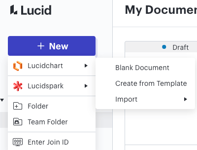
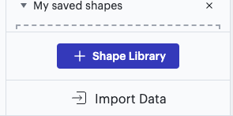
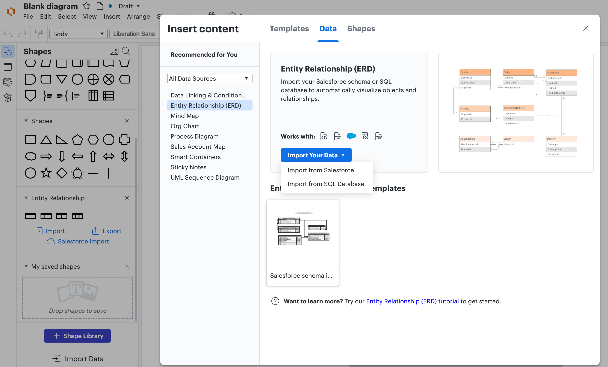
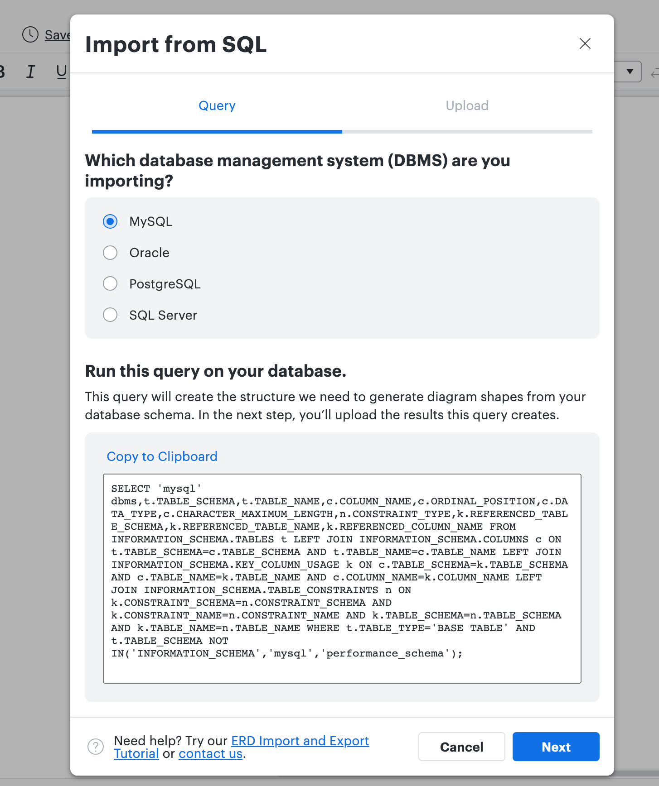
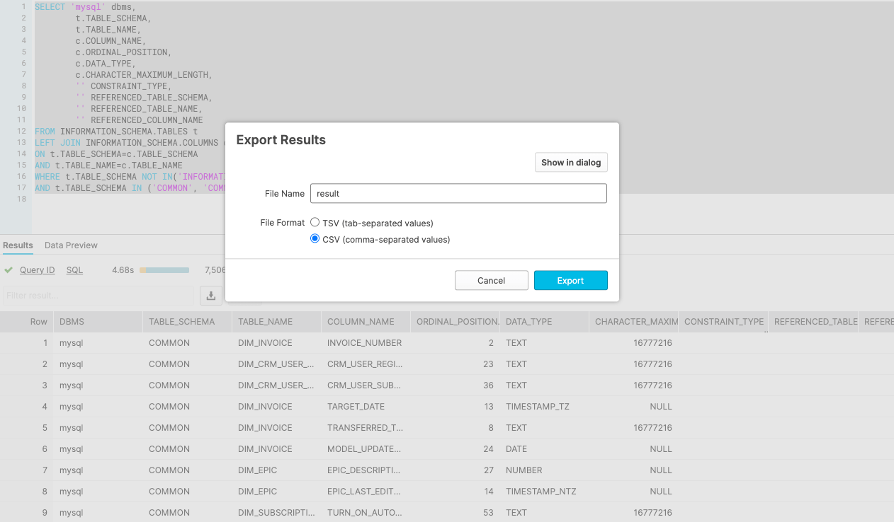
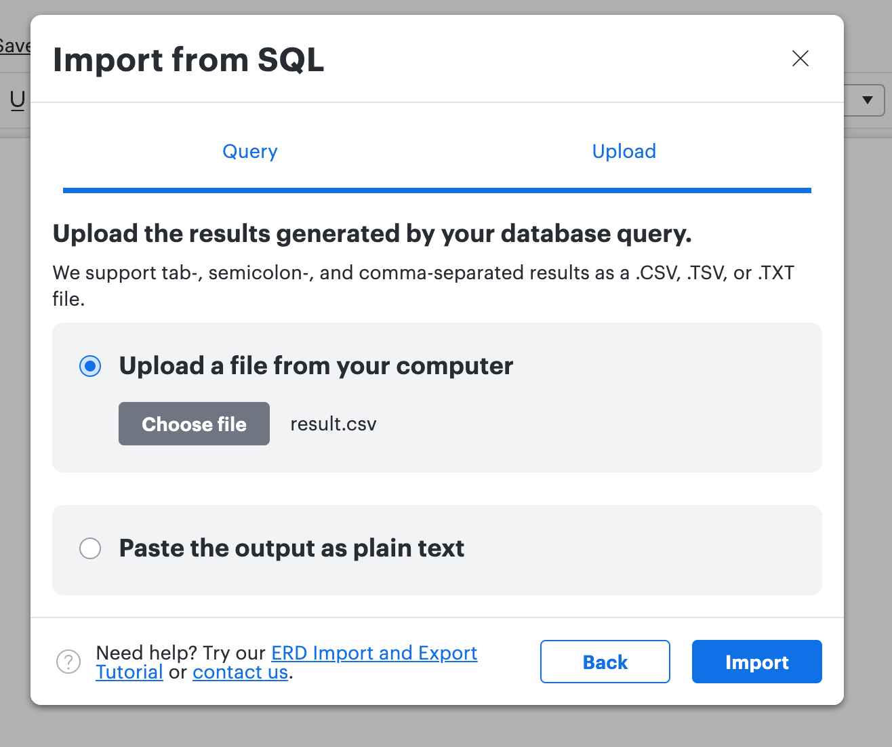
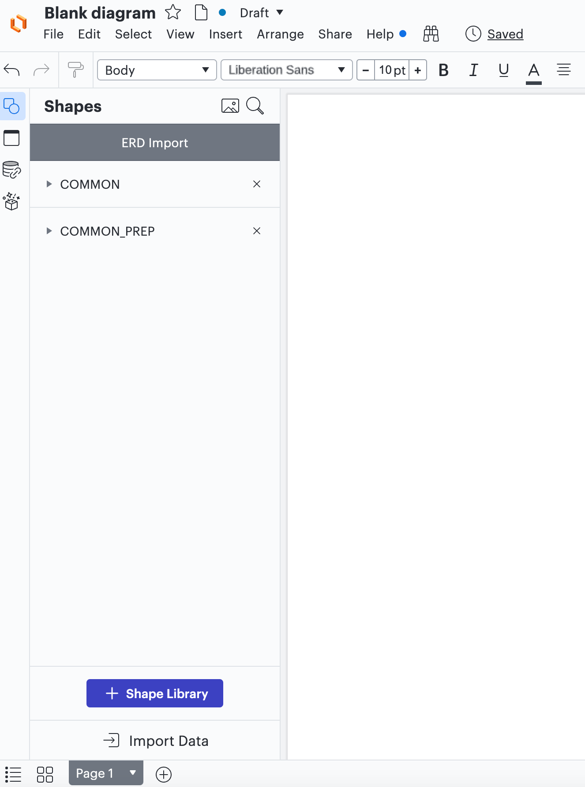
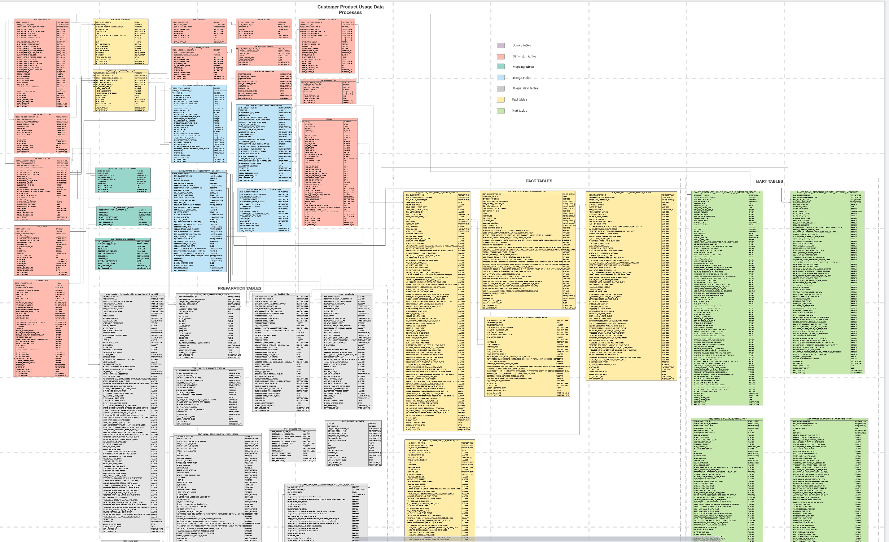

---

title: "Enterprise Data Warehouse"
---


## Enterprise Data Warehouse Overview

The Enterprise Data Warehouse (EDW) is used for reporting and analysis. It is a central repository of current and historical data from GitLab's Enterprise Applications. We use an ELT method to Extract, Load, and Transform data in the EDW. We use Snowflake as our EDW and use [dbt](/handbook/business-technology/data-team/platform/dbt-guide/) to transform data in the EDW. The [Data Catalog](/handbook/business-technology/data-team/data-catalog/) contains Analytics Hubs, Data Guides, Data Dictionaries, and Analysis for the data models built in the EDW.

The Production Database in the EDW is used for reporting and analysis by Data Consumers at GitLab. It is composed of 4 major schemas which are `COMMON_`, `SPECIFIC`, `LEGACY_` and `WORKSPACE_` schemas. Below are descriptions of each Schema:

1. `COMMON_`: This schema is where our Enterprise Dimensional Model (EDM) lives. The EDM is GitLab's centralized data model, designed to enable and support the highest levels of accuracy and quality for reporting and analytics. The data model follows the [Kimball](https://www.kimballgroup.com/data-warehouse-business-intelligence-resources/kimball-techniques/dimensional-modeling-techniques/) technique, including a Bus Matrix and Entity Relationship Diagrams. Dimensional Modeling follows our [Trusted Data Development](/handbook/business-technology/data-team/data-development/#trusted-data-development) process and enables us to repeatedly produce high-quality data solutions. Our Enterprise Applications that integrate with each other are great candidates for the Kimball Dimensional Modeling Methodology. Foreign keys in a data table from a different source system is a strong indication that a `COMMON_` solution is required. If some data tables qualify for the `COMMON_` solution, then all data from that source system should be modeled in the EDM. This prevents a confusing user experience of having data from a source system modeled with different methods and patterns.

1. `SPECIFIC_`: This schema is where data from applications that do not integrate with other applications lives. The EDM in the `COMMON_` schema excels at modeling data from Integrated Enterprise Applications; however, not all application data is integrated nor requires the rigor of Dimensional Modeling. The data models in the `SPECIFIC_` schema follow the [Trusted Data Development](/handbook/business-technology/data-team/data-development/#trusted-data-development) process with the exception of a Dimensional Modeling methodology not being required. A key acceptance criteria for models entering this schema is that the models are built from application data that is not integrated with other application data. The `SPECIFIC_` schema is not a waypoint for models that should be modeled in the `COMMON_` schema; however, it could be possible for models in this schema to mature and require an EDM solution. This helps us prevent technical debt from building up in the `SPECIFIC_` schema.

1. `WORKSPACE_`: This schema follows the [Ad-Hoc Data Development](/handbook/business-technology/data-team/data-development/#ad-hoc-data-development) process. This schema is where data modelers can experiment and prototype data solutions. The `WORKSPACE_` schema can also be used as a waypoint for models that need an EDM solution in the `COMMON_` schema. The `WORKSPACE_` should be selected for this and not the `SPECIFIC_` schema.

1. `LEGACY_`: This schema is where data from our old modeling paradigm lives and is in the process of being deprecated by `2025-01-31`. The [Legacy Structure](/handbook/business-technology/data-team/platform/dbt-guide/#model-structure) is defined in the dbt guide.

## Enterprise Dimensional Model (COMMON Schema)

### Primary Dimensional Modeling Artifacts

- The [Enterprise Bus Matrix](https://docs.google.com/spreadsheets/d/1j3lHKR29AT1dH_jWeqEwjeO81RAXUfXauIfbZbX_2ME/edit#gid=1372061550) consolidates all of our Fact and Dimension tables into an easy-to-use table and is patterned after the [Kimball bus matrix](https://www.kimballgroup.com/data-warehouse-business-intelligence-resources/kimball-techniques/kimball-data-warehouse-bus-architecture/).
- The [Enterprise Entity Relationship Diagram](https://lucid.app/lucidchart/12ee91c1-7ae5-4e99-96ae-bc51652dfa19/view?page=B47EyN20O.G6#) presents a unified entity-level view of the Fact and Dimension tables.
- The [Dimensional Modelling Development Process](/handbook/business-technology/data-team/data-development/#trusted-data-development) covers our modeling standards, including naming conventions.

### The Enterprise Dimensional Model 'BIG PICTURE' Diagram

- We use Lucidchart's [ER diagram template](https://www.lucidchart.com/pages/er-diagrams) to build [Enterprise Entity Relationship Diagram](https://lucid.app/lucidchart/12ee91c1-7ae5-4e99-96ae-bc51652dfa19/view?page=B47EyN20O.G6#) source.

A Step-by-Step process of creating an ERD using Lucidchart can be found [here](/handbook/business-technology/data-team/platform/edw/##create-entity-relationship-(er)-diagrams-using-lucidchart).

<div style="width: 640px; height: 480px; margin: 10px; position: relative;"><iframe allowfullscreen frameborder="0" style="width:640px; height:480px" src="https://lucid.app/documents/embeddedchart/12ee91c1-7ae5-4e99-96ae-bc51652dfa19" id="jBktl-f497ew"></iframe></div>

### Entity Relationship Diagram (ERD) Library

These diagrams provide the relationships between data objects in the Enterprise Dimensional Model across the major business process fly wheels.

#### Lead to Cash ERDs

<details markdown=1>

<summary><b>ERD Library</b></summary>

- [Sales Funnel ERD](https://lucid.app/lucidchart/invitations/accept/inv_aaf2071b-0e70-446c-bc7f-1f8dcfdd650c)
- [Annual Recurring Revenue (ARR) ERD](https://lucid.app/lucidchart/invitations/accept/inv_8914efa4-00a6-4705-8ce3-d422d052cc22)
- [Common Subscription Model ERD](https://lucid.app/lucidchart/invitations/accept/inv_776b0a6b-70f9-44e2-bc60-cfbf56dcc7bb)
- [Common Behavior ERD](https://lucid.app/lucidchart/5d5c918d-2e6d-47d6-a2e5-db3c4951c531/edit?viewport_loc=-109%2C105%2C3982%2C1787%2CFb93ppTmuaDu&invitationId=inv_a4c5f29c-930f-4103-a121-320dd8009b5a)
- [Delta ARR: Subscription Lineage Monthly ERD](https://lucid.app/lucidchart/invitations/accept/inv_07d25d39-3076-408f-b768-67d1895ea064)
- [DRAFT: Quota ERD](https://lucid.app/lucidchart/invitations/accept/inv_2d4d5137-8aa6-488f-89a1-4295bf9ebde5)
- [DRAFT: Orders ERD](https://lucid.app/lucidchart/invitations/accept/inv_b726f4d1-7d92-4a21-832e-68f9db4fb104)

</details>

#### Product Release to Adoption ERDs

<details markdown=1>

<summary><b>ERD Library</b></summary>

- [Common Product Usage Data Model ERD](https://lucid.app/lucidchart/3a42e56a-028e-45d7-b2ca-5ef489bafd32/edit?viewport_loc=2142%2C1704%2C4416%2C1626%2C8XAjn~AniBES&invitationId=inv_e0a19114-45d5-4a78-9123-dc3b8991d826)
- [Common Behavior ERD](https://lucid.app/lucidchart/5d5c918d-2e6d-47d6-a2e5-db3c4951c531/edit?viewport_loc=-109%2C105%2C3982%2C1787%2CFb93ppTmuaDu&invitationId=inv_a4c5f29c-930f-4103-a121-320dd8009b5a)

</details>

#### Team Member ERDs

<details markdown=1>

<summary><b>ERD Library</b></summary>

- [Common Team Member Data Model ERD](https://lucid.app/lucidchart/17fbbbe5-f652-40e9-905e-1b07ec040520/edit?viewport_loc=153%2C6%2C1472%2C542%2CC6RZ78OfF1Bh&invitationId=inv_f6b923fd-02bb-4786-abd7-bf205c7d1da2)
- [DRAFT: Recruiting ERD](https://lucid.app/lucidchart/caa98a41-649a-4af0-9d2b-129360dbce96/edit?viewport_loc=-1384%2C-550%2C3649%2C1344%2C0_0&invitationId=inv_5af17fdd-3d57-4966-823a-bba083d80718)

</details>

## What Is Dimensional Modeling?

Dimensional modeling is part of the Business Dimensional Lifecycle methodology developed by [Ralph Kimball](https://en.wikipedia.org/wiki/Ralph_Kimball) which includes a set of methods, techniques and concepts for use in data warehouse design.

*a logical design technique that seeks to present the data in a standard, intuitive framework that allows for high-performance access*

Dimensional Modeling is business process oriented and can be built in 4 steps:

1. Choose the business process e.g. track monthly revenue
1. Declare the grain e.g. per customer
1. Identify the dimensions
1. Identify the fact

### Fact and dimension tables

Dimensional modeling always uses the concepts of facts (measures), and dimensions (context).
Facts are typically (but not always) numeric values that can be aggregated, and dimensions are groups of hierarchies and descriptors that define the facts.

In the simplest version fact table is a central table and is linked to dimensional tables with foreign keys creating a star schema.
Star schema with dimensional tables linking to more dimensional tables are called snowflake schemas, multi fact tables schemas are called galaxies.

### Why is it worth using dimensional modeling

- Dimensional Modeling has a few flavors, but the overall design is industry standard and has been used successfully for decades
- The FACT and DIM structures result in easy to understand and access data, suitable for business teams
- Dimensional modeling supports centralized implementation of business logic and consistent definitions across business users e.g. one source of truth of customer definition
- The design supports 'plug and play' of new subject areas and in fact the model grows in power as more dimensions are added

## Enterprise Dimensional Model Governance

#### Modeling Development Process

1. Extend the [dimension bus matrix](https://docs.google.com/spreadsheets/d/1j3lHKR29AT1dH_jWeqEwjeO81RAXUfXauIfbZbX_2ME/edit#gid=1372061550) as the blueprint for the EDM.
1. Add the table to the appropriate LucidChart ERD.
1. Model each source in the `PREP` database using source specific schema names.
1. Create `PREP` tables in the `COMMON_PREP` schema in the `PROD` database as required by the use case. Building `PREP` tables in the `COMMON_PREP` schema is optional and depends on the use case.
1. Deploy dimension tables. Each dimension also includes a common record entry of `MD5('-1')` key value to represent `missing`.
1. Create fact tables. Populate facts with correct dimension keys, and use the `MD5('-1')` key value for missing keys.

#### Using Seed, Sheetload, and Driveload files in the EDM

When the canonical source of data is **NOT** a CSV file type upload, our preference is to extract the data directly from the source system application. However, in some cases, a short-term work around such as a seed file, Sheetload, or Driveload file extraction is acceptable. Be cautious in these situations; short term workarounds frequently turn into technical debt, and it may be wise to draft a removal plan before implementing a short term fix. While these approaches should be used sparingly in the Enterprise Dimensional Model, the use of seed, Sheetload, or Driveload files is fine for the workspace schemas.

When the Canonical source of a data set is inherently a CSV file type, we have several options to extract the data into Snowflake. All the options have different pros and cons.

1. dbt seed: This is a solid option. dbt seed is version controlled via GitLab, easy to update via MR in GitLab Web IDE. A con is that it is recommended to be used with low row counts, about a 1,000.

1. GCP Driveload: This is a solid option as well. It is stable and has no unexpected changes to data. A con is that you have to load a new file to driveload to update.

1. Sheetload: Sheetload makes it easy for team members to enter data and self-serve in GSheets. However, there are several issues associated with Sheetload: it is unstable and has broken many times, causing downstream data to get stale; it is hard to keep SOX compliant; it is an uncontrolled entry point into the data warehouse. In certain cases, we've had to disable the Sheetload model extraction to ensure trust for Tier 1 data assets and prevent unexpected changes to data.

Of the 3 options, dbt seed is the highest preference when the use case requires less than 1000 records of data. GCP Driveload is preferred when a row limitation prevents the use of dbt seed. Sheetload is the last option for any of our Tier 1 Data Assets due to low stability and high difficulty of audit.

#### Naming Standards

It is critical to be intentional when organizing a self-service data environment, starting with naming conventions. The goal is to make navigating the data warehouse easy for beginner, intermediate, and advanced users. We make this possible by following these best practices:

1. PREP TABLES: `prep_<subject>` = Used to clean raw data and prepare it for dimensional analysis.
1. FACT TABLES: `fct_<verb>` Facts represent events or real-world processes that occur. Facts can often be identified because they represent the action or 'verb'.  (e.g. session, transaction)
1. DIMENSION TABLES: `dim_<noun>` = dimension table. Dimensions provide descriptive context to the fact records. Dimensions can often be identified because they are 'nouns' such as a person, place, or thing (e.g. customer, employee) The dimension attributes act as 'adjectives'. (e.g. customer type, employee division)
1. MART TABLES: `mart_<subject>` = Join dimension and fact tables together with minimal filters and aggregations. Because they have minimal filters and aggregations, mart tables can be used for a wide variety of reporting purposes.
1. REPORT TABLES: `rpt_<subject>` = Can be built on top of dim, fact, and mart tables. Very specific filters are applied that make report tables applicable to a narrow subset of reporting purposes.
1. PUMP TABLES: `pump_<subject>` = Can be built on top of dim, fact, mart, and report tables. Used for models that will be piped into a third party tool.
1. MAP TABLES: `map_<subjects>` = Used to maintain one-to-one relationships between data that come from different sources.
1. BRIDGE TABLES: `bdg_<subjects>` = Used to maintain many-to-many relationships between data that come from different sources. See the Kimball Group's [documentation](https://www.kimballgroup.com/2012/02/design-tip-142-building-bridges/) for tips on how to build bridge tables.
1. SCAFFOLD TABLES: `rpt_scaffold_<subject>` = Used to support the visualization layer by creating a template / blueprint with all the combinations of common dimensions between the desired fact tables.
1. Singular naming should be used, e.g. dim_customer, not dim_customers.
1. Use prefixes in table and column names to group like data. Data will remain logically grouped when sorted alphabetically, e.g. dim_geo_location, dim_geo_region, dim_geo_sub_region.
1. Use dimension table names in primary and foreign key naming. This makes it clear to the user what table will need to be joined to pull in additional attributes. For example, the primary key for dim_crm_account is dim_crm_account_id. If this field appears in fct_subscription, it will be named dim_crm_account_id to make it clear the user will need to join to dim_crm_account to get additional account details.
1. Dimension, fact, and mart tables are not to contain references to operational systems. We abstract the name away from the source system the data is produced into a name that describes the business entity or semantic significance of the data. For example, data from Salesforce is described as `crm` in the dimensional model and not `sfdc` or `salesforce`.

#### Modeling Guidelines

##### Keys for Dimension Tables

- **All dimensions must have a surrogate key:**
    - The hashed surrogate key is a type of primary key that uniquely identifies each record in a model. It is generated by `dbt_utils.surrogate_key` macro and is not derived from any source application data unlike a natural key. The main uses of the surrogate key are to act as the primary key and be used to join dims and facts together in the dimensional model. This allows the data warehouse to generate and control the key and protect the dimensional model from changes in the source system. The surrogate key cannot be used to filter tables since it is a hashed field.
    - An example of the surrogate key creation can be found in [prep_order_type](https://gitlab-data.gitlab.io/analytics/#!/model/model.gitlab_snowflake.prep_order_type#code). In this example
`{{ dbt_utils.surrogate_key(['order_type_stamped']) }}`, the natural key `order_type_stamped` is added to the macro to generate the surrogate key `dim_order_type_id`.
    - As of June 2022, the hashed surrogate key should not include the id in the column name. This is because a composite surrogate key would no longer be an id, so just using `_sk` will keep it simple to name both composite and non-composite surrogate keys. dim_order_type_id will be dim_order_type_sk. This is a new requirement starting in June 2022; therefore, not all surrogate keys in models will have the `_sk` suffix.
    - All hashed surrogate keys should have the `dim_` prefix on them. An example is `dim_order_type_id`. This prefix indicates that this is what the dimension should be joined on in the dimensional model. The new requirement would have this key named `dim_order_type_sk`.
    - The surrogate key should be the first column in the final dimension table and should have a commented section named `--Surrogate Key` so that it is easily identifiable. Also, the surrogate key description can be added to the columns in the `schema.yml` file.

- **All dimensions must have a natural key:**
    - A natural key is a type of primary key that uniquely identifies each record in a model. The natural key is fetched from the source system application.
    - A natural key can be a single field key value or the key value can be composed from multiple columns to generate uniqueness. It is not necessary to create a concatenated natural key field in the model and the surrogate key would provide a composite key. Natural keys are useful for filtering and analysis in the data and there is no utility gained by adding a concatenated natural key. In the [prep_order_type](https://gitlab-data.gitlab.io/analytics/#!/model/model.gitlab_snowflake.prep_order_type#code) example, `order_type_stamped` is a single field natural key that is included in the dimension table.
    - In the first 2 years of the dimensional model build, we used the `dim_` prefix to indicate a natural key for single key or composite natural keys. We will continue to use the `dim_` prefix to name single field natural keys for consistency in the model. For natural keys that are composed of multiple columns, we have not added the `dim_` prefix and we will continue to follow that pattern of not adding the `dim_` prefix. We determined that it would be expensive to refactor all existing models and Sisense dashboards to not have the `dim_` prefix on existing natural keys and it would add little value to do so. Typically, we would prefer to not have the `dim_` prefix at all on the natural key because the dimension should not be joined on the natural key to query or materialize star schemas. The joining of dims and facts and materializations of star schemas in the dimensional model should only be done via the hashed surrogate keys.
    - The natural key should be the second column(s) in the dimension table. The key should have a commented section named `--Natural Key` so that it is easily identifiable. Also, the natural key description can be added to the columns in the `schema.yml` file.

- **All dimensions must have a missing member value:**
    - An example of this is in [prep_order_type](https://gitlab-data.gitlab.io/analytics/#!/model/model.gitlab_snowflake.prep_order_type#code). We used the `MD5('-1')` to generate the `dim_order_type_id` value for missing member. As of June 2022, the `dbt_utils.surrogate_key` will be used to generate the value for missing member key. It returns the same value as the `MD5('-1')` and it will be easier to keep the same function that is used to generate the main surrogate key in the dimension. `'Missing order_type_name' AS order_type_name` and `'Missing order_type_grouped' AS order_type_grouped` are added as the values that would be returned when a join is made to the dimension and there is a missing member.
    - We have developed a [macro](https://gitlab.com/gitlab-data/analytics/-/blob/master/transform/snowflake-dbt/macros/utils/missing_member_column.sql) that can be used to generate the `missing member` value automagically in the dimension. The macro will generate the missing member record as follows:
        - **primary key**: returns `MD5('-1')` for the primary key supplied
        - **referential integrity columns**: returns `MD5('-1')` for the columns supplied so referential integrity tests do not fail
        - **not null test columns: return**s `0` so `not_null` tests do not fail for any column type (text, boolean, numeric)
        - Values for the remaining fields are automatically filled in with default values based on the field's data type

##### Keys for Fact Tables

- **All fact tables must have a primary key:**
    - The Primary Key can be either a single column using a column(surrogate key), a column(natural key), or set of columns(composite key) that have meaning to the business user and uniquely identifies a row in a table.
    - The primary key should be the first column in the fact table. The `dbt_utils.surrogate_key` macro or a concatenation function can be used to create the key.
    - In some cases, the dimension and the fact will be at the same grain as is the case with [dim_crm_opportunity](https://gitlab-data.gitlab.io/analytics/#!/model/model.gitlab_snowflake.dim_crm_opportunity#code) and [fct_crm_opportunity](https://gitlab-data.gitlab.io/analytics/#!/model/model.gitlab_snowflake.fct_crm_opportunity#code). In those cases, we can use the hashed surrogate key as the primary key for both the fact and the dimension. This will make it simple to use and understand the tables.
    - The primary key should have a commented section named `--Primary Key` in the SQL script so that it is easily identifiable.
    - The name of the key should be the table name minus the `fct_` prefix plus the `_pk` suffix on the end. It is not necessary to include `id` in the field name. An example is the [fct_event](https://gitlab-data.gitlab.io/analytics/#!/model/model.gitlab_snowflake.fct_event#code) where `event_id` is the primary key, in a commented `--Primary Key` section, where the key is the table name `fct_event` minus `fct_` plus `id` on the end. However, going forward from June 2022, this primary key would be named `event_pk`.

- **All fact tables should have a foreign key section:**
    - The foreign key section should be a commented section named `--Foreign Keys`. [fct_event](https://gitlab-data.gitlab.io/analytics/#!/model/model.gitlab_snowflake.fct_event#code) is an example. The foreign keys are the hashed surrogate keys from the dimensions. The star schema should be joined on and materialized using hashed surrogate keys.
    - The commented `--Foreign Keys` section can also be further organized into a `Conformed Dimensions` and `Local Dimensions` sub-sections for the foreign keys. This will help for readability and makes it easy to identify the conformed and local dimensions.
    - All foreign keys should use the [get_keyed_nulls macro](https://gitlab-data.gitlab.io/analytics/#!/macro/macro.gitlab_snowflake.get_keyed_nulls) to handle missing members and be able to join to the dimension to fetch the missing member. An example of this is [fct_crm_opportunity](https://gitlab-data.gitlab.io/analytics/#!/model/model.gitlab_snowflake.fct_crm_opportunity#code) where the foreign keys brought into the model use the `get_keyed_nulls` macro.

##### Testing and Documentation

- Models are tested and documented in a schema.yml file in the same directory as the models

##### Table Audit Columns

- **All fact and dimension tables should have the following audit columns:**
    - revision_number - this is a manually incremented number representing a logical change in the model
    - created_by - this is a GitLab user id
    - updated_by - this is a GitLab user id
    - model_created_at timestamp - this is a static value for when the model was created
    - model_updated_at timestamp - this is the last time the model was updated by someone
    - dbt_created_at timestamp - this is populated by dbt when the table is created
    - dbt_updated_at timestamp - this is the date the data was last loaded. For most models, this will be the same as dbt_created_at with the exception of incremental models.

##### ERD Requirements

- Generated in Lucidchart
- Embedded into the dbt docs for all relevant models as an iframe
- Cross-linking from the ERD to the dbt docs for the give model
- Proper relationship connections
- Primary and foreign keys listed
- At least 3-5 other columns that demonstrate the nature of the table and are unlikely to change
- Working SQL reference example

##### Additional Guidelines

- The Dimensional Model is meant to be simple to use and designed for the user. Dimensional models are likely to be denormalized, as opposite to source models, making them easier to read and interpret, as well as allowing efficient querying by reducing the number of joins.
- Typically, we will create the dimensions in the `common` schema first, and then the code that builds the fact tables references these common dimensions (LEFT JOIN) to ensure the common key is available. There are some situation where logically we are 100% confident every key that is in the fact table will be available in the dimension. This depends on the source of the dimension and any logic applied.
- When building dimensions, we prefer to not use other dimensions to build derived dimensions. This can create spaghetti code lineages that are hard to follow and make sense of from an organizational perspective. If a dimension needs to reference another table, we prefer to use Common_Prep or Source tables. There is one edge case where we do this which is when we have a dimension with sensitive data in a restricted sensitive schema and we want to expose a sanitized version of the dimension to users for analysis. In this case, we can create a type of derived dimension where the sanitized dimension could be built off the sensitive version of the dimension. With more robust Snowflake masking policies and more robust data access controls in the BI Tool, we may be able to avoid creating dimensions in this way in the future.
- Both facts and dimensions should be tested using [Trusted Data Framework (TDF)](/handbook/business-technology/data-team/platform/dbt-guide/#trusted-data-framework) tests.
    - For dimensions, we can test for the existence of the `MD5('-1')` (missing) dimension_id, and total row counts.
    - For facts, we can test to ensure the number of records/rows is not expanded due to incorrect granularity joins.
- fct_and dim_ models should be materialized as tables to improve query performance.
- Before implementing the current dimensional modeling structure, we used a [different data modeling approach](/handbook/business-technology/data-team/platform/dbt-guide/#model-structure). This structure still exists in our Legacy schema, while some of it has been migrated to the newer methodology. Look at the [Use This Not That](https://docs.google.com/spreadsheets/d/1yr-J4ztkyl9vmJ6Euj58gczDLTIss7xIher5SV-1VDY/edit?usp=sharing) mapping to determine which new Kimball model replaces the legacy model.

## Schemas

The `Common` schemas contain the Enterprise Dimensional Model. Each schema has a specific purpose in the Architecture as described below.

#### Common Prep

The Common Prep Schema has 6 primary use cases at this time. The use cases are as follows:

1. Generate Surrogate Keys used in the Common Schema.
1. Clean Source System data such as the conversion of data types and replacing `NULL` values.
1. Apply business process logic that is needed before combining with other data in the Common Schema.
1. Bring in Foreign Keys/Identifier fields from other models that are useful for joins in dimensions and facts in the Common Schema.
1. Unioning data coming from multiple sources before loading into tables in the Common Schema.
1. Breakup big data sources into smaller pieces so models can build and run in the data warehouse.

In order to keep the `COMMON_PREP` schema streamlined and without unnecessary redundancies, we need to have guidelines and preferences for developing models in the Common Prep Schema. As Developers work through the use cases mentioned above, they should take into consideration the below guidelines when developing models in the `COMMON_PREP` schema. The `COMMON_PREP` schema is optional and it is not a requirement that every lineage have a model built in the `COMMON_PREP` schema. However, the `COMMON_PREP` schema is useful to resolve the above mentioned use cases while keeping the data model DRY (Do not repeat yourself) and maintaining a SSOT for business entity use cases.

1. Prefer to have one Prep Model per dimensional entity in the `COMMON` schema. For example, prefer to only have `prep_charge` and NOT a `prep_charge` and `prep_recurring_charge`. The 2nd `prep_recurring_charge` is a filtered down and aggregated version of `prep_charge`. In this case, `prep_recurring_charge` should instead be built as either a `FACT`, `MART`, or `REPORT` downstream in the lineage of `prep_charge`. Doing this will streamline the lineages, keep code DRY, and prevent extra layers and redundancy in the `COMMON_PREP` schema. Multiple Prep models in this case results in the Developer having to update code in both Prep models.

1. Prefer to keep the Prep model at the lowest grain of the dimensional entity it is representing in the `COMMON_PREP` schema. This allows it to be the SSOT Prep model for the lineage where additional dimensional and reporting models can be built downstream from it either in a `DIM`, `FACT`, `MART`, `MAPPING`, `BDG` or `REPORT` table. Pre-aggregating data in the `COMMON_PREP` schema renders the Prep model not useful to build models in the `COMMON` schema that would be at a lower grain.

1. Prefer to not filter records out of the Prep Model in the `COMMON_PREP` schema. This allows it to be the SSOT Prep model for the lineage where additional dimensional and reporting models can be built downstream from it either in a `DIM`, `FACT`, `MART`, `MAPPING`, `BDG` or `REPORT` table. Prefer to start filtering out data in the `COMMON` schema and subsequent downstream models. Filtering out data in the `COMMON_PREP` schema renders the Prep model not useful to build models in the `COMMON` schema that would require the data that was filtered out too early in the `COMMON_PREP` schema.

1. Prefer to not make a model in the `COMMON_PREP` schema that is only for the sake of following the same pattern of having Prep models. For example, if a dimension table is built in the `COMMON` schema and is only built by doing a `SELECT *` from the table in the `COMMON_PREP` schema, then it may be the case that the Prep model is not needed and we can build that model directly in the `COMMON` schema.

#### Common Mapping

Mapping/look-up(map_) tables to support dimension tables should be created in the `common_mapping` schema.

#### Common

The Common schema is where all of the facts and dimensions that compose the Enterprise Dimensional Model are stored. The Common schema contains a variety of different types of dimensions and facts that create multiple star schemas. The models in this schema are robust and provide the basis for analyzing GitLab's businesses processes. The `Common Mart` schema contains materializations of the star schemas stored in the `Common` schema that provide the Analyst and BI Developer with easy to use and query data marts. What follows is a summary of the different types of facts and dimensions that are available in the Common Schema.

##### Conformed Dimensions

Conformed Dimensions serve as the basis for a series of interlocking stars.

1. A conformed dimension is a dimension that has the same meaning to every fact with which it relates to. Different subject areas share conformed dimensions.
1. Conformed dimensions allow facts and measures to be categorized and described in the same way across multiple fact tables and/or data marts, ensuring consistent analytical reporting and reusability. Allows each subject areas to be analyzed on its own and in conjunction with related with related areas. This cross-area analysis will not work if the dimensions are slightly different in each subject area.
1. A classic example of a conformed dimension is the [dim_date](https://gitlab-data.gitlab.io/analytics/#!/model/model.gitlab_snowflake.dim_date) model that is used across various fact tables/Subject areas such as ARR [fct_mrr](https://gitlab-data.gitlab.io/analytics/#!/model/model.gitlab_snowflake.fct_mrr) and Salesforce Opportunities [fct_crm_opportunity_daily_snapshot](https://gitlab-data.gitlab.io/analytics/#!/model/model.gitlab_snowflake.fct_crm_opportunity_daily_snapshot). Other examples of conformed dimensions include [dim_crm_account](https://gitlab-data.gitlab.io/analytics/#!/model/model.gitlab_snowflake.dim_crm_account) and [dim_subscription](https://gitlab-data.gitlab.io/analytics/#!/model/model.gitlab_snowflake.dim_subscription).
1. Kimball refers to the set of conformed dimensions as the conformance bus.
1. Reuse of Common Dimensions allows for reports that combine subject areas.

##### Local Dimensions

Local dimensions serve as the basis for analyzing one star.

1. These dimensions have not been conformed across multiple subject areas and they cannot be shared by a series of interlocking stars in the same way that a conformed dimension could.
1. These local dimensions can be useful if we do not want to store the attributes on the single fact table as degenerate dimensions. In that case, we can promote those dimensional attributes to a stand-alone, local dimension table.
1. An example is [dim_instances](https://gitlab-data.gitlab.io/analytics/#!/model/model.gitlab_snowflake.dim_instances) that contains statistical data for instances from Service ping and is specifically used in Product Usage models like [mart_monthly_product_usage](https://gitlab-data.gitlab.io/analytics/#!/model/model.gitlab_snowflake.mart_monthly_product_usage).

##### Atomic Facts

Facts are the things being measured in a process. The terms `measurement` or `metric` are often used instead of fact to describe what is happening in the model. The Atomic Facts are modeled at the lowest level of the process they are measuring. They do not filter out any data and include all the rows that have been generated from the process the Atomic Fact table is describing. The documentation for the models would include details about the fact table being an atomic one or a derived one.

##### Derived Facts

Derived Facts are built on top of the Atomic Facts. The Derived Fact directly references the Atomic Fact thereby creating an auditable, traceable lineage. The documentation for the models would include details about the fact table being an atomic one or a derived one. There are several use cases for building a Derived Fact table:

1. Filter a large, Atomic Fact table into smaller pieces that provide for an enhanced querying and analysis experience for Data Analytics Professionals. For example, we may have a large event table and one Business Analytics team may only need to query 10% of that data on a regular basis. Creating a Derived Fact table that essentially describes a sub-process within the larger business process the event table is measuring provides for an optimized querying experience.
1. Precompute and aggregate commonly used aggregations of data. This is particular useful with semi-additive and non-additive measurements. For example, semi-additive metrics such as ratios cannot be summed across different aggregation grains and it is necessary to recompute the ratio at each grain. In this case, creating a Derived Fact would help insure that all Analysts and BI Developers get the same answer for the ratio analysis. Another example is with measures that are semi-additive balances such as ARR, Retention, or a Balance Sheet account balance. In those cases, creating Derived Facts that precompute answers at the required grains would help insure that all Analysts and BI Developers get the same answer for the analyses.
1. Create `Drill Across Facts` that connect two or more facts together through Conformed Dimensions and store as a Derived Fact table. In this process, separate select statements are issued to each fact in the project and includes the Conformed Dimensions the facts have in Common. The results are combined using a Full Outer Join on the Conformed Dimensions included in the select statement results.

##### Bridge Tables

Bridge(bdg_) tables should reside in the `common` schema. These tables act as intermediate tables to resolve many-to-many relationships between two tables.

#### Common Mart

Marts are a combination of dimensions and facts that are joined together and used by business entities for insights and analytics. They are often grouped by business units such as marketing, finance, product, and sales. When a model is in this directory, it communicates to business stakeholders that the data is cleanly modelled and is ready for querying.

Below are some guidelines to follow when building marts:

1. Following the naming convention for fact and dimension tables, all marts should start with the prefix `mart_`.
1. Marts should not be built on top of other marts and should be built using FCT and DIM tables.

##### Scaffold Tables

Scaffold tables provide a foundational structure between desired fact tables ensuring that all potential combinations of dimensions are represented in visualizations and analyses, even if some combinations are absent in any of the primary fact tables. This is particularly valuable in tools like Tableau which may necessitate a full dataset for relationships. Here, scaffold tables act as a template or blueprint that the corresponding fact tables can join to.

Examples:

When joining actual sales / opportunity data against target values, a scaffold can ensure a day-by-day / attribute-by-attribute structure. This ensures that even if there's no sales data for a given day for any combination of the joining dimensions , the target remains intact and is represented appropriately.

Scaffold tables should be built on top of the desired fact tables.

Scaffold (rpt_scaffold_) tables should reside in the `common_mart` schema.

## Slowly Changing Dimensions & Snapshots

In broad, generalized terms, there are two perspectives used when analysing data: the current view and the historical view.  When using the current view, an analyst uses the most up-to-date values for dimensions to slice facts, regardless of what these values may have been in the past. However, sometimes it is necessary to look at the world the way it was in a prior period, when the values in a dimension were different. For example, you may want to look at sales numbers using a prior product catalog or calculate the number of customers in a given country over time, to provide insights on customers who change addresses periodically.

We use three types of dimensions to cover both the current and historical view of the data. For a current view, a Type 1 dimension will have the up-to-date values for each attribute. For this historical analysis, a Type 2 slowly changing dimension (SCD) can track infrequent changes to a dimension's attributes and capture the period when these values were valid. This differs from an event/activity table because the attribute values are not expected to change, but are allowed to change. In an activity table, we track the changes made to objects which have lifecycles (ex. opportunities). A third type of dimension can be used to provide an alterative view. This could be used when a product in the catalog could fall into two categories, and the analyst would like to see the data from both perspectives separately. We do not currently employ this Type 3 dimension in the Enterprise Dimensional Model.

For more information about the three types of dimensions:

1. [Type 1](https://www.kimballgroup.com/2008/08/slowly-changing-dimensions/): Dimension values are overwritten when they are updated. This provides a current-state view of the data with no historical context.
1. [Type 2](https://www.kimballgroup.com/2008/09/slowly-changing-dimensions-part-2/): Dimension values are added as they are updated. Dates (`valid_from` and `valid_to`) are associated with each record in the dimension to indicate when the value was actively used in the source data. Using these dates, we can look back to how the universe looked at a previous state in time. This is what we call a slowly changing dimension.
1. [Type 3](https://www.kimballgroup.com/2008/09/slowly-changing-dimensions-part-2/): Dimension values are overwritten as in Type 1 slowly changing dimensions, but there is an additional field for an `Alternate Category` which can allow users to slice the data by an alternative version of a dimension. This type of dimension in not currently used in the Enterprise Dimensional Model.

Slowly changing dimensions are useful when coupled with snapshot tables. A snapshot table shows the history of an object, providing analysts with a timeline of the modifications made to the object from its creation to the present day. As an example, an analyst might want to track an opportunity from the day it was created, through each of its states, and see what state it is in today. In another handbook page, we have described how to [create snapshots in dbt](/handbook/business-technology/data-team/platform/dbt-guide/#snapshots). The end result of this process is a model which has a format similar to the below example:

| id | attribute | valid_from_date | valid_to_date|
| --- | --- | --- | --- |
| 1 | 'open' | 2022-01-01 | 2021-01-02 |
| 1 | 'validating' | 2022-01-02 | 2022-01-02 |
| 1 | 'approved' | 2022-01-02 | 2022-01-03 |
| 1 | 'closed' | 2022-01-03 | 2022-01-05 |
| 1 | 'approved' | 2022-01-05 | NULL |
| 2 | 'open' | 2022-01-01 | 2022-01-05 |
| 2 | 'approved' | 2022-01-05 | NULL |

**Tip**: It can be helpful to add a column with logic to indicate the most recent record in a slowly changing dimension.

For performance reasons, it is helpful to keep the slowly changing dimension at the grain in the example above for as long as possible. That being said, it is often easier for users to understand a slowly changing dimension when it is [expanded to a daily snapshot view](/handbook/business-technology/data-team/platform/dbt-guide/#building-models-on-top-of-snapshots). The example above is transformed into the table below:

| id | attribute | date|
| --- | --- | --- |
| 1 | 'open' | 2022-01-01 |
| 1 | 'validating' | 2022-01-02 |
| 1 | 'approved' | 2022-01-02 |
| 1 | 'approved' | 2022-01-03 |
| 1 | 'closed' | 2022-01-03 |
| 1 | 'closed' | 2022-01-04 |
| 1 | 'closed' | 2022-01-05 |
| 1 | 'approved' | 2022-01-05 |
| 1 | 'approved' | repeat until chosen date |
| 2 | 'open' | 2022-01-01 |
| 2 | 'open' | 2022-01-02 |
| 2 | 'open' | 2022-01-03 |
| 2 | 'open' | 2022-01-04 |
| 2 | 'open' | 2022-01-05 |
| 2 | 'approved' | 2022-01-05 |
| 2 | 'approved' | repeat until chosen date |

In the Enterprise Dimensional Model, we introduce the daily grain in the `COMMON` schema so the snapshot models are available in our reporting tool. These daily snapshot models should end with the suffix `_daily_snapshot`. If a slowly changing dimension requires additional business logic beyond what comes out of the source system and is stored in a `_source` model, the best practice is to create a staging model in the `COMMON_PREP` schema with the transformations and then [build the slowly changing dimension](/handbook/business-technology/data-team/platform/dbt-guide/#create-snapshot-tables-with-dbt-snapshot) and daily snapshot model from the `COMMON_PREP` model.

The dbt solution for building snapshot tables will set the `valid_to` field as NULL for the current version of a record, as shown in the first example above. This is how the data will be presented in the `_source` models. When this is transformed into a daily snapshot in the `COMMON` schema, there is flexibility for the analyst to decide how to [set the end date](https://discourse.getdbt.com/t/building-models-on-top-of-snapshots/517) (today's date, a future date, into the infinite future) depending on the business use case.

## Create Entity Relationship (ER) Diagrams using Lucidchart

`Lucidchart` is a web-based diagramming application that allows users to visually collaborate on drawing, revising and sharing charts and diagrams, and improve processes, systems, and organizational structures.

An `Entity Relationship (ER) Diagram` is a type of flowchart that illustrates how `entities` or `objects` relate to each other within a system. `ER diagrams` are used to model and design relational databases, in terms of logic and business rules (in a logical data model) and in terms of the specific technology to be implemented (in a physical data model.)

The below steps illustrate how to create an `ER Diagram` (Logical & Physical Data Model) using `Lucidchart's ERD import functionality`. This process of creating a data model from a database or a script is also known as `Reverse engineering`.

<details markdown=1>
<summary><b>Step 1:</b> Create a blank lucid document from 'Lucidchart app' (should be available via Okta dashboard in case a user is assigned to it).</summary>


</details>

<details markdown=1>
<summary> <b>Step 2:</b> Click 'Import Data' that appears below the 'Shape Library' located at the bottom left hand side of the page. </summary>


</details>

<details markdown=1>
<summary><b>Step 3:</b> Select 'Entity Relationship (ERD)' from 'All Data Sources'. And choose 'Import from SQL Database' option from the dropdown list menu of 'Import your Data'.</summary>


</details>

<details markdown=1>
<summary> <b>Step 4:</b>  Select 'MySQL' as the DBMS source to import the data from, to create the ERD.</summary>


</details>

<details markdown=1>
<summary> <b>Step 5:</b>  Run the below script in Snowflake after updating/modifying the filter critera for selecting the 'table_schema' for selecting the tables for which the ERD needs to be created for.</summary>

```sql
The below query can be run in Prod database in Snowflake to get all the Models/tables from COMMON and COMMON_PREP Schemas:

SELECT 'mysql' dbms,
        t.TABLE_SCHEMA,
        t.TABLE_NAME,
        c.COLUMN_NAME,
        c.ORDINAL_POSITION,
        c.DATA_TYPE,
        c.CHARACTER_MAXIMUM_LENGTH,
        '' CONSTRAINT_TYPE,
        '' REFERENCED_TABLE_SCHEMA,
        '' REFERENCED_TABLE_NAME,
        '' REFERENCED_COLUMN_NAME
FROM INFORMATION_SCHEMA.TABLES t
LEFT JOIN INFORMATION_SCHEMA.COLUMNS c
ON t.TABLE_SCHEMA=c.TABLE_SCHEMA
AND t.TABLE_NAME=c.TABLE_NAME
WHERE t.TABLE_SCHEMA NOT IN('INFORMATION_SCHEMA')
AND t.TABLE_SCHEMA IN ('COMMON', 'COMMON_PREP')
```

</details>

<details markdown=1>
<summary><b>Step 6:</b> Download and export the results/output of the above query from Snowflake in to a csv file.</summary>


</details>

<details markdown=1>
<summary><b>Step 7:</b>  Navigate back to Lucidchart app and select the result.csv file to be uploaded and click 'Import'.</summary>


</details>

<details markdown=1>
<summary><b>Step 8:</b> All the tables/models from the selected 'table_schema' list will now appear under 'ERD Import'. The schemas can be expanded and scrolled through to view all the tables.</summary>




</details>

<details markdown=1>
<summary><b>Step 9:</b>  The required tables/entities of interest can be dragged on to the canvas and relationships between the entities can be defined from the ribbon to create the ER Diagram. <br>
Note: The number of fields to be shown for each of the entity can easily be modified from the 'Advanced Options' section thats appears towards the right hand side of the page.</summary>


</details> <br>

## SPECIFIC Schema

More details coming soon...

## Entitlement

To facilitate the use of row level security in both Snowflake and Tableau a schema dedicated for entitlement tables, a mapping between the user or role and the records they are allowed to see, is used.  The tables in this schema follow a standard form but are not limited to an exact structure.  The purpose of these tables is to be joined to other tables in such a way that at query time the second table will be limited to the appropriate records for the runner of the query.

### Naming

The name of the entitlement table should direct users to the other table or tables that it should be used in combination with as well as the application it should be used with. Documentation for exactly what tables the entitlement table should be used for can be found in the data warehouse model [documentation](https://dbt.gitlabdata.com/#!/overview).  For example an entitlement table that would be used with the `mart_team_member_directory` table in Tableau would be named `ent_team_member_directory_tableau`.

### Form

Each entitlement table must have at least two columns: a join key that will connect to an other table and represents a subset of records and a column representing a Tableau user or Snowflake role.  The column that is used to join to an other table should be named the same as it is in that table to make it easier to user the correct table.  The values in the column that is used as a join key should represent the values of that column in the corresponding table.  The column or columns that represent the Tableau users or Snowflake roles should be named to match.

Every combination of user and join key must be explicitly included in as row in the table.

### Example

If row level security is to be implented on the `mart_team_member_directory` table diretly in Snowflake then the following table would be created:

`ent_team_member_directory_snowflake`

| cost_center   | snowflake_role |
|---------------|----------------|
| Cost of Sales | TMEMBER1       |
| G&A           | TMEMBER1       |
| R&D           | ANALYST_GROUP  |
| Marketing     | ANALYST_GROUP  |

Then a [row access policy](https://docs.snowflake.com/en/user-guide/security-row-intro) would be applied to the `mart_team_member_directory` table.

If row level security is to be implented on the `mart_team_member_directory` table in a Data Source in Tableau then the following table would be created:

`ent_team_member_directory_tableau`

| cost_center   | tableau_user            |
|---------------|-------------------------|
| Cost of Sales | team_member1@gitlab.com |
| Cost of Sales | team_member2@gitlab.com |
| Cost of Sales | team_member3@gitlab.com |
| G&A           | team_member1@gitlab.com |
| G&A           | team_member2@gitlab.com |
| Sales         | team_member1@gitlab.com |
| R&D           | team_member3@gitlab.com |
| Marketing     | team_member1@gitlab.com |

Then, using the guidelines outlined in [Tableau Developers Guide](/handbook/business-technology/data-team/platform/tableau/tableau-developer-guide/#row-level-security), a Data Source and filters would be created.

## Big Data

Big Data is a concept that we use to understand the limits of data offerings. Generically, Big Data is anything that exceeds or strains our current technical capacity for processing and delivery.  Dealing with Big Data may be less efficient and more costly as new or creative solutions need to be developed and deployed to expand the capabilities of the data offerings.

### Big Data and the Enterprise Data Warehouse

Big Data in the Enterprise Data Warehouse is categorized by three general topics:

1. Volume - how much data there is for a relevant source, concept, or model
1. Velocity - how quickly the data changes, is ingested, or consumed
1. Variety - how the structure and format of a data source compares to other sources

The Enterprise Data Warehouse is limited in each of these conceptual areas and any data that approaches these limits would be considered Big Data.

#### Volume

While there is not a real limit to the amount of data that can be stored in the Enterprise Data Warehouse there are limits to how much data can be transformed in a performant and cost effective way.  The current limits are being able to create a single table within a 3 hour timeframe using an XL snowflake warehouse.  As an example all of the collected snowplow data, over 6TB and 30 billion records, can not all be processed at once and would be considered Big Data.

#### Velocity

As the Enterprise Data Warehouse is designed to process and transform the data to present a curated set of tables, there are limits to how quickly those transformations can be processed in a cost effective way.  The Enterprise Data Warehouse is designed to process the data every 24 hours and data that needs to be processed more quickly than that to accommodate business needs would be considered Big Data.  As an example evaluating website behavior in near real time would be considered Big Data.

#### Variety

The current design of the Enterprise Data Warehouse is build on the Snowflake cloud database.  This limits the formats and structures of data that can be processed to those that fit into structured tables.  While some processing of semi-structured data, such as JSON, is possible directly in the Enterprise Data Warehouse this is limited and must be first ingested as a column in a table decreasing efficiency.  Generally, any data input or output from the Enterprise Data Warehouse that is not in a structured table would be considered Big Data.  As an example the service ping payload from the Version database is JSON that requires extensive manipulation before in can be analyzed and would be considered Big Data.

## Useful links and resources

- [dbt Discourse about Kimball dimensional modelling](https://discourse.getdbt.com/t/is-kimball-dimensional-modeling-still-relevant-in-a-modern-data-warehouse/225/6) in modern data warehouses including some important ideas why we should still use Kimball
- [Dimensional modelling manifesto](https://www.kimballgroup.com/1997/08/a-dimensional-modeling-manifesto/)
- [Dimensional Modelling techniques](https://www.kimballgroup.com/data-warehouse-business-intelligence-resources/kimball-techniques/dimensional-modeling-techniques/) by Kimball Group
