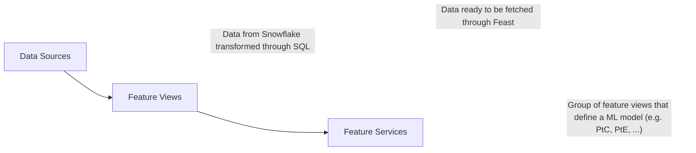

---

title: "Using Feast"
description: "How to use Feast to train ML models"
---

[Feast](https://docs.feast.dev/) is an open source feature store aimed to improve the process of obtaining, documenting and deploying features for data science (DS) models. In the DS Gitlab team we are currently focused on using the Offline Store (used for batch non-realtime predictions). The repository for Feast can be found [HERE](https://gitlab.com/gitlab-data/data-science-projects/feast-poc)

The most important concepts to understand the Feast Offline Store are:

1. [Data Sources](https://docs.feast.dev/v/master/getting-started/concepts/data-ingestion#data-source): The building blocks that contain the features that will be served. These can be specified as either a physical data source (CSV, parquet file, ...) or a SQL query. Since Feast is currently lacking a feature transformation engine, we define any feature transformations as SQL queries.
2. [Feature Views](https://docs.feast.dev/v/master/getting-started/concepts/feature-view#feature-views): Built with data sources and metadata of fields such as descriptions, tags, field type. Feature views are used when creating a new model, can be fetched through Feast.
3. [Feature Services](https://docs.feast.dev/v/master/getting-started/concepts/feature-retrieval#feature-services): Combination of fields from feature views that are needed to make inferences with the trained Machine Learning models. Feature services are used at the end, when we know which features are needed in the final model.



## Advantages of using a feature store

1. **Reusable Feature Pipelines:** Reduces time to build predictive models by enabling the creation of feature pipelines that can be shared and reused across different teams and projects.
2. **Consistency in Feature Engineering:** Ensures uniformity of features during both training and production stages, as features are engineered once and used in multiple contexts; reduces SQL redundancies
3. **Point-in-Time Correctness:** Automates the maintenance of historical data which helps with retrieving correct values at any specific point in the past, crucial for predictive accuracy.
4. **User Interface (UI):** Facilitate easier discovery and management of features, reducing time to model creation.
5. **Model Feature Versioning:** Implements version control for features, aiding in tracking changes and maintaining consistency across model iterations.
6. **Online Feature Store:** Supports real-time predictions with an online store, potentially valuable for future projects requiring immediate data processing.

## Setup

Feast uses a [registry](https://docs.feast.dev/getting-started/architecture-and-components/registry) that acts as a central catalog which stores the feature definitions and the necessary metadata. At Gitlab we store the registry in Snowflake.

There are two ways of interacting with the Feature Store:

1. Access already created feature views and services
2. Creating new feature views / services locally and testing them in your own unique database/Feast registry before asking for it to be merged to the production registry

For both of these workflows you need a read access to the `FEATURE_STORE.FEAST` schema in Snowflake, which can be granted through [Access Request](https://gitlab.com/gitlab-com/team-member-epics/access-requests/-/issues/new?issuable_template=Individual_Bulk_Access_Request).

To connect to the feature store we use the following command in python / jupyter notebook:

```python
from feast import FeatureStore
store = FeatureStore(fs_yaml_file=[credential_yaml_file])
```

Here `[credential_yaml_file]` indicates the YAML file with the necessary credentials to connect to the feature store. There are currently 3 credential files that can be chosen (these can be found in the [Feast repository](https://gitlab.com/gitlab-data/data-science-projects/feast-poc/-/tree/main/feature_repo?ref_type=heads)):

1. [production_feature_store.yaml](https://gitlab.com/gitlab-data/data-science-projects/feast-poc/-/blob/main/feature_repo/production_feature_store.yaml?ref_type=heads): This one connects to the production registry stored in the Snowflake database.schema `FEATURE_STORE.FEAST`. This YAML is used by the models ran in production and/or trained by CI.
2. [production_local_feature_store.yaml](https://gitlab.com/gitlab-data/data-science-projects/feast-poc/-/blob/main/feature_repo/production_local_feature_store.yaml?ref_type=heads): Similar to above, instead it uses your Snowflake credentials instead of production ones.
3. [staging_local_feature_store.yaml](https://gitlab.com/gitlab-data/data-science-projects/feast-poc/-/blob/main/feature_repo/staging_local_feature_store.yaml?ref_type=heads): This one connects to your personal Snowflake database and uses the registry stored there. For example, `{YOUR_USER}_PROD.FEAST`. This yaml file is only needed if you intend to follow the second workflow.

### Instruction

If you only want to interact with the Feature Store as described in the first option (fetching already made feature views / services), then follow only the first 3 steps. If you also want to create new and/or modify feature views and services, complete all of them:

1. Set up the environment variables in your `~/.zshrc` file. These are the variables that are referenced in the `[credential_yaml_files]`:

    ```console
    # Feast Development variables
    export FEAST_DEV_SNOWFLAKE_ACCOUNT="GITLAB"
    export FEAST_DEV_SNOWFLAKE_USER="{USER}@gitlab.com"
    export FEAST_DEV_SNOWFLAKE_AUTHENTICATOR="externalbrowser"
    export FEAST_DEV_SNOWFLAKE_ROLE="{USER}"
    export FEAST_DEV_SNOWFLAKE_WAREHOUSE="DEV_XS"
    export FEAST_DEV_SNOWFLAKE_SCHEMA="FEAST"
    export FEAST_DEV_SNOWFLAKE_DATABASE="{USER}_PROD"
    export FEAST_PROD_SNOWFLAKE_DATABASE="FEATURE_STORE"
    export FEAST_PROD_SNOWFLAKE_SCHEMA="FEAST"
    export FEAST_USAGE=False
    ```

    Where user correspond to your snowflake user. For example, JPEGUERO. Make sure {USER} is in uppercase.

2. Run the command: `source ~/.zshrc`
3. In Snowflake, run the following command: `CREATE OR REPLACE SCHEMA {USER}_PROD.FEAST;`. For example: `CREATE OR REPLACE SCHEMA JPEGUERO_PROD.FEAST;`
4. To run the repository locally install pipenv.
5. Clone the repository into the `~/repos` directory and cd into it.
6. Finally, run the following commands:

    ```console
    mkdir .venv
    pipenv install
    make run-feast-local
    ```

    These commands set up the python virtual environment. **If you would also like to run the sample workbook make sure to also install the dev dependencies:**

    ```console
    pipenv install --dev
    ```

`make run-feast-local` will run `feast apply` which creates the necessary infrastructure to deploy the offline store by the feature definitions in the feature_repo directory.

After this, the [model_feature_service_manager](https://gitlab.com/gitlab-data/data-science-projects/feast-poc/-/tree/main/model_feature_service_manager?ref_type=heads) is ran. This creates feature services out of YAML file definitions. These definitions needs to be stored in the [feature_repo/models](https://gitlab.com/gitlab-data/data-science-projects/feast-poc/-/tree/main/feature_repo/models?ref_type=heads) directory to be picked up.

### Running the UI locally

Currently we have the UI running in a VM that can be accessed by requesting permission to the Data Engineering team. In case you would like to run the UI locally, you can use one of these two commands:

1. `make ui-local`: This runs the UI locally against the production database / production registry. After running the command you can access it through the following [http://0.0.0.0:8889](http://0.0.0.0:8889).
2. `make ui-staging`: This runs the UI against your personal development database instead of the production database (for example, when creating a MR to introduce new features and you want to test locally).

## Project Structure

```text
├── feature_repo
│   └── product                             <- Feature definitions for product data.
|   |   └── queries                         <- Helper SQL queries to be used in the product data sources definitions.
│   └── marketing                           <- Intermediate data that has been transformed.
|   |   └── queries                         <- Helper SQL queries to be used in the marketing data sources definitions.
│   └── ...                                 <- Same as above.
|   |   └── queries                         <- Same as above.
|   |
|   └── models                              <- Contains YAML files with definitions for creation of feature services.
|   |
│   ├── entities.py                         <- [Entity](https://docs.feast.dev/getting-started/concepts/entity) definitions for the feature store.
|   |
│   └── helpers.py                          <- Helper functions to be used when building the feature definitions.
│   |
|   └── production_feature_store.yaml       <- Feast yaml file that contains credentials to sign in to database. To be used when deploying changes to production and reading features for production models.
|   └── production_local_feature_store.yaml <- Feast yaml file that contains credentials to sign in to database. To be used when querying the feature store locally.
|   └── staging_local_feature_store.yaml    <- Feast yaml file that contains credentials to sign in to database. To be used when testing changes to the feature store locally.
│
├── model_feature_service_manager           <- Module to generate feature services from a YAML file. Used to create feature services for DS models (PtC, PtE, ...)
│
├── orchestrate
|   └── mr_ci.py                            <- Script that generates the feature_store.yaml (configuration file) needed to run feast in MR CI.
```

Currently (V1) feature repository is split in different functional areas such as product data, marketing, sales, ... Each one of those directories contains the necessary SQL queries that are used to create the data sources and the python files that create the feature views and annotate the fields with metadata.

`actionable_insight` is one of the metadata fields that describes the feature, which is used to populate insights about scores. To learn how actionable insight features are used with a feature service, review [feature_repo.helpers.get_actionable_insight_descriptions](https://gitlab.com/gitlab-data/data-science-projects/feast-poc/-/blob/main/feature_repo/helpers.py?ref_type=heads#L14).

## Workflow

### Building ML models with Feast

Workflow summary:

1. Go to the Feast UI and find the features views that you want to use to train your model. Example: `product_stage_by_account_5_period_unit` and `product_stage_change_metrics_1_period_unit`
1. Copy the `production_feature_store.yaml`, `production_local_feature_store.yaml` and `staging_local_feature_store.yaml` to your ML project repository root.
1. Access feature views using the function [get_fields_from_feature_views](https://gitlab.com/gitlab-data/data-science-projects/feast-poc/-/blob/main/feature_repo/helpers.py?ref_type=heads#L23)
1. Note that our ML model might only need a fraction of the fields in the feature views for inference, therefore you can create [feature services](https://docs.feast.dev/v/v0.12-branch/getting-started/concepts/feature-service). To do that, in the [model directory](https://gitlab.com/gitlab-data/data-science-projects/feast-poc/-/tree/main/feature_repo/models?ref_type=heads) create a YAML file that defines the name of the feature service and the name of the feature views used together with the required fields. An example can be seen here for the [PtC V4 model](https://gitlab.com/gitlab-data/data-science-projects/feast-poc/-/blob/main/feature_repo/models/propensity_to_churn_contract/ptc_v4.yaml?ref_type=heads).
    1. An utility function that is helpful to create such YAMLs is [create_yaml_for_model_feature_service](https://gitlab.com/gitlab-data/data-science-projects/feast-poc/-/blob/main/feature_repo/helpers.py?ref_type=heads#L38).
1. Create a MR in this project and add the feature service yaml to the models directory. Test that the feature service contains all the features that you need.
    1. Feast can be build in a personal database by following the above [Setup section](/handbook/business-technology/data-team/platform/feast#setup). It allows to do local testing before pushing the changes to production. Make sure to use the `staging_local_feature_store.yaml` when fetching the feature services when working with the MR workflow.
1. Push the changes to the remote branch in the repository. Wait for the CI jobs `clone-image` (clones the Docker image from production so Feast can run) and `clone-feature-store-db` (clones the `FEATURE_STORE.FEAST` schema from production to a dedicated MR database) to pass.
1. Test the changes introduced to the feature store by running the CI job `test-on-mr`. This job runs the command `feast apply` on the MR feature store database testing that the feature store can run after the changes introduced.
1. After merging the MR and the feature service is now in production, connect to the feature store using the `production_local_feature_store.yaml` credential file or `production_feature_store.yaml` when running on CI. Going back to our python code, this would look like:

    ```python
    from feast import FeatureStore
    if is_local_development:
        store = FeatureStore(fs_yaml_file='path/to/production_local_feature_store.yaml')
    else:
        store = FeatureStore(fs_yaml_file='path/to/production_feature_store.yaml')
    ```

Sample jupyter notebook can be found [HERE](https://gitlab.com/gitlab-data/data-science-projects/feast-poc/-/blob/main/sample_workflow/build_model.ipynb?ref_type=heads).

Also, make sure to check out the current implementation of PtC, specifically [create_prod_models.ipynb](https://gitlab.com/gitlab-data/data-science-projects/propensity-to-contract-and-churn/-/blob/main/dev/v04_feast/create_prod_models.ipynb?ref_type=heads) and [scoring_code.ipynb](https://gitlab.com/gitlab-data/data-science-projects/propensity-to-contract-and-churn/-/blob/main/dev/v04_feast/prod_staging/scoring_code.ipynb?ref_type=heads), as it is a model fully created and moved to production CI using Feast.

## From Data Sources to serving features

[Per diagram](/handbook/business-technology/data-team/platform/feast#feast) at the top of the page, there are three stages to serve features in Feast:

- Data Sources
- Feature Views
- Feature Services

### Defining Data Sources and feature trasnsformations

To address lacking transformations in Feast, following types of SQL queries are used in the Gitlab Feast repository:

1. Simple aggregations such as SUM, AVG (with optional grouping by account id, opportunity id, etc)
1. Rolling / window aggregations - summing / averaging a certain value over a rolling window of past months / weeks / days. Example can be found in [product usage period usage query](https://gitlab.com/gitlab-data/data-science-projects/feast-poc/-/blob/main/feature_repo/product/product_usage.py?ref_type=heads), to create this type of aggregation:
    a. Create a "scaffold" CTE, this is, for every distinct account in the base table that the data source is based on we create an entry for the aggregation date we intend to use. In this case this means take all the entities together with all the snapshot_months.
    b. Join the scaffold back to the base CTE, we join on the main entity_id AND on the desired interval of aggregation date. In this case, we wanted a rolling window of 5 months, and this was accomplished with: `base.snapshot_month BETWEEN ADD_MONTHS(scaffold.snapshot_month, -5) AND scaffold.snapshot_month`.
1. Period over period transformation. A good example is [product usage change metrics query](https://gitlab.com/gitlab-data/data-science-projects/feast-poc/-/blob/main/feature_repo/product/queries/product_usage_change_metrics_period_unit.sql?ref_type=heads). The pattern here is to define a base CTE where we have the table at the wanted aggregation period, then we create a period_2 CTE which will be the data in the past. In this example we wanted to shift the data by 1 month in the past and this is accomplished with `DATEADD('month', 1, snapshot_month) AS snapshot_month_2` in the period_2 CTE.

The data source table in Feast should have following format:

| Entity_id (e.g. CRM_ACCOUNT_ID) | event_timestamp | metric (e.g. product_usage_unique_active_users) |
| -- | -- | -- |
| xxxx                            | 2023-01-01      | 44                                              |
| xxxx                            | 2023-02-01      | 49                                              |

The main `entity_id` in the data source is unique when combined with the `event_timestamp`. The metric field is the result of the SQL transformation. In case of [product usage period usage query](https://gitlab.com/gitlab-data/data-science-projects/feast-poc/-/blob/main/feature_repo/product/product_usage.py?ref_type=heads) this would be a CRM Account per event_timestamp (here: monthly aggregated data), and the metric would be something like the window average of `unique_active_users` in the `period_unit` of aggregation. If `period_unit = 5` we would have that the record of 2023-01-01 is averaging `unique_active_users` from 2022-09-01 to 2023-01-01, the record of 2023-02-01 averages from 2022-10-01 to 2023-03-02 etc

#### Parameters

Feast allows to create reusable queries that can be modified with parameters. It is useful when one model may require rolling 5 months for the product usage data, while the other - 3 months of the same product usage metrics.

1. **period_unit**: Queries with `period_unit` result in columns that indicate window of time (usually in months). When creating the feature view, the period_unit is substituted with provided value. For example, for [product usage period usage query](https://gitlab.com/gitlab-data/data-science-projects/feast-poc/-/blob/main/feature_repo/product/product_usage.py?ref_type=heads) a feature view named `product_usage_metrics_5_period_unit` was created by setting the `{period_unit}` value to 5 months, as seen [here](https://gitlab.com/gitlab-data/data-science-projects/feast-poc/-/blob/main/feature_repo/product/product_usage.py?ref_type=heads)
1. TODO - not implemented yet - **entity**: To address various levels of aggregation, variable `entity` can be used, which allows to extract specific granularity from the table. For example, when working with product-related table that is unique on both account and namespace level - entity will allow to refer to either of those granularities.

## Future improvements

1. Implement `feast apply` to run transformations for only those feature views or services that were updated (especially when testing locally)
1. Move helper functions to the `gitlabdata` python package.
1. Create authentication functions to replace the credential yaml files and avoid copy-pasting between repositories. This functionality should be added to `gitlabdata` python package.
