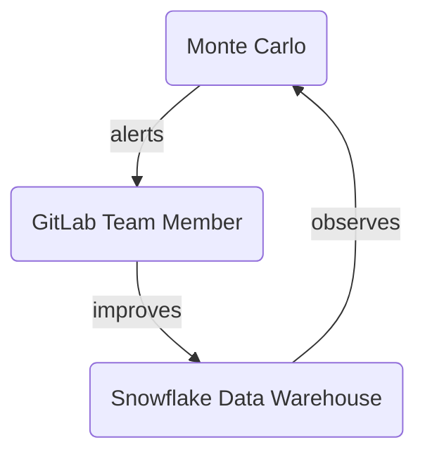

## What and why

[Monte Carlo](https://www.montecarlodata.com/) (MC) is our [Data Observability](https://www.montecarlodata.com/blog-what-is-data-observability/) tool and helps us **deliver better results more efficiently**.

The Data Team default for observing the status of the data is using Monte Carlo. Creating any tests (called monitors in MonteCarlo) are done via the UI of Monte Carlo and reported according to the [notification strategy](/handbook/business-technology/data-team/platform/monte-carlo/#notification-strategy). On another iteration in the near future we plan to implement [Monitors as Code](https://docs.getmontecarlo.com/docs/monitors-as-code) and these tests will also be version controlled. Currently dbt still used for existing tests, there is no roadmap in place to migrate these to Monte Carlo.

## How We Operate Monte Carlo

We use the [#data-pipelines](https://gitlab.slack.com/archives/C0384JBNVDJ) Slack channel for MC platform related alerts.
We are planning on using the [#data-analytics](https://gitlab.slack.com/archives/CBZD1BA5S) Slack channel in the near future for model related alerts, as soon as we have implemented the full notification strategy for Monte Carlo.
This work is planned under this epic for F23Q3: [Onboard Analytics Engineers to the Monte Carlo Tool](https://gitlab.com/groups/gitlab-data/-/epics/615)

Monte Carlo is an integral part of our [Daily Data Triage](/handbook/business-technology/data-team/how-we-work/triage/) and will replace the [TD Trusted Data Dashboards](/handbook/business-technology/data-team/platform/dbt-guide/#trusted-data-operations-dashboard).

The whole body of work covering the Monte Carlo rollout at GitLab falls under epic [Rollout Data Observability Tool with 100% coverage of Tier 1 Tables to improve Trusted Data, Data Quality, and Data Team member efficiency](https://gitlab.com/groups/gitlab-data/-/epics/567), where the work breakdown has been done and issues have been created to reflect the necessary steps until we are up and running with Monte Carlo on production.

## Logging In

Login to Monte Carlo is done via Okta. Go to https://getmontecarlo.com/signin.
The following screen appears upon login and after providing your email and clicking "Sign in with SSO", you should be redirected to your Okta login.
Please note, you need to login via SSO and not via username/password.

A runbook of how everything is technically set up can be found in the [Monte Carlo Runbook](https://gitlab.com/gitlab-com/business-technology/team-member-enablement/runbooks/-/wikis/IT-Runbooks/App-Setup/Monte-Carlo:-How-It's-Built).

The gist of it is that there is an Okta Group called `okta-montecarlo-users` that is maintained by the Data team and has the Monte Carlo app assigned to it.
In order to be able to access Monte Carlo via Okta by default, your user should be part of the `okta-montecarlo-users` group.
For that you should submit an AR (similar ARs: [Example AR 1]](https://gitlab.com/gitlab-com/team-member-epics/access-requests/-/issues/22860), [Example AR 2](https://gitlab.com/gitlab-com/team-member-epics/access-requests/-/issues/22878)) and assign it to Rigerta Demiri (@rigerta) or ping the #data channel linking the AR.

## Navigating the UI

Once logged in, you should be able to see the Monte Carlo Monitors dashboard with details on the objects being monitored and several custom monitors that have already been set up.

You can create a new monitor or view existing monitor details, such as definition and schedule and any anomalies related to it.
Alternatively, you can also list all the incidents by clicking on the Incidents menu item on the top menu bar, you can search for a specific model by querying the Catalog view or check Pipelines for a detailed lineage information on how the data flows from the source to the production model.

Depending on the role assigned to your user (by default every user logging in via SSO is assigned a Viewer role), you might be able to see Settings and check existing users and integrations (such as Slack integration, Snowflake integration, dbt integration etc.)

If you need your role to be updated, you can reach out to anyone on the data platform team and they will be able to modify your existing role.

More information on navigating the UI can be found in the [official Monte Carlo documentation](https://docs.getmontecarlo.com/docs/how-to-navigate-the-monte-carlo-ui).

## Adding a New Monitor

Monte Carlo will be running volume, freshness and schema change monitors by default on all the objects it has access to.
However, these checks are based on update patterns the tool learns from the data and if you need a specific custom check that runs on a certain schedule, you might want to add a custom monitor for that.

The official Monte Carlo documentation on monitors can be found in the [Monitors Overview guide](https://docs.getmontecarlo.com/docs/monitors-overview).

## Fine-Tuning an Existing Monitor

If you want to modify an existing monitor, depending on the type of monitor, you can modify different parts of it such as the schedule, the timestamp field to be taken into account & the alert condition.

## Responding To A Slack Alert

Currently, when we are getting notifications on different Slack channels, we can already triage the issue via Slack by assigning a status to it choosing from: `Fixed`, `Expected`, `Investigating`, `No action needed` and `False positive` (`No status` is a default status by MonteCarlo).
Once we start investigating and we have a finding, if we write a comment on Slack in the same notification thread, that comment will automatically be added to the incident on Monte Carlo.

Our goal is to be able to integrate Monte Carlo with GitLab so that whenever we get an alert on Slack, a triage issue would automatically be opened on GitLab and we'd follow the same [Data Triage procedure](/handbook/business-technology/data-team/how-we-work/triage/) as usual.

There is detailed information including a video section in the official Monte Carlo documentation on [how to respond to an alert](https://docs.getmontecarlo.com/docs/explore-monte-carlo-incidents).

### Incident status

Each MonteCarlo incident has always a status. See the folowwing list when to use which status:

| MonteCarlo status   | Context                                                                                                                                       | Actions done or to -do                                                                 |
|---------------------|-----------------------------------------------------------------------------------------------------------------------------------------------|----------------------------------------------------------------------------------------|
| Fixed               | Incident is not active anymore.                                                                                                               | Actively worked on resolving the incident or the incident is normalized automatically. |
| Expected            | Incident was flagged by MonteCarlo **correctly**. We knew that this was coming, like a batch update or a schema change that was in the works. | None                                                                                   |
| Investigating       | Actively working on the incident                                                                                                              | Root cause investigation and resolve if needed                                         |
| No action needed    | Incident was flagged by MonteCarlo **correctly**, but its not a breaking change                                                               | None                                                                                   |
| False positive      | Incident was flagged by MonteCarlo **wrongly**                                                                                                | None                                                                                   |
| No Status           | Default status by MonteCarlo                                                                                                                  | Start investigating and update status                                                  |

## Note on DWH Permissions

In order for Monte Carlo to be integrated with Snowflake, we have had to run the permissions script as specified in the [official docs](https://docs.getmontecarlo.com/docs/snowflake) for each database we needed to monitor.
The same script has to be run as many times as we have databases to monitor (in our case `raw`, `prep` and `prod`) with the correct values for the `$database_to_monitor` variable. The scrips foresees new tables to be added to existing schemas. In case of a new schema the script has to be executed again for the database the schema resides. The data observability user is stored on our internal data vault.

Please note this is an exception to our usual permission-handling procedure, where we rely on Permifrost, because observability permissions are an edge-case for Permifrost and not yet supported by the tool.
There is an ongoing [feature request](https://gitlab.com/gitlab-data/permifrost/-/issues/120) on Permifrost for adding granularity to the way permissions are set, but no solution has been agreed on yet.

#### Muting Monte Carlo alerts for sandbox schema's

Sandbox environments are generally created for the purpose of testing. We normally don't take any actions on them even if any alerts come through in our triage slack channels. For this reason, with the confirmation from stakeholders we mute notifications from within monte carlo for sandbox schemas to avoid getting any alerts from them. To mute a schema, head over to [mute-datasets page](https://getmontecarlo.com/settings/muted-data/datasets).

## Notification strategy

All incidents are reported in MonteCarlo incident portal. For triage purposes the most important (which requires action) are routed towards Slack. The following matrix shows per data area which type of monitors are routed and towards which channel:

| Database | DataScope                                               | Volume               | Freshness      |  Schema changes                                   | Custom monitors|
|-----------|------------------------------------------------------|----------------------|----------------------|-------------------------------------|----------------------|
| RAW       | TIER1                                                | #data-pipelines      | #data-pipelines      | #analytics-pipelines (once per day) | #data-pipelines      |
|           | TIER2                                                | #data-pipelines      | #data-pipelines      | #analytics-pipelines (once per day) | #data-pipelines      |
|           | TIER3                                                | #data-pipelines      | #data-pipelines      | #analytics-pipelines (once per day) | #data-pipelines      |
| PREP      | n/a                                                  | -                    | -                    | -                                   | -                    |
| PROD      | COMMON `*` | #analytics-pipelines | #analytics-pipelines | -                                       | #analytics-pipelines                                       |
|           | WORKSPACE  `**`                                      | -                    | -                    | -                                   | -                    |
|           | WORKSPACE-DATA-SCIENCE     | #data-science-pipelines | #data-science-pipelines                     | -                                   | #data-science-pipelines |
|           | LEGACY `***`                                         | -                    | -                    | -                                   | -                    |

`*` COMMON is also the COMMON_RESTRICTED equivalent. It excludes `COMMON_PREP` and `COMMON_MAPPING`
`**` WORKSPACE-DATA-SCIENCE is the only workspace schema we are including in the notification strategy
`***` Only these two models (`snowplow_structured_events_400` and `snowplow_structured_events_all`) of the `LEGACY` schema have been included temporarily as per MR [!7049](https://gitlab.com/gitlab-data/analytics/-/merge_requests/7049)

This notification strategy is the basis for any alert being sent from Monte Carlo towards Slack. However, as of [Notifications 2.0](https://docs.getmontecarlo.com/docs/notifications-v2) Monte Carlo has introduced *Audiences*.
This means, the above notification strategy has now been migrated towards Audiences and we have the following Audiences in place, sending alerts to Slack channels as specified below:

| Audience                          | Slack Channel                                        |
|-----------------------------------|------------------------------------------------------|
| Analytics Engineers               |      #analytics-pipelines                            |
| Analytics Instrumentation         |      #g_analyze_analytics_instrumentation            |
| Data Engineers                    |      #data-pipelines                                 |
| Data Science                      |      #data-science-pipelines                         |
| Sales Analytics                   |      #sales-analytics-pipelines                      |

## Domains

We have the availability to use [domains](https://vimeo.com/646676972) in our Monte Carlo environment. Currently domains can be used to create separate environments for separate team members,  domains automatically filter monitors and incidents by projects and datasets. We have a limited number of domains available.

| Domain | Description | Data Scope |
| ------ | ----------- | ---------- |
| Data Platform Team | Domain for the Data Platform Team - scope raw data layer in Snowflake | Snowflake `raw` layer |

### Use domains

In Monte Carlo UI in the top right corner there is a dropdown box available which you can select a particular domain or all domains.

## BI Integrations

When we initially deployed Monte Carlo at GitLab, we defaulted to Sisense as a BI tool, as it was what we were using at the time.
However, recently we have started migrating to Tableau and therefore we have added the Tableau integration to our Monte Carlo instance.

It is now possible to check table and field lineage from our raw models to Tableau objects, such as Tableau Views, Tableau Live Data Sources or Tableau Extract Data Sources.

The Sisense integration and Tableau integration coexist on Monte Carlo and all related Sisense charts as well as Tableau objects can be seen on the lineage charts.

## Internal Monte Carlo handbook page

Additional internal information is available in our [Internal GitLab Handbook](https://internal.gitlab.com/handbook/enterprise-data/platform/monte-carlo).
