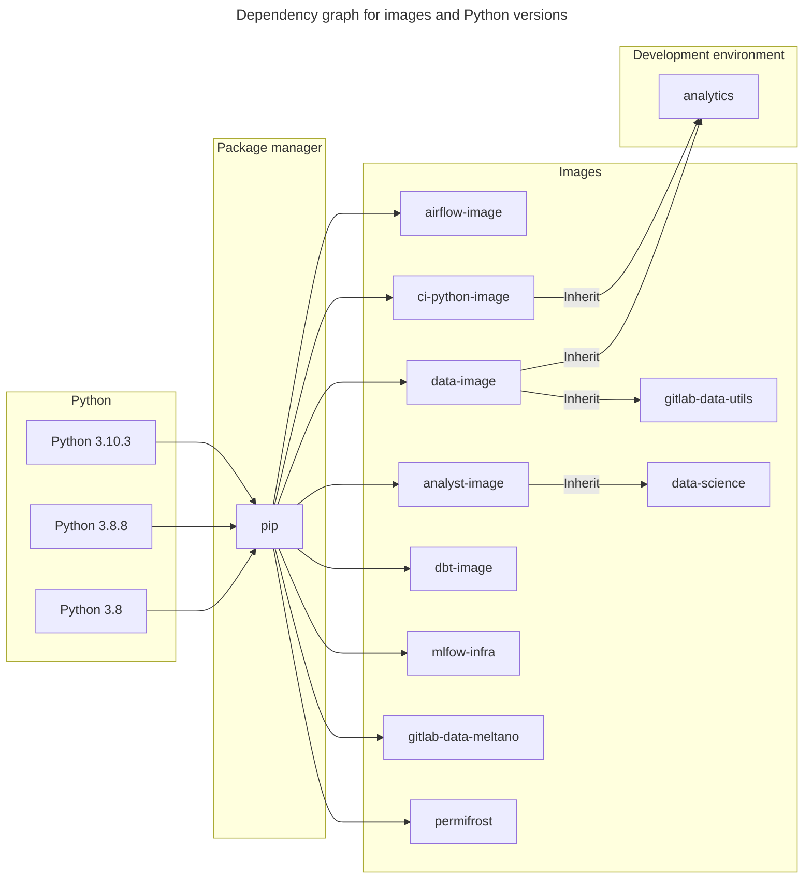

On this page the main intention is to keep all details about the inventory we are using for the Data Platform, mainly thinking of the Python libraries and the following tools.
The motivation is to keep a neat inventory list with details and criteria of who, why, when and what we will upgrade. Also, the plan is to expose detailed conditions regarding the upgrade and command line application to gather all details about the recent and latest versions of Python libraries. The inventory list contains:

- 🐍 `Python` versions in use
- 🛠 Tools we are using (`dbt`, `airflow`, `permifrost`, `meltano`)
- 📚 Python libraries _(packages)_ in use (i.e `pandas`, `requests`, `matplotlib`)

We strive to have a DRI for every tool or package. The DRI responsibility is to keep that tool or package in a healthy shape by advice and or initiate upon upgrades.

## General motivation for upgrading

As the tool upgrading strategy is specific to each tool, it is up to DRI when the upgrade will happen and under which circumstances.

Motivation for upgrading:

1. Reduce vulnerabilities
1. Fix bugs and crashes
1. Ensure compatibility with other updated technologies
1. New functionality introduced which we intend to use
1. Ensure proper support
1. Easier future upgrades (not falling to far behind on version)
1. Marketplace relevance
1. End of life

### End of life check up

At **minimum** we abide to and end of life policy. This is because anything becomes deprecated usually no longer receives any bug fixes, even critical security ones, which is a security risk to us.
The main benchmark for updating the Python version is the `end-of-life` parameter. In case, the version is not supported anymore, should be a candidate for upgrading.

## Initiate/Schedule a version upgrade

A DRI is an expert in the domain of their tool or package and monitors new versions and releases. If and when an upgrade is applicable, the advise and initiates an upgrade. This advice contains:

1. Motivation for the upgrade
1. Impact and dependencies
1. Criticality of the upgrade (timeline)

Above will be documented in an issue and discussed during a weekly Data Platform Team meeting.

### Planning

Upgrades are scheduled as an OKR (P2) on a quarterly basis, following the Data Planning drumbeat. If needed (i.e. in case of a security vulnerability) we can schedule during the quarter as a P1. This will result compromising P2-OKR work that was already scheduled.

## Python Image/Container Inventory List

There are several images we are using 🐍`Python`. Various versions are in use (`>=3.7`), due to the following reasons:

- use cases are various for the different projects
- some libraries require a specific 🐍`Python` version _(due to dependencies)_
- multiple teams are using images and they have requirements for the specific versions implementation

> **Table 1:** List of images we are using

| Image                                                                                                             | Version in use | Image version                                                      | DRI       | User                  |
|-------------------------------------------------------------------------------------------------------------------|----------------|--------------------------------------------------------------------|-----------|-----------------------|
| [analytics](https://gitlab.com/gitlab-data/analytics/-/blob/master)                                               | `3.10`         | `N\A`                                                              | `TBA`     | `Data Platform`       |
| [airflow-image](https://gitlab.com/gitlab-data/airflow-image/-/blob/main/src/Dockerfile?ref_type=heads)           | `3.8`          | `python:3.8`                                                       | `TBA`     | `Data Platform`       |
| [analyst-image](https://gitlab.com/gitlab-data/analyst-image/-/blob/main/src/Dockerfile?ref_type=heads)           | `3.8.8`        | `jupyter/tensorflow-notebook:python-3.8.8`                         | `TBA`     | `Analytics Engineers` |
| [ci-pyhton-image](https://gitlab.com/gitlab-data/ci-python-image/-/blob/main/src/Dockerfile) | `3.8`          | `python:3.8-slim-buster`                                           | `TBA`     | `Data Platform`       |
| [data-image](https://gitlab.com/gitlab-data/data-image/-/blob/master/data_image/Dockerfile?ref_type=heads)        | `3.10.3`          | `python:3.10.3`                                                       | `TBA`     | `Data Platform`       |
| [data-science](https://gitlab.com/gitlab-data/data-science/-/blob/main/docker-compose.yml?ref_type=heads)         | `3.8.8`        | `registry.gitlab.com/gitlab-data/data-image/analyst-image:v0.0.19` | `TBA`     | `Data Scientists`     |
| [dbt-image](https://gitlab.com/gitlab-data/dbt-image/-/blob/main/src/Dockerfile)             | `3.10.3`       | `python:3.10.3`                                                    | `TBA`     | `Data Platform`       |
| [gitlab-data-meltano](https://gitlab.com/gitlab-data/gitlab-data-meltano/-/blob/main/Dockerfile?ref_type=heads)   | `3.8`          | `meltano/meltano:v2.16.1-python3.8`                                | `TBA`     | `Data Platform`       |
| [mlfow-infra](https://gitlab.com/gitlab-data/mlflow-infra/-/blob/main/mlflow_image/Dockerfile?ref_type=heads)     | `3.8`          | `python:3.8`                                                       | `TBA`     | `Data Scientists`     |

<details><summary>Dependency graph (Click to expand)</summary>



</details>

### Approach to update Python version

The current section is the guideline of how and when to upgrade the 🐍`Python` version in the particular image. There is no unified condition of **when** to upgrade the Python version, most of the listed items are recommendations and best methods. The main reason for this statement is the versatile use cases for the images we are using.

Another vital benchmark for extra upgrading is security vulnerabilities. Source for checking potential Python vulnerabilities:

- [cvedetails: Python: Security Vulnerabilities](https://www.cvedetails.com/vulnerability-list/vendor_id-10210/product_id-18230/Python-Python.html)
- [readthedocs: Python Security Vulnerabilities](https://python-security.readthedocs.io/vulnerabilities.html)

In case of any known and confirmed Python vulnerabilities, we should start a process for upgrading the Python version as soon as possible.

Generally, in the following tex exposed a set of advices and, if there is a particular reason **NOT** to upgrade the 🐍`Python` version, will be good to expose the explanation.

For maintaining and upgrading 🐍`Python` versions and check when the particular version will become obsolete, check on [Python supported timeline](https://devguide.python.org/versions/), or alternatively can check [endoflife.date](https://endoflife.date/python). The inventory list for the images we are using is listed in the table below.
Python version upgrades will be determined from case to case as the impact can be huge on the image. A good option is to consider `end-of-life` for the particular version.

Example for the `end-of-life` policy:
Regarding the upgrade policy, think we should at the **minimum** abide by the end of life policy.
This is because anything becomes deprecated usually no longer receives any bug fixes, even critical security ones, which is a security risk to us.

> 1. [Python life cycle](https://devguide.python.org/versions/), we are currently using the following Python versions which are either at end-of-life or close to it:
>    1. `3.7` already at end of life
>    1. `3.8` at end of life in end of 2024

## Tools inventory list

> **Table 2:** List of tools GitLab Data team is using

| Tool name                                                                                                   | Version in use | Version supported timeline                                                                                                                                                                                                                                                                         | How to upgrade   | DRI       | Users                                                               | Upgrade Policy |
|-------------------------------------------------------------------------------------------------------------|----------------|----------------------------------------------------------------------------------------------------------------------------------------------------------------------------------------------------------------------------------------------------------------------------------------------------|------------------|-----------|---------------------------------------------------------------------| ------------ |
| [dbt](https://about.gitlab.com/handbook/business-technology/data-team/platform/dbt-guide/)                  | `1.6.4`        | [link](https://docs.getdbt.com/docs/dbt-versions/core#latest-releases)| - [dbt best practices for upgrading](https://docs.getdbt.com/docs/dbt-versions/core#best-practices-for-upgrading)<br>- [Upgrading dbt version](https://gitlab.com/gitlab-data/runbooks/-/blob/main/infrastructure/upgrading_dbt_version.md)  | `TBA`     | - `Data Platform`<br>- `Analytics Engineers`<br>- `Data Scientists` | Not more than 2 versions behind (beta release excluded) and minimum support level `critical` |
| [airflow](https://about.gitlab.com/handbook/business-technology/data-team/platform/infrastructure/#airflow) | `2.5.3`        | [link](https://airflow.apache.org/docs/apache-airflow/stable/installation/supported-versions.html#version-life-cycle) | [Upgrade Plan for Airflow](https://gitlab.com/gitlab-data/analytics/-/issues/11804)                                                                                                                                                          | `TBA`     | `Data Platform`                                                     | Current version released > 1 year |
| [permifrost](https://about.gitlab.com/handbook/business-technology/data-team/platform/permifrost/)          | `0.15.4`       | [link](https://gitlab.com/gitlab-data/permifrost)                                                                     | [Upgrading permifrost version](https://gitlab.com/gitlab-data/permifrost/-/blob/master/RELEASE.md?ref_type=heads)                                                                                                                            | @rbacovic | `Data Platform`                                                     | Not more than 2 versions behind (beta release excluded) |
| [meltano](https://about.gitlab.com/handbook/business-technology/data-team/platform/Meltano-Gitlab/)         | `2.16.1`       | [link](https://github.com/meltano/meltano/releases)                                                                   | [Upgrade Meltano version](https://gitlab.com/gitlab-data/gitlab-data-meltano/-/merge_requests/34)                                                                                                                                            | `TBA`     | `Data Platform`                                                     | Current version released > 1 year |

### dbt packages inventory

| package name                                                                                | Version in use |  DRI  | User                                   |
|---------------------------------------------------------------------------------------------|----------------|-------|----------------------------------------|
| [snowflake_spend](https://gitlab.com/gitlab-data/snowflake_spend)                           | `1.1`          | `N\A` |-Data Engineers<br>-Analytics Engineers |
| [data-tests](https://gitlab.com/gitlab-data/data-tests)                                     | `N\A`          | `N\A` |-Data Engineers<br>-Analytics Engineers |
| [dbt-labs/audit_helper](https://github.com/dbt-labs/dbt-audit-helper)                       | `0.9.0`        | `N\A` |-Data Engineers<br>-Analytics Engineers |
| [dbt-labs/dbt_utils](https://github.com/dbt-labs/dbt-utils)                                 | `1.1.1`        | `N\A` |-Data Engineers<br>-Analytics Engineers |
| [dbt-labs/snowplow](https://github.com/dbt-labs/snowplow/tree/0.15.1/)                      | `0.15.1`       | `N\A` |-Data Engineers<br>-Analytics Engineers |
| [dbt-labs/dbt_external_tables](https://hub.getdbt.com/dbt-labs/dbt_external_tables/latest/) | `0.8.7`        | `N\A` |-Data Engineers<br>-Analytics Engineers |
| [brooklyn-data/dbt_artifacts](https://github.com/brooklyn-data/dbt_artifacts)               | `2.6.1`        | `N\A` |-Data Engineers<br>-Analytics Engineers |

### Approach to update tools version

Example for the `end-of-life` policy:
Regarding the upgrade policy, think we should at the **minimum** abide by the end of life policy.
This is because anything becomes deprecated usually no longer receives any bug fixes, even critical security ones, which is a security risk to us.

> 1. the [airflow life cycle](https://airflow.apache.org/docs/apache-airflow/stable/installation/supported-versions.html), end of life for `1.10.15` was `June 17, 2021` so going forward, we should try to upgrade much earlier if following this end of life rule
> 1. dbt [latest releases](https://docs.getdbt.com/docs/dbt-versions/core#latest-releases)
>    1. `v1.2` and `v1.3` are already at their end of life and will be completely deprecated end of 2023
>    1. dbt describes [best practices](https://docs.getdbt.com/docs/dbt-versions/core#best-practices-for-upgrading) for upgrading, one of them being to at least upgrade to new `patch versions`, which are _"bugfix"_ or _"security"_ releases

## Libraries inventory list

The libraries inventory list is a bit automated process where we have a command line application that gathers all the information we need for upgrading libraries. Besides gathering all information about libraries, the application generates 2 reports that can be attractive for the upgrade process:

1. **Get inventory list for each image** - For utilities to check if the library we are implementing is outdated and how far away from the latest version.
2. **Check duplicated versions among images** - To check if there is the version is in use in more than one image and the version is not in sync. If there is a version of libraries not in sync, possibly there is a specific reason why they are mismatched. Generally, it will be handy to keep the unique version across images _(if possible and not a stopper)_.

To be able to run this program, checkout the `/package_inventory` [repo](https://gitlab.com/gitlab-data/package_inventory/-/tree/master/README.md) and run the following code:

- Run program

```bash
# run file
python3 gitnventory.py [--dry-run] [--logging [print/logging]] [--report_folder DEFINE_FOLDER] [--log_file DEFINE_LOG_FILE] [--help]
```

For more details how the program if running, refer to the [**source code**](https://gitlab.com/gitlab-data/package_inventory/-/tree/master/README.md).

**Note:** Keep in mind that we are relying on [PyPi](pypi.org) and [GitLab Data](https://gitlab.com/groups/gitlab-data) group as a primary source of the latest version of the library.

> **Table 3:** DRI for Python libraries

| Tool name        | DRI       |
|------------------|-----------|
| Python libraries | @rbacovic |

### Approach to updating libraries

Proposal for creating a candidate list for upgrading criteria:

> **Table 4:** Example criteria for upgrading Python, tools or libraries version

| Criteria                                                                             | Example                                                                     | Risk for the implementation<br>(1.0 low, 5.0 high) |
|--------------------------------------------------------------------------------------|-----------------------------------------------------------------------------|----------------------------------------------------|
| The current version is outdated and not supported anymore (the `end-of-life` policy) | [Python 2.7](https://docs.python.org/release/2.7/)                                                          | `4.0` ⭐⭐⭐⭐☆                                        |
| The current version is vulnerable                                                    | [Article](https://unit42.paloaltonetworks.com/malicious-packages-in-pypi/)  | `N\A`                                              |
| Major version released                                                               | Current version: `2.1.0`<br>Latest version `3.0.0`                          | `3.0` ⭐⭐⭐☆☆                                        |
| Minor version released                                                               | Current version: `2.1.0`<br>Latest version `2.2.0`                          | `1.0` ⭐☆☆☆                                         |
| Patch version released                                                               | Current version: `2.1.0`<br>Latest version `2.1.8`                          | `1.0` ⭐☆☆☆☆                                        |

As the library updating can be difficult to determine when and why to upgrade, a few considerations can assist us here. We should think about upgrade (in addition to the `end-of-life` criteria):

- Need a new feature for a particular version - in case there is a significant feature we need/want to use, should go for the upgrade
- Upgrade only if serious vulnerability in package - this is always a red flag and we should start upgrading immediately
- Upgrade if behind more than x major/minor versions - probably good reason to move on with the upgrade, with serious consideration of the impact. For instance, jumping to the newer major version, in some cases requires a new version of Python. If the risk is assessed properly, should move on

#### Dependency check up

The reason for upgrading can be dependent tool/package. For instance, if you plan to upgrade `dbt` and sometimes it requires upgrading 🐍 `Python` as well _(for `dbt-image` image)_. That can be the reason to upgrade Python as it is required by other tools _(`dbt` in this example)_.

## Tips and tricks for upgrading

✅ **Do`s**:

- Do the extraordinary upgrade [when there is a known issue](https://www.cisa.gov/known-exploited-vulnerabilities-catalog) that can impact our platform
- When upgrading the 🐍 `Python` package to a major version change, check compatibility with the Python version active in the image as there can be a collision with it
- Check if a 🐍 `Python` package you want to install/upgrade is safe and does not contain malicious code
- Always check backward compatibility with other packages _(pipelines in the project will help you here during the image build)_.

🛑 **Dont`s**:

- Do not upgrade to the `pre-release` version of the software, always use a [stable release](https://en.wikipedia.org/wiki/Software_release_life_cycle#Stable_release) version
- Do not use `non-trusted` sources. We prefer [PyPi](pypi.org) or packages from [GitLab Data](https://gitlab.com/groups/gitlab-data) group for the source of the installation

### Upgrade logging

> **Table 5:** Log activities regarding the upgrade

| Quarter<br>_(In which quarter we do upgrade planning) | Issue for check upgrades<br>_(Put the link to the issue you plan to use for the upgrade planning)_ | Upgrade execution<br>_(In which quarter we do upgrade execution)_ | Epic for planned upgrade<br>_(Put the link to the epic you plan to use for the upgrade execution)_ | Type of upgrading<br>[`Python`\|`Tool`\|`Libraries`]<br>(What type of object you plan to upgrade) | DRI<br>_(The individual who will check what is required for the upgrade planning)_ |
|-------------------------------------------------------|----------------------------------------------------------------------------------------------------|-----------------------------------------------------------------|----------------------------------------------------------------------------------------------------|-----------------------------------------------------------------------------------------------------|------------------------------------------------------------------------------------|
| `FY24Q4`                                              | [#19248](https://gitlab.com/gitlab-data/analytics/-/issues/19248#package-version-inventory)        | `FY25Q1`                                                        |                                                                                                    |                                                                                                     | @rbacovic                                                                          |
| `FY25Q1`                                              | [#20233](https://gitlab.com/gitlab-data/analytics/-/issues/20233)                                                                                                  | `FY25Q2`                                                        |                                                                                                    |                                                                                                     |@rbacovic                                                                           |
| `FY25Q2`                                              |                                                                                                    | `FY25Q3`                                                        |                                                                                                    |                                                                                                     |                                                                                    |
| `FY25Q3`                                              |                                                                                                    | `FY25Q4`                                                        |                                                                                                    |                                                                                                     |                                                                                    |
| `FY25Q4`                                              |                                                                                                    | `FY26Q1`                                                        |                                                                                                    |                                                                                                     |                                                                                    |
