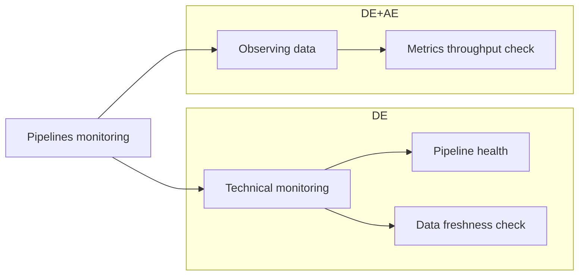
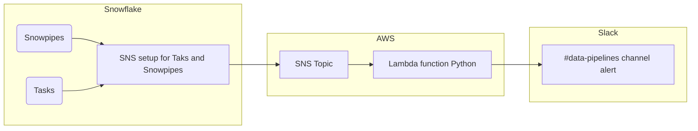
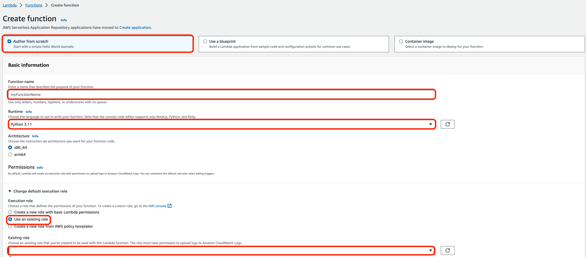
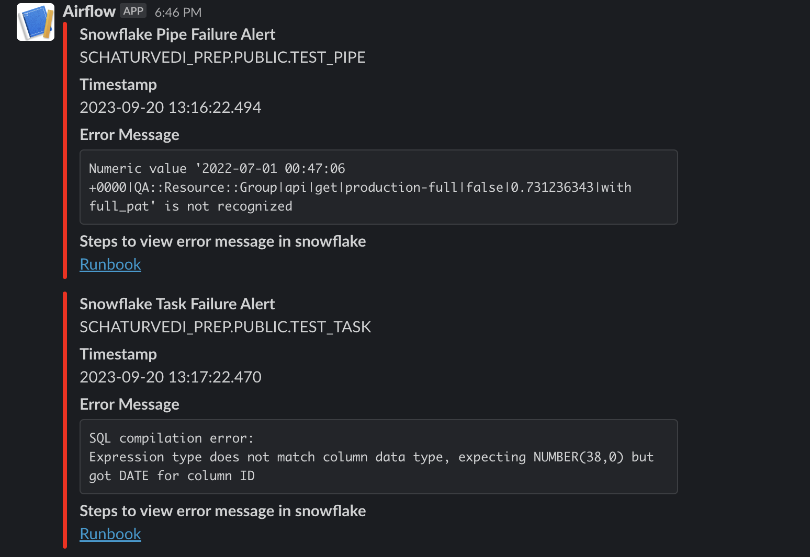

---

title: "Snowflake Guide"
description: "Snowflake Data Warehouse Guide"
---


---

## What and why

[Snowflake](https://www.snowflake.com/) is our Enterprise Data Warehouse (EDW) and is the core technology in our [Enterprise Data Platform](/handbook/business-technology/data-team/platform/#our-data-stack).

## What does Snowflake Contain?

Snowflake contains all of our analytical data and [Data Source](/handbook/business-technology/data-team/platform/#data-sources)s defines the set of original/raw data available.

## Related Content

- [Access](/handbook/business-technology/data-team/platform/#warehouse-access)
- [Support Portal Access](/handbook/business-technology/data-team/platform/#data-warehouse)
- [Compute Resources](/handbook/business-technology/data-team/platform/#compute-resources)
- [Data Masking](/handbook/business-technology/data-team/platform/#data-masking)
- [Backups](/handbook/business-technology/data-team/platform/#backups)

## Logging In

Login to Snowflake from Okta.

## Navigating the UI

The [Snowflake Quick Tour of the Web Interface](https://docs.snowflake.com/en/user-guide/snowflake-manager.html) provides comprehensive documentation for the UI.

## Snowflake account configuration

### ABORT_DETACHED_QUERY

[ABORT_DETACHED_QUERY](https://docs.snowflake.com/en/sql-reference/parameters#abort-detached-query) parameter is set on account level to `True`.

We often have cases where the connectivity was lost and the query keeps trying to run and still does not complete. It is meaningless for the query to keep running in these cases and adds no value. There is a grace period of 5 mins. If the connectivity isn’t fixed in 5 mins now, it stops the execution after the 5 mins so the warehouses won’t be running unnecessarily.

## Snowflake SNS integration for snowflake snowpipe and task for failure

Snowpipe can push error notifications to a cloud messaging service when it encounters errors while loading data i.e. through snowpipe or on failure of snowflake task. The notifications describe the errors encountered in each file, enabling further analysis of the data in the files for snowpipe. Task error notifications trigger a notification describing the errors encountered when a task executes SQL code. The notifications describe any errors encountered during task execution.

Currently, cross-cloud support is not available for push notifications. Configure error notification support for the messaging service provided by the cloud platform where your Snowflake account is hosted.

Since our Snowflake is hosted in AWS  the setup for push notification has been done in AWS.

For both snowpipe and snowflake task the SNS integration is same.
Over here [enabling-error-notifications](https://docs.snowflake.com/en/user-guide/data-load-snowpipe-errors-sns#enabling-error-notifications) Snowflake has defined steps for the same.

### Snowflake SnowPipe and Tasks Triage

Notified a repeatable situation occurred:

- Occasionally we see a drop in data and notify it after some time - we implemented mechanism to have a push warning about missing or incomplete data. Usually, we use a reactive approach after we are informed from the business side, which is not the preferred way. Now, we are more proactive and alerted immediately when error happened.
- The pipelines we monitor (`version_db`, `Snowplow`, `PTO`) are running either via `Snowflake tasks` or `Snowpipe` mechanism.
- Used a comprehensive approach to focus and reveal shape and status of pipelines inside `Snowflake`

#### Workflow



#### Technical monitoring

Have to make sure that we get notified via `Slack` if there are errors on SnowPipe and/or Snowflake tasks. In case of an error and if it turns out that the root cause is upstream we have to solve in collaboration with source owners. The `Data Platform` is responsible for health of pipelines.



Below covered details of the name and commands used for setup.

### **Step 1: Created SNS topic in AWS  named `gitlab-snowflake-notification` following the instructution.**

For this full access on SNS topic should be provided to the user
Same SNS topic can be used for all snowflake task and snowpipe push notification.
Capture the ARN value for the topic as it will be required in step 4.

### **Step 2: Requested IT help for  Creating the IAM Policy in AWS**

It Create an AWS Identity and Access Management (IAM) policy that grants permissions to publish to the SNS topic.

### **Step 3: Requested IT help for Creating the AWS IAM Role in AWS.**

Create an AWS IAM role on which to assign privileges on the SNS topic
Record the Role ARN value located on the role summary page.

### **Step 4: Creating the Notification Integration in snowflake**

To create Notification Integration [ACCOUNTADMIN](https://docs.snowflake.com/en/user-guide/security-access-control-considerations#using-the-accountadmin-role) privileges are required.

```sql
CREATE OR REPLACE NOTIFICATION INTEGRATION gitlab_data_notification_int
  ENABLED = true
  TYPE = QUEUE
  NOTIFICATION_PROVIDER = AWS_SNS
  DIRECTION = OUTBOUND
  AWS_SNS_TOPIC_ARN = '<topic_arn>'
  AWS_SNS_ROLE_ARN = '<iam_role_arn>';
```

### **Step 5: Granting Snowflake Access to the SNS Topic**

Run below query in Snowflake:

```sql
  DESC NOTIFICATION INTEGRATION gitlab_data_notification_int;
```

And capture **SF_AWS_IAM_USER_ARN** and **SF_AWS_EXTERNAL_ID** post this modify the Trust Relationship in the IAM Role by setting

```json
 {
  "Version": "2012-10-17",
  "Statement": [
    {
      "Sid": "",
      "Effect": "Allow",
      "Principal": {
        "AWS": "<sf_aws_iam_user_arn>"
      },
      "Action": "sts:AssumeRole",
      "Condition": {
        "StringEquals": {
          "sts:ExternalId": "<sf_aws_external_id>"
        }
      }
    }
  ]
}
```

 This will require the IT help to update the policy.

### **Step 6: Grant usage permission on integration to loader role**

With `ACCOUNTADMIN` role execute below in Snowflake.

```sql
 GRANT USAGE on  INTEGRATION gitlab_data_notification_int to role loader;
```

**Note:** `Above  setup should not be modified because modifying any step will require all the step from 1 to 6 redo  as the integration will break.`

### **Step 7: Create Lambda function to send slack notification**

For this the user should have `Create lambda function` and `ListRoles` permission in AWS. If any of those 2 privileges are missing, create an [**AR issue**](https://gitlab.com/gitlab-com/team-member-epics/access-requests/-/issues/new).

For Creating lambda function select the following :

1. `Author from scratch`
1. Give unique name to lambda function
1. Select any of the `Python` version (everything `>=3.10` is fine)
1. Architecture `Default`
1. Under `Change default execution role`  select `Use an existing role` and under this select `Gitlab-lambda-snowflake`
1. Click `Create function` button

More details are shown in the image below.



Once the function is created under code you can set up the basic Python code to send the `Slack` notification. Here is an example from our `gitlab_snowflake_notification` lambda code:

``` python
import urllib3
import json
import os

http = urllib3.PoolManager()

def lambda_handler(event, context):
    url = os.environ["slack_webhook_url"]
    data = event["Records"][0]
    timestamp = data["Sns"]["Timestamp"]
    timestamp = timestamp.replace("T", " ").replace("Z", "")
    task_details= json.loads(data["Sns"]["Message"])
    if 'taskName' in task_details:
        failure_type_name= task_details['taskName']
        error_meesage=task_details['messages'][0]["errorMessage"]
        title="Snowflake Task Failure Alert"
    if 'pipeName' in task_details:
        failure_type_name= task_details['pipeName']
        error_meesage=task_details['messages'][0]["firstError"]
        title="Snowpipe Failure Alert"

    error_message_markdown=f"```{error_meesage}```"

    log_link='https://gitlab.com/gitlab-data/runbooks/-/blob/main/triage_issues/snowflake_pipeline_failure_triage.md'
    log_link_markdown = f"<{log_link}|Runbook>"

    message = {
            "channel": "#data-pipelines",
            "username": "SNOWFLAKE_TASK_PIPE",
            "icon_emoji": "snowflake",
            "attachments": [{
                          "fallback":"Snowflake Task Failure Alert",
                          "color":"#FF0000",
                          "fields": [
                                    {
                                        "title":title,
                                        "value":failure_type_name
                                    },
                                    {
                                        "title":"Timestamp",
                                        "value":timestamp
                                    },
                                    {
                                        "title":"Error Message",
                                        "value":error_message_markdown
                                    },
                                    {
                                        "title":"Steps to view error message in snowflake",
                                        "value":log_link_markdown
                                    }
                                    ]
                        }]
    }

    encoded_msg = json.dumps(message).encode("utf-8")
    resp = http.request("POST", url, body=encoded_msg)

    print(
        {
            #"message": event['Records'],
            "status_code": resp.status,
            "response": resp.data
        }
    )
```

**Things to consider during the implementation**:

- Good practice is to encrypt environment variables you plan to use in `AWS` Lambda function, as a part of good practices. Here is the comprehensive guideline on how to [secure environment variables](https://docs.aws.amazon.com/lambda/latest/dg/configuration-envvars.html#configuration-envvars-encryption).

Above function will send all the event notification information into `Slack` for snowflake tasks and snowpipe failures and it will look like:



### **Step 7: Add trigger to the Lambda function as the SNS topic which is created in step 1**

This will trigger the lambda function which will send the Slack notification

### **Step 8: Alter snowflake Snowpipe and Snowflake task to send notification on failure**

In this example I have done it for one of snowflake task

```sql
ALTER TASK RAW.PROMETHEUS.PROMETHEUS_LOAD_TASK suspend;
ALTER TASK RAW.PROMETHEUS.PROMETHEUS_LOAD_TASK SET ERROR_INTEGRATION = gitlab_data_notification_int;
ALTER TASK RAW.PROMETHEUS.PROMETHEUS_LOAD_TASK resume;
```

The task should be suspended in order to apply the integration.

Once above is defined on any failure the notification will be sent to `Slack` channel.

All the required permission in AWS account has been provided to all data platform team member. Also the Permission has been granted to loader role to use snowflake integration.

**Note:** Snowpipe error notifications only work when the `ON_ERROR` copy option is set to `SKIP_FILE` *(the default value)*. Snowpipe will not send any error notifications if the `ON_ERROR` copy option is set to `CONTINUE`.

You can use the `NOTIFICATION_HISTORY` table function to query the history of notifications sent through Snowpipe. For more information, refer to [NOTIFICATION_HISTORY](https://docs.snowflake.com/en/sql-reference/functions/notification_history) documentation.

## Triage errors

When we got an alert in `Slack`, should go to a [runbooks page](https://gitlab.com/gitlab-data/runbooks/-/blob/main/triage_issues/snowflake_pipeline_failure_triage.md) and analyze the issue.

## Data freshness check

For data freshness check, we want to leverage the automatic monitors in `MonteCarlo` for monitoring the data.
