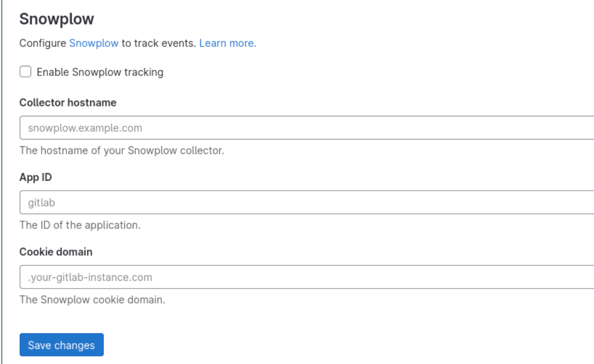
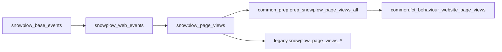

---

title: Snowplow
description: Snowplow Infrastructure Management
---


### Snowplow Overview

Snowplow is an open source, event analytics platform. There is a business entity that runs SaaS for Snowplow and they also maintain the code for the open source product. The general [architecture overview of snowplow is on GitHub](https://github.com/snowplow/snowplow/#snowplow-technology-101) and has more detail on the basics of how it works and how it is set up.

In `June of 2019`, we switched sending Snowplow events from a third party to sending them to infrastructure managed by GitLab, documented on this page. From the perspective of the data team, not much changed from the third party implementation. Events are sent through the collector and enricher and dumped to S3.

#### Snowplow - adding new `app_id`

When new application should be tracked by `Snowplow` here is the few things should be considered.



The right `app_id`, and collector URL should be done in coordination with the data team.
URL wil stay the same `snowplow.trx.gitlab.net`. Any `app_id` is fine if there are no other concerns around enabling tracking on `CustomersPortal` staging as well.

> **Note:** Any un-expected events *(with wrong app_id)* are normally dropped.

The only model with app_id filtering is [snowplow_base_events](https://dbt.gitlabdata.com/#!/model/model.snowplow.snowplow_base_events). That model flows downstream to the page view models:



In order to add a new `app_id` to [snowplow_base_events](https://dbt.gitlabdata.com/#!/model/model.snowplow.snowplow_base_events) *(and downstream page view models)*, the `snowplow:app_ids`
variable in the dbt package must be updated. Those values are set in the `dbt_project.yml`
file. As an example, [here is an issue](https://gitlab.com/gitlab-data/analytics/-/issues/16552) to update the variable.

#### GitLab Implementation

The original design document to move our Snowplow infrastructure from a 3rd-party hosting service to 1st-part is documented in the [Infrastructure design library](/handbook/engineering/infrastructure/library/snowplow/). This was written before the build was started and contains many of the assumptions and design decisions.

Snowplow is built with Terraform on AWS documented in the [gitlab-com-infrastructure project](https://ops.gitlab.net/gitlab-com/gitlab-com-infrastructure/blob/master/environments/aws-snowplow/README.md).

For a detailed walk-through of our setup, watch [this GitLab Unfiltered internal video](https://www.youtube.com/watch?v=fK9aw3bHFBg&feature=youtu.be).


##### S3

Enriched events are stored in TSV format in the bucket `s3://gitlab-com-snowplow-events/output/`.
Bad events are stored as JSON in `s3://gitlab-com-snowplow-events/enriched-bad/`.
For both buckets, there are paths that follow a date format of `/YYYY/MM/DD/HH/<data>`.

#### Data Warehousing

#### Snowpipe

Once events are available in S3, we ingest them into the data warehouse using [Snowpipe](https://docs.snowflake.net/manuals/user-guide/data-load-snowpipe-intro.html#introduction-to-snowpipe). This is a feature of our Snowflake Data Warehouse.
An [Amazon SQS](https://aws.amazon.com/sqs/) event queue was set up for the good and bad event paths.

To run properly, Snowpipe needs a "stage" in Snowflake and a table to write to.
The good and bad S3 paths each have their own Stage within Snowflake.
These are named `gitlab_events` and `gitlab_bad_events`, respectively. They are owned by the `LOADER` role.

The create table statements for the good and bad events are as follows:

``` sql
-- Good Events
CREATE OR REPLACE TABLE snowplow.gitlab_events
(
    app_id                   VARCHAR,
    platform                 VARCHAR,
    etl_tstamp               VARCHAR,
    collector_tstamp         VARCHAR,
    dvce_created_tstamp      VARCHAR,
    event                    VARCHAR,
    event_id                 VARCHAR,
    txn_id                   VARCHAR,
    name_tracker             VARCHAR,
    v_tracker                VARCHAR,
    v_collector              VARCHAR,
    v_etl                    VARCHAR,
    user_id                  VARCHAR,
    user_ipaddress           VARCHAR,
    user_fingerprint         VARCHAR,
    domain_userid            VARCHAR,
    domain_sessionidx        VARCHAR,
    network_userid           VARCHAR,
    geo_country              VARCHAR,
    geo_region               VARCHAR,
    geo_city                 VARCHAR,
    geo_zipcode              VARCHAR,
    geo_latitude             VARCHAR,
    geo_longitude            VARCHAR,
    geo_region_name          VARCHAR,
    ip_isp                   VARCHAR,
    ip_organization          VARCHAR,
    ip_domain                VARCHAR,
    ip_netspeed              VARCHAR,
    page_url                 VARCHAR,
    page_title               VARCHAR,
    page_referrer            VARCHAR,
    page_urlscheme           VARCHAR,
    page_urlhost             VARCHAR,
    page_urlport             VARCHAR,
    page_urlpath             VARCHAR,
    page_urlquery            VARCHAR,
    page_urlfragment         VARCHAR,
    refr_urlscheme           VARCHAR,
    refr_urlhost             VARCHAR,
    refr_urlport             VARCHAR,
    refr_urlpath             VARCHAR,
    refr_urlquery            VARCHAR,
    refr_urlfragment         VARCHAR,
    refr_medium              VARCHAR,
    refr_source              VARCHAR,
    refr_term                VARCHAR,
    mkt_medium               VARCHAR,
    mkt_source               VARCHAR,
    mkt_term                 VARCHAR,
    mkt_content              VARCHAR,
    mkt_campaign             VARCHAR,
    contexts                 VARCHAR,
    se_category              VARCHAR,
    se_action                VARCHAR,
    se_label                 VARCHAR,
    se_property              VARCHAR,
    se_value                 VARCHAR,
    unstruct_event           VARCHAR,
    tr_orderid               VARCHAR,
    tr_affiliation           VARCHAR,
    tr_total                 VARCHAR,
    tr_tax                   VARCHAR,
    tr_shipping              VARCHAR,
    tr_city                  VARCHAR,
    tr_state                 VARCHAR,
    tr_country               VARCHAR,
    ti_orderid               VARCHAR,
    ti_sku                   VARCHAR,
    ti_name                  VARCHAR,
    ti_category              VARCHAR,
    ti_price                 VARCHAR,
    ti_quantity              VARCHAR,
    pp_xoffset_min           VARCHAR,
    pp_xoffset_max           VARCHAR,
    pp_yoffset_min           VARCHAR,
    pp_yoffset_max           VARCHAR,
    useragent                VARCHAR,
    br_name                  VARCHAR,
    br_family                VARCHAR,
    br_version               VARCHAR,
    br_type                  VARCHAR,
    br_renderengine          VARCHAR,
    br_lang                  VARCHAR,
    br_features_pdf          VARCHAR,
    br_features_flash        VARCHAR,
    br_features_java         VARCHAR,
    br_features_director     VARCHAR,
    br_features_quicktime    VARCHAR,
    br_features_realplayer   VARCHAR,
    br_features_windowsmedia VARCHAR,
    br_features_gears        VARCHAR,
    br_features_silverlight  VARCHAR,
    br_cookies               VARCHAR,
    br_colordepth            VARCHAR,
    br_viewwidth             VARCHAR,
    br_viewheight            VARCHAR,
    os_name                  VARCHAR,
    os_family                VARCHAR,
    os_manufacturer          VARCHAR,
    os_timezone              VARCHAR,
    dvce_type                VARCHAR,
    dvce_ismobile            VARCHAR,
    dvce_screenwidth         VARCHAR,
    dvce_screenheight        VARCHAR,
    doc_charset              VARCHAR,
    doc_width                VARCHAR,
    doc_height               VARCHAR,
    tr_currency              VARCHAR,
    tr_total_base            VARCHAR,
    tr_tax_base              VARCHAR,
    tr_shipping_base         VARCHAR,
    ti_currency              VARCHAR,
    ti_price_base            VARCHAR,
    base_currency            VARCHAR,
    geo_timezone             VARCHAR,
    mkt_clickid              VARCHAR,
    mkt_network              VARCHAR,
    etl_tags                 VARCHAR,
    dvce_sent_tstamp         VARCHAR,
    refr_domain_userid       VARCHAR,
    refr_dvce_tstamp         VARCHAR,
    derived_contexts         VARCHAR,
    domain_sessionid         VARCHAR,
    derived_tstamp           VARCHAR,
    event_vendor             VARCHAR,
    event_name               VARCHAR,
    event_format             VARCHAR,
    event_version            VARCHAR,
    event_fingerprint        VARCHAR,
    true_tstamp              VARCHAR,
    uploaded_at              TIMESTAMP_NTZ(9) DEFAULT CAST(CURRENT_TIMESTAMP() AS TIMESTAMP_NTZ(9))
)

-- Bad Events Table
CREATE OR REPLACE TABLE snowplow.gitlab_bad_events
(
    jsontext    VARIANT,
    uploaded_at TIMESTAMP_NTZ(9) DEFAULT CAST(CURRENT_TIMESTAMP() AS TIMESTAMP_NTZ(9))
);
```

Since TSV is not as straight-forward as CSV, a custom file format was created with the following statement:

``` sql
CREATE OR REPLACE FILE FORMAT snowplow_tsv TYPE = CSV FIELD_DELIMITER = '\t'
```

The actual pipe for good events was created using:

``` sql
CREATE OR REPLACE PIPE raw.snowplow.gitlab_good_event_pipe auto_ingest= TRUE AS
COPY INTO raw.snowplow.gitlab_events
    FROM (SELECT $1, $2, $3, $4, $5, $6, $7, $8, $9,$10,$11,$12,$13,$14,$15,$16,$17,$18,$19,$20,$21,$22,$23,$24,$25,$26,$27,$28,$29,$30,$31,$32,$33,$34,$35,$36,$37,$38,$39,$40,$41,$42,$43,$44,$45,$46,$47,$48,$49,$50,$51,$52,$53,$54,$55,$56,$57,$58,$59,$60,$61,$62,$63,$64,$65,$66,$67,$68,$69,$70,$71,$72,$73,$74,$75,$76,$77,$78,$79,$80,$81,$82,$83,$84,$85,$86,$87,$88,$89,$90,$91,$92,$93,$94,$95,$96,$97,$98,$99,100,101,102,103,104,105,106,107,108,109,110,111,112,113,114,115,116,117,118,119,120,121,122,123,124,125,126,127,128,129,130,131,CAST(CURRENT_TIMESTAMP() AS TIMESTAMP_NTZ(9)) AS uploaded_at
          FROM @raw.snowplow.gitlab_events)
    FILE_FORMAT = (FORMAT_NAME = 'snowplow_tsv')
    ON_ERROR = 'skip_file';
```

This highlights the fact that JSON would be a better format. This could be a future iteration of the infrastructure.

The bad event pipe is created as follows:

``` sql
CREATE OR REPLACE PIPE raw.snowplow.gitlab_bad_event_pipe auto_ingest= TRUE AS
COPY INTO raw.snowplow.gitlab_bad_events (jsontext)
    FROM @raw.snowplow.gitlab_bad_events
    FILE_FORMAT = (TYPE = 'JSON');
```

To view pipes:

``` sql
SHOW PIPES IN raw.snowplow;
```

To describe a pipe:

``` sql
DESCRIBE PIPE raw.snowplow.gitlab_good_event_pipe;
```

To pause a running pipe:

``` sql
ALTER PIPE raw.snowplow.gitlab_good_event_pipe SET PIPE_EXECUTION_PAUSED = TRUE;
```

To force resume a pipe:

``` sql
SELECT system$pipe_force_resume('raw.snowplow.gitlab_good_event_pipe');
```

To check the status of a pipe

``` sql
SELECT system$pipe_status('raw.snowplow.gitlab_good_event_pipe');
```

To force a refresh of the stage so that snowpipe picks up older events:

``` sql
ALTER PIPE gitlab_good_event_pipe refresh;
```

#### dbt

To materialize data from the RAW database to PROD for querying, we have implemented a partitioning strategy within dbt. By default, the snowplow models and the [Fishtown snowplow package](https://github.com/fishtown-analytics/snowplow) will write to a schema scoped to the current month in the PREP database. For July 2019, the schema would be `snowplow_2019_07`.

Within each monthly partition all of the base models and the models generated by the package are written for all events that have a derived timestamp that matches the partition date. Different monthly partitions can be generated by passing in variables to dbt at run time:

`--vars '{"year": "2019", "month": "01", "part": "2019_01"}'`

Backfills are done via Airflow. The [`dbt_snowplow_backfill` DAG](https://gitlab.com/gitlab-data/analytics/blob/master/dags/transformation/dbt_snowplow_backfill.py) will generate a task for each month from July 2018 to the current month.

#### Do Not Track

Our snowplow tracking configuration and particular implementations respect the [Do Not Track (DNT) headers](https://en.wikipedia.org/wiki/Do_Not_Track) whenever it's present on a user's browser.

#### Duo data redaction

We only keep Duo free form feedback for 60 days in snowflake. This is managed by the [duo_data_redaction DAG](https://gitlab.com/gitlab-data/analytics/-/blob/master/dags/general/duo_data_redaction.py), which runs daily, removing contents of the `extendedFeedback` attribute in the `contexts` column for all feedback response Snowplow events in `RAW` and `PREP`. This timeline allows for our full-refresh process to complete, updating all downstream data, within 90 days for compliance.
