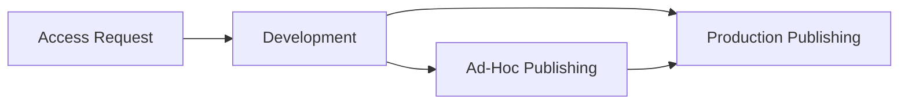
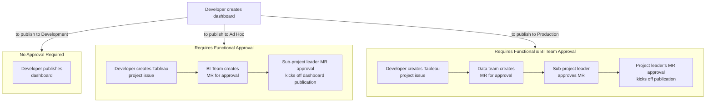

---

title: "Tableau"
description: "Tableau at GitLab"
---


---

## Quick Links

- [Tableau Online GitLab instance](https://10az.online.tableau.com/#/site/gitlab/home)
- [Tableau eLearning Portal](https://elearning.tableau.com)
- [Tableau Customer Portal](https://customer-portal.tableau.com/s/)
- [Tableau Status Page](https://trust.tableau.com)
- [Internal Slack channel](https://app.slack.com/client/T02592416/C03RMCEHVCP)
- [External Slack channel](https://app.slack.com/client/T02592416/C031QE95QJU)
- [GitLab Tableau Developer Guide](/handbook/business-technology/data-team/platform/tableau/tableau-developer-guide/)
- [GitLab Tableau Administration Guide](/handbook/business-technology/data-team/platform/tableau/tableau-admin-guide/)
- [Reporting Data Catalog](/handbook/business-technology/data-team/platform/tableau/reporting-data-catalog/)
- [Handbook Embedding Demonstration](/handbook/business-technology/data-team/platform/tableau/embed-demo/)

## Tableau

[Tableau](https://www.tableau.com) is our new Enterprise Business Intelligence tool. It is a [leader](https://interworks.com/blog/2021/02/24/the-2021-gartner-bi-magic-quadrant-visualized-in-tableau/) in the Business Intelligence space. We are applying the [Tableau Blueprint](https://help.tableau.com/current/blueprint/en-us/bp_overview.htm) to launch our Tableau production environment. The Tableau Blueprint outlines the processes and best practices from thousands of Tableau customers. We will apply these processes and best practices in accordance GitLab's TeamOps and culture.

## Terms and Definitions

- Connections: The method Tableau used to communicate with a source of data.
  - Direct to Source: When Tableau uses a built in connector to communicate with source of data like Snowflake or Google Drive.
  - Virtual Connection: A curated connection where the communication to the source of data has been set by the admin team.  Will generally simulate a Direct to Source connection.
  - Published Data Source: A curated connection to a single tableau that is the result of data modeling. It is stored on Tableau Online.
  - Connect to A File: A method of getting data from the files in your system into Tableau. This includes Excel files, CSV, PDF, etc.
  - Connect to A Server: A method of connecting to an online data source. This includes any connection to any online data sources, including Tableau Online and Snowflake
- Connection Credentials: The information used to certify connection to a source of data.
  - Embedded: Credentials are saved as part of the connection.
  - Prompt User: Credentials must be input every time the connection is used.
- Connection Freshness: Determines how often a connection will communicate with the source of data.
  - Live: Will send a query to the source of data each time the data is needed.
  - Extract: Well send a query when prompted to the source of data storing the result in custom micro database.
  - Scheduled Extract: An extract hosted on Tableau Online that will, on a fixed frequency, communicate with the source of data and update the stored data.
- Data Modeling: The method of combining multiple tables of data into a single result table.
  - Data Warehouse: The query to combine the table is stored in the data warehouse repository and is materialized in the data warehouse.
  - Tableau Data Modeling: Relationships are defined between tables, in the connection interface, directly in Tableau.
  - Tableau Blending: Relationships between data sources defined in the visualization construction interface.
  - Custom SQL: Using SQL within a connection to define the relationships between tables.
- Tableau Objects: The elements that a developer will work with to create visualizations.
  - Project: The folder structure maintained in Tableau Online.  This is where content permissions are administered.
  - Workbook: The base file time for creating visitations.
    - View: The element that represent a chart or other visualization.
    - Dashboard: A collection of views and layout elements.
    - Story: A collection of views and layout elements where the views can be set to a specific filter or parameter value and displayed in a sequential structure.
  - Data Source: A collection of connections and data modeling that results in a single result table that can be published and a stand alone file.
  - Flow: A collection of connections and transformation steps that will typically result in creating one or more Data Sources.

## Roadmap

### FY25 Tableau Roadmap

Having completed the migration to Tableau in FY25-Q1, we are now focused on improving the Tableau developer experience and scaling our implementation to stregthen enterprise reporting.

- FY25-Q2 - Establish the framework for the Future State of Tableau, with input from Functional teams
    - Publish the Executive Landing Page to drive users towards critical dashboards
    - Document an approach to Tableau data source creation that promotes single-source-of-truth reporting
    - Document and implement a user deprovisioning policy & process, in order to free up unused licenses on a set cadence
    - Document the key GTM domain areas that lack single-source-of-truth data sources
    - Run an assessment of our Tableau environment, using quantitative and qualitative measures
        - Data sources (number of data sources that exist, custom SQL vs. table-based, commonly used tables that may indicate an opportunity for data source consolidation, etc.)
        - Dashboards (number of dashboards that exist, distribution of usage, average user views per dashboard, etc.)
        - Users (login frequency, etc.)
- FY25-Q3 - Achieve the following targets (specific numbers will be updated in Q2, and will be informed by findings from Q2 assessment):
    - Document and implement dashboard/data source archival policies & process, in order to remove clutter from our environment
    - Document and implement a process to help users distinguish between certified & uncertified dashboards
    - Initiate the BI Enablement charter with programs & materials to support the Tableau community at GitLab
    - Define, calculate, and publish quantitative metrics for Tableau health to be viewed on-demand, and incorporate into the quarterly Data Key Review. Examples below, but will be iterated on and updated:
        - Average user views per dashboard (should increase as we declutter the Tableau environment through archival policies)
        - Average # dashboards per published data source (should increase as we build up the inventory of SSOT published data sources)
        - % of published dashboards in the Production environment (should increase as we build up the inventory of SSOT dashboards)
        - etc.
    - Publish X certified Tableau data sources for critical domain areas that require single-source-of-truth data sources
    - Support functional teams in repointing dashboards to leverage certified data sources
    - Refresh assessment of Tableau environment
- FY25-Q4 - Achieve the following targets (specific numbers will be updated in Q3)
    - Iterate on the BI Enablement charter  
    - Accelerate certified data source creation with support from Functional Analytics teams, publishing X additional certified data sources
    - Repoint X dashboards to leverage certified data sources
    - Archive X unused dashboards, and increase the average user views per dashboard by Y as a byproduct of concentrating user views on certified dashboards
    - Refresh assessment of Tableau environment and quantative metrics for Tableau health

## Governance Model

Governance is the combination of controls, roles, and repeatable processes that creates trust and confidence in data and analytics. Both IT and business stakeholders on the project team are responsible for defining data and content governance together. In a successful self-service environment, the appropriate levels of governance create accountability and enable, rather than restrict, access to trusted content for users at GitLab. Governance is a spectrum, different kinds of data and content require different kinds of governance. It’s not a one-time effort because skills and expectations will evolve. Periodically evaluating governance processes will allow us to evolve and delegate more responsibilities as new analytical skills and use cases develop.

We use a self-governing model at GitLab. In a self-governing model, there is strong collaboration between IT and business users. Certified content and data sources are available, and ad-hoc content is being created regularly by Creators and Explorers. Viewers understand the delineation between certified, ad-hoc, and sandbox content states. The process of validation, promotion, and certification is well-defined and well-understood by users of all skill levels. With increasing analytical skills across the organization, the boundaries between the roles of the Modern Analytics Workflow are fluid as users switch from consuming to creating to promoting content with the appropriate level of permissions.

### BIOps

Our Tableau self-governing model is administered and enforced in the [GitLab Tableau Project](https://gitlab.com/gitlab-data/tableau) using BIOps. The BIOps approach will leverage GitLab's repository, maintainer and code review functionality to administer the governance model. Tableau does not currently have a Git integration so our BIOps is not fully automated and there are some limitations. The README file is coming soon which will describe the BIOps workflow. We will iterate on this approach with the GTM and Finance teams during Q1 and Q2 and adjust and adapt as needed.

### Tableau Project Architecture

The Project Architecture in Tableau Online is replicated and governed in the GitLab Tableau Project. Please see the [GitLab Tableau Project](https://gitlab.com/gitlab-data/tableau) for more details. Below are descriptions of the project folders and a sample of the project architecture found in Tableau online.

The top-level folders in our Tableau Project, and their corresponding levels of governance, include:

- `Development`: content in this folder intentionally includes no governance, in order to enable users to quickly prototype. As such it should be considered to be sandbox content.
- `Ad Hoc`: content in this folder has been reviewed and approved by a sub-project leader, with traceability via an MR. (see [project-permission-structure](handbook/business-technology/data-team/platform/tableau/#biops-roles-and-responsibilities) for a list of sub-project leaders.)
- `Production`: content in this folder has been reviewed and approved by sub-project leader(s) as well as project leader(s). This is the highest level of certification for Tableau content.
- `Resources`: content in this folder includes workbook templates and certified data sources that can be used in workbook development

<details markdown=1>

<summary><b>Project and Sub-Project Folder Descriptions</b></summary>

- **Top Level Project Folders:** **The top level project provides what the purpose of the workbook is.** There are four top level projects; Production, Ad-hoc, Development, and Resources. This is the highest folder level that the Tableau user lands on. These folders guide the user either down a Production path to view certified content, an Ad-hoc path to view Ad-Hoc content, a development path to view sandbox content, or a resources path to access workbook templates and certified data sources to be used in workbook development.
    - **2nd Level Sub-Project Folders:** **The 2nd level project provides who the primary owner of the workbook is.** This level of the architecture contains sub-projects for each department and cross-functional business motion such as the Go To Market Motion. Each department and cross-functional business motion will have their own sub-project. This gives us flexibility to create different types of security at the sub-project level based on specific departmental and business motion needs.
        - **3rd Level Sub-Project Folders:**  **The 3rd level project provides security around who can see the workbook.** Our SAFE Data Program is applied on this level of the architecture. This allows us flexibility to apply more security controls, by department, in the future to include enhanced SAFE Data program controls, row and column level security, and security around confidential information. Applying the security at this level will allow for customized, and scalable security programs by department and business motion.

</details>

<details markdown=1>

<summary><b>Project Architecture</b></summary>

1. **Resources**
    1. **General**
        1. **Admin Insights**
            1. Admin Insights Starter
        2. **Templates**
            1. Workbook Template
        3. Data Source Name
    1. **SAFE**
        1. Data Source Name
1. **Development** (Sandbox Environment)
    1. **Customer Success**
        1. **General**
            1. Data Source Name
            2. Workbook Name
        1. **SAFE**
            1. Data Source Name
            2. Workbook Name
        1. Workbook Name
    2. **Data Team**
    3. **Engineering**
    4. **Finance**
    5. **Go To Market**
    6. **Marketing**
    7. **People**
    8. **Product**
    9. **Sales**
    10. **Security**
1. **Ad-hoc** (Maps to our [Ad-Hoc Data Development Process](/handbook/business-technology/data-team/data-development/#ad-hoc-data-development))
    1. **Customer Success**
        1. **General**
            1. Data Source Name
            2. Workbook Name
        1. **SAFE**
            1. Data Source Name
            2. Workbook Name
    2. **Data Team**
    3. **Engineering**
    4. **Finance**
    5. **Go To Market**
    6. **Marketing**
    7. **People**
    8. **Product**
    9. **Sales**
    10. **Security**
1. **Production** (Maps to our [Trusted Data Development Process](/handbook/business-technology/data-team/data-development/#trusted-data-development)
    1. **Customer Success**
        1. **General**
            1. Data Source Name
            2. Workbook Name
        1. **SAFE**
            1. Data Source Name
            2. Workbook Name
    2. **Data Team**
    3. **Engineering**
    4. **Finance**
    5. **Go To Market**
    6. **Marketing**
    7. **People**
    8. **Product**
    9. **Sales**
    10. **Security**

</details>

### BIOps Roles and Responsibilities

Please see the [project-permission-structure](/handbook/business-technology/data-team/platform/tableau/#project-permission-structure) section for details on the permissions for the BIOps roles.

1. **Top Level Project Leader / Maintainer Responsibilities:** The Top Level Project leaders come from the BI Platform Team. These leaders are responsible for publishing content in the Sub-Projects that role up to the Top Level Projects and are responsible for maintaining the GitLab Tableau Project. This role does not specifically include Tableau Online Site Administration responsibilities although several Top Level Project Leaders are also [Tableau Online Site Admins](/handbook/business-technology/data-team/platform/tableau/#tableau-online-admins).
2. **Sub-Project Leader / Code Owner Responsibilities:** The Sub-Project Leaders come from functional departments and teams. These leaders are responsible for reviewing and approving content for publishing in their department's folder and in cross-functional Sub-Project folders like the Go To Market folder as Code Owners. The [CODEOWNERS file](https://gitlab.com/gitlab-data/tableau/-/blob/main/CODEOWNERS?ref_type=heads) in the Tableau project is the source of truth for sub-project leads who are able to review and approve MRs to publish dashboards to Production.

### BIOPs Workflows

The BIOps Workflow consists of 4 stages; Access Request, Development, Ad-Hoc Publishing, and Production Publishing. Please see the [README](https://gitlab.com/gitlab-data/tableau/-/blob/main/README.md) in the GitLab Tableau Project for detailed steps on the workflow to include the process for submitting a Merge Request for Tableau Production publishing, submitting an Issue for Tableau Ad-Hoc publishing, and receiving the necessary maintainer and code owner approvals from Project and Sub-Project leaders for publishing content.



1. **Access Request:** The Access Request stage requires completion of an Access Request. Please see the [Access](/handbook/business-technology/data-team/platform/tableau/#access) section of the Tableau handbook page for more details.
2. **Development:** All Tableau Content Development starts in the Development Project Folder. The Development Folder is a Sandbox environment where Tableau developers are free to experiment and iterate with content and share with team members for initial peer reviews. Tableau Developers can organize their Sandbox work using [Collections](https://help.tableau.com/current/pro/desktop/en-us/collections.htm) for easy access and sharing.  **The Development Folder will have the same user experience as our old Sisense BI tool where team members can create and share content on demand without any approvals being required from the BI Platform team.** Tableau Creators should follow [SAFE development workflow guidelines](/handbook/business-technology/data-team/platform/safe-data/#tableau) when working with MNPI data in the development folder.
3. **Ad-Hoc Publishing:** When content in the Development Project Folder is ready for publishing, it can be published in the Ad-Hoc Project Folder if it adheres to the [Ad-Hoc Data Development](/handbook/business-technology/data-team/data-development/#data-development-at-gitlab) methodology. **Please see the [README](https://gitlab.com/gitlab-data/tableau/-/blob/main/README.md) for detailed steps on publishing content to the Ad-Hoc Project Folder.**
4. **Production Publishing:** When content in the Development or Ad-Hoc Project Folders is ready for Production publishing, it can be published in the Production Project Folder if it adheres to the [Trusted Data Development](/handbook/business-technology/data-team/data-development/#data-development-at-gitlab) methodology. Content that adheres to the Trusted Data Development process will get a Certified Stamp in Production. If the content does not adhere to the Trusted Data Development requirements, but is still considered SSOT, Production grade content, the content can still be published in Production, but it will not receive a Certified Stamp. In such cases, there should be an issue with a project plan for the Tableau content to receive a Certified Stamp. **Please see the [README](https://gitlab.com/gitlab-data/tableau/-/blob/main/README.md) for detailed steps on publishing content to the Production Project Folder.**

### BIOps Workflow Examples

The flowchart below illustrates 3 examples of the BIOps publication workflow.

In Example 1, a developer is publishing a dashboard to their own **Development** space. No governance or approval is required.

In Example 2, a developer is publishing a dashboard to a sub-folder within the **Ad Hoc** space. This requires review and approval by the project leads (i.e. Functional Team leaders) of the sub-folder the dashboard will be published to. For example, if the developer is publishing a dashboard to the Sales sub-folder within the Ad Hoc space, a Sales sub-project leader will need to review and approve it.

In Example 3, a developer is publishing a dashboard to a sub-folder within the **Production** space. This requires review and approval by the project leaders (i.e. Functional Team leaders) of the sub-folder the dashboard will be published to, *as well as* review and approval by the top-level project leaders (i.e. project leaders from the Enterprise Data Team). For example, if the developer is publishing a dashboard to the Sales sub-folder within the Production space, a Sales sub-project leader will need to review and approve it, and an Enterprise Data Team project leader will need to additionally review and approve it.



### BI Development Excellence

Tableau Workbooks must satisfy all of the below requirements in order to be published to Tableau Production. These requirements are included in the Merge Request Template for Production Publishing (Link coming soon...).

1. The workbook uses a template in the Resources folder. If a template is not used, then at a minimum, the workbook should include the GitLab logo, handbook url, and the project path.
1. The content adheres to the Development workflow.
1. The content is the Single Source of Truth (SSOT) for a business area. The SSOT should be documented in the handbook either in a Business Domain Handbook Page, Data Guide in the Data Catalog, or both.
1. Business owner has signed off on both the functionality of the content and the validity of the numbers.
1. Technical owner has signed off on validity of the numbers.
1. The workbook uses a Certified Virtual Connection or a Certified Published Data Source.
1. Performance tuning has been performed and the workbook refreshes within 5 minutes max.

<details markdown=1>

<summary><b>Tableau Style Guide</b></summary>

For more guidance on design best practices and resources, please refer to our [Tableau Style Guide](/handbook/business-technology/data-team/platform/tableau-style-guide/) handbook page.

</details>

### Tableau Trusted Data Certification

Tableau Workbooks that meet all requirements for [Trusted Data Development](/handbook/business-technology/data-team/data-development/#trusted-data-development) and meet all requirements for BI Development Excellence (Link coming soon...) will receive a `Trusted Data` Certification. The certification is applied by placing a `TD` in the workbook title.

Tableau Data Sources that meet all requirements for [Trusted Data Development](/handbook/business-technology/data-team/data-development/#trusted-data-development) will receive a `Trusted Data` Certification. The certification is applied using native [Tableau functionality](https://help.tableau.com/current/server/en-us/datasource_certified.htm) and a certified stamp is applied to the data source.

### Tableau Publishing Service Level Objectives (SLOs)

**Production Publishing SLO**

The BI Platform team will publish production content once a week on Thursday. The due date for submitting content for publishing is Friday of the prior week which allows 4 days for the BI Platform team to review the content and publish it on Thursday of the following week.

**Ad-Hoc Publishing SLO**

The department sub-project leaders will publish ad-hoc content within 24 to 48 hours after it is submitted for publishing.

**Development Publishing SLO**

Individual Tableau developers can publish development content on-demand to their department's development sub-project.

## Deployment

Tableau Cloud leverages GitLab's existing technology investments and integrates into our IT infrastructure to provide a self-service, modern analytics platform for our users.

### Tableau Online Admins

| **Primary / Backup** | **User** |  Designated Support Contact with Tableau Support |
| ------- |------- | ------- |
| Primary | `@ttnguyen28` | Yes |
| Primary | `TBD` | Yes |
| Backup  | `@snalamaru`  | Yes |
| Backup  | `@pempey`  | Yes |

### Permissions

Pursuant to GitLab's Transparency value, all GitLab team members will have access to all content in Tableau by default. However, as a Public Company, we have to abide by the [SAFE Framework](/handbook/legal/safe-framework/) and limit access to certain sensitive and confidential data in Tableau to team members that need SAFE data to do their jobs. In Tableau, we set these SAFE data permissions via User Groups at the Project level.

#### User Groups

User Groups are the only prescribed method we use for setting permissions across the Tableau site. A User Group is a collection of users that can be based on a topic, project, or organization structure, that will need to have the same set of access and permissions for content. All users will be a member of the General Access user group and can be added to more User Groups as required. The assignment of users to groups will be documented and controlled from YAML files maintained in the Tableau Project in the Data Group.

#### Limited Access User Groups

Limited access user groups will allow business teams to manage accessibility to their published content based on rules that they've identified. Request for the creation of a limited access user group can be made through the All Requests template in [Issues](https://gitlab.com/gitlab-data/tableau/-/issues/?sort=created_date&state=opened&first_page_size=100) section of the Tableau project and requires the approval of that department's [sub-project lead](/handbook/business-technology/data-team/platform/tableau/#biops-roles-and-responsibilities).

#### List of User Groups

Each section below below corresponds to a limited access user group and the designated owner. Please note: To gain access to an user group, the designated owner will need to give approval in the AR.

##### **General SAFE Access**

  - This group allows viewing of and development with data that contains material non-pulic information that should be kept [SAFE](/handbook/legal/safe-framework/).  Team members must be on the [Designated Insiders](/handbook/legal/publiccompanyresources/#sts=Designated%20Insiders) list to be added to this group.
  - To gain [access to SAFE data](/handbook/business-technology/data-team/platform/safe-data/) and be part of the SAFE Access group please submit an AR like this [example](https://gitlab.com/gitlab-com/team-member-epics/access-requests/-/issues/24284), which requires manager and VP approval.

##### **ASM AMER Commercial Restricted Access**

  - This project allows access to the ASM AMER Commercial sub project. It is restricted because the data contains sensitive information about sales rep activity, bookings, and segmentation.
  - Please work with Keith Gliksman @keith.gliksman for access approval.

##### **ASM EMEA Commercial Restricted Access**

  - This project allows access to the ASM EMEA Commercial sub project. It is restricted because the data contains sensitive information about sales rep activity, bookings, and segmentation.
  - Please work with Keith Gliksman @keith.gliksman for access approval.

##### **ASM Restricted Access**

  - Please work with the GTM Planning & Ops team and/or Alex Cohen @alex.cohen for access approval.

##### **Customer Success Access**

  - Please work with the Customer Success team and/or Brandon Butterfield @bbuterfield for access approval.

##### **Internal Audit Restricted Access**

  - Please work with the Internal Audit team and/or Harinakshi Poojary @hpoojary for access approval.

##### **People Restricted Access**

  - Please work with the People Analytics team and/or Adrian Perez @aperez349 for access approval.

##### **RSA SAFE Access**

  - This group is for the Revenue Strategy and Analytics team and is restricted because analysis performed are confidential planning efforts that may impact people roles. Team members must be on the Designated Insiders list to be added to this group.
  - Please work with the Sales Strategy team and/or Olga Falkenhof @ofalken for access approval.

##### **Sales Development SAFE Access**

  - Team members must be on the Designated Insiders list to be added to this group.
  - Please work with Keith Gliksman @keith.gliksman for access approval.

##### **Self-Service SAFE Access**

  - Team members must be on the Designated Insiders list to be added to this group.
  - Please work with the Self-Service team and/or Max Fleisher @mfleisher for access approval.

<details markdown=1>

<summary><b>Example User Group</b></summary>

```yml

groups:
  - group_name: group 1
  - group_name: group 2
  - group_name: group 3

users:
  - user_name: team_memebr@gitlab.com
    site_role: Site Administrator Creator
    auth_setting: SAML
    groups:
      - group 1
      - group 2

  - user_name: other_team_member@gitlab.com
    site_role: Viewer
    auth_setting: SAML
    groups:
      - group 1

```

</details>

#### Project Permission Structure

User Groups are applied at the Project and Sub-Project levels. We have two types of User Groups that we apply, Administrator User Groups and Access Control User Groups. The Admistrator User Group gives permissions relating to what administrative tasks the user can do on the project such as moving content, deleting content, and changing permissions on the project. The Access Control User Group gives permissions relating to what access the user has such as viewing and publishing content.

The Admistrator User Group and the Access Control User Group can be customized to meet the unique needs and requirements of each Project and Sub-Project on the Tableau site. This allows for flexibility to add or customize security controls on an as-needed basis. The assignment of a User Groups permission rule set for a Project or Sub-Project will be documented and controlled from YAML files maintained in the Tableau Project in the Data Group.

No content is published in the top level Production, Ad-Hoc, and Development Projects. Content is only published in the Sub-Projects under the Top level projects which is a best practice for content, access, and security control. Top level Project (Production, Ad-Hoc, and Development) Leaders will always be a member of the Central Data Team's BI Platform team and will need a site role of Creator to function as Project Administrators for publishing content. [Data Champions](/handbook/business-technology/data-team/direction/data-champion/) will serve as Project Leaders for the Sub-Projects for their respective functional areas. The Sub-Project Leaders will be added to the applicable Administrator and Access Control Groups in order to have the right permissions to lead the Sub-Project.

The standard permission rules for top level Projects are noted below:

| Project     | View             | Publish             | Administer                      |
|-------------|------------------|---------------------|---------------------------------|
| Development | All Team Members | All Team Members    | Project and Sub Project Leaders |
| Ad-hoc      | All Team Members | Sub Project Leaders | Project Leaders                 |
| Production  | All Team Members | Project Leaders     | Project Leaders                 |
| Resources   | All Team Members | Project Leaders     | Project Leaders                 |

Below is an example of User Groups and Permissions applied to a Data Team Sub-Project where only Data Team Members can publish in the project, but All Team Members can view the content in the Sub-Project. At the Sub-Project Level, for the User Group Name, `Limited Access Team Members` can replace the `All Team Members` User Group Name for limited access.

| User Group Name           | User Group Type      | Permission Template      |
|---------------------------|----------------------|----------------------|
| BI Platform Team          | Administrator Group  | Inherited Administer |
| Data Team Project Leaders | Administrator Group  | Administer           |
| Data Team                 | Access Control Group | Publish              |
| All Team Members          | Access Control Group | View                 |

<details markdown=1>

<summary><b>Example Project Permissions YAML File</b></summary>

```yml

projects:
  - project_name: Example Project
    content_permissions: ManagedByOwner
    project_path: Project Name/Project Name/
    permission_set:
      - group_name: group 1
        permission_rule: view
      - group_name: group 2
        permission_rule: project_lead

```

</details>

#### Capabilities

[Capabilities](https://help.tableau.com/current/server/en-us/permissions_capabilities.htm) are a Tableau concept that we apply. Permissions are made up of capabilities, or the ability to perform a given action on a piece of content, such as view, filter, download, or delete. Permission rules are the setting for each capability (allowed, denied, or unspecified) for the user group. Permission rules have templates available that make it easier to assign capabilities quickly.

Templates group sets of capabilities that are often assigned together based on common user scenarios such as View, Publish, and Administer. When we assign a template, its included capabilities are set to Allowed, with the rest left as Unspecified. The templates are built to have all of the capabilities a user would need, for example the Publish template includes everything from the View template plus additional capabilities.

Below are examples of Permission Templates we use at GitLab. Permission templates are applied to Tableau content.

| Capability         | View | Publish | Administer |
|:-------------------|:----:|:-------:|:----------:|
| View/Interact/Use  | X    | X       | X          |
| View/Add Comments  | X    | X       | X          |
| Download Image/PDF | X    | X       | X          |
| Share Views        | X    | X       | X          |
| Download Data      |      | X       | X          |
| Web Edit           |      | X       | X          |
| Overwrite/Publish  |      | X       | X          |
| Move               |      |         | X          |
| Delete             |      |         | X          |
| Change Permissions |      |         | X          |

Below are examples of Site Roles that we use. Individual users are assigned to site roles and given permissions via site role. Site roles act as an upper limit of what a Tableau User can do on the site.

| Capability            | Viewer | Explorer | Creator |
|:----------------------|:------:|:--------:|:-------:|
| View/Interact         | X      | X        | X       |
| View/Add Comments     | X      | X        | X       |
| Download Image/PDF    | X      | X        | X       |
| Download Summary Data | X      | X        | X       |
| Download Full Data    |        | X        | X       |
| Share Views           |        | X        | X       |
| Web Edit              |        | X        | X       |
| Overwrite/Publish     |        | X        | X       |
| Move                  |        | X        | X       |
| Delete                |        | X        | X       |
| Change Permissions    |        | X        | X       |
| Create Alerts         |        | X        | X       |
| Publish Data Source   |        |          | X       |
| Use Data Flows        |        |          | X       |
| Site Administration   |        |          | X       |

<details markdown=1>

<summary><b>Example Permission Templates YAML File</b></summary>

```yml

permission_templates:
  - name: view
    projects:
      Read: Allow # View
    workbooks:
      Read: Allow # View
      Filter: Allow # Filter
      ViewComments: Allow # View Comments
      AddComment: Allow # Add Comments
      ExportImage: Allow # Download Image/PDF
      ViewUnderlyingData: Allow # Download Summary Data
      ShareView: Allow # Share Customized
    data_sources:
      Read:  Allow # View
      Connect: Allow # Connect
      ExportXml:  Allow # Download Data Source
    data_roles:
      Read: Allow # View
    flows:
      Read: Allow
      ExportXml:  Allow # Download Flow
    lenses:
      Read: Allow # View
    metrics:
      Read: Allow # View
    virtual_connections:
      Read:  Allow # View
      Connect: Allow # Connect
    databases:
      Read:  Allow # View
    tables:
      Read:  Allow # View

  - name: project_lead
    projects:
      ProjectLeader: Allow # Set Project Leader
```

</details>

<details markdown=1>

<summary><b>Permissions Best Practices for Admins & Project Leaders</b></summary>

- Don’t publish in the parent folder(s) and create nested subfolders instead.
- Set permission on a project folder level, not an individual workbook.
- Assign permissions to a group, not an individual person.
- Required course to complete: [Site Management](https://elearning.tableau.com/path/site-administrator/site-management)
- Ensure non-SAFE users cannot access SAFE content. This is the only time you should make use of the "deny" permissions functionality.

</details>

#### Tableau Licenses

The Data Team will regularly review users' Tableau activity to determine if users have the appropriate license type, and will potentially downgrade users whose activity suggests they would be adequately served by a lower license tier. License adjustments will be made to optimize the pool of available licenses and will be based on the the following activity guidelines:

- To maintain a Creator license the team member must meet any of the following:
  - Have published a datasource within the past 90 days
  - Have connected to Tableau Cloud from Tableau Desktop within the past 90 days
- To maintain an Explorer license the team member must meet any of the following:
  - Have accessed the web authoring environment within the past 90 days
  - Have published a workbook within the past 90 days
- To maintain a View license the team member must meet any of the following:
  - Have accessed a View within the past 90 days
  - Have accessed a Datasource within the past 90 days

Inactive licenses will be reclaimed quarterly following our [Data Health and Security practices](https://handbook.gitlab.com/handbook/business-technology/data-team/data-management/#tableau).

**Tracking License Usage**

- [Downgrade Check](https://10az.online.tableau.com/t/gitlab/views/UserDeprovisionCheck/UserDowngradeCheck)
- [Deprovision Check](https://10az.online.tableau.com/t/gitlab/views/UserDeprovisionCheck/UserDeprovisionCheck)
- [Assigned Licenses](https://10az.online.tableau.com/#/site/gitlab/users) (Admins only)
- [Licenses Used](https://10az.online.tableau.com/#/site/gitlab/analysis/LoginBasedLicenseUsage)
- [Actions by Users](https://10az.online.tableau.com/#/site/gitlab/analysis/ActionsbyAllUsers)
- [eLearning Usage](https://dashboard.skilljar.com/analytics/) (Admins only)

### Access

#### Tableau Online Access

Users can request access by creating an issue in the [access requests project](https://gitlab.com/gitlab-com/team-member-epics/access-requests) documenting the level of access required. To make a request, please navigate to the **Choose a template** dropdown menu and select the **Tableau_Request** template to get your AR started. After acquiring manager approval, add the labels ~"AR-Approval::Manager Approved" ~"ReadyForProvisioning" so it will be picked up by the Central Data Team for provisioning.

All users will be given access to their Division's sub-project by default. For access to another team's space please submit your request in a [Tableau Project issue](https://gitlab.com/gitlab-data/tableau/-/issues) via the **All Requests** template and tag the designated Lead Approver(s) for that team from the [BIOps Roles and Responsibilities](/handbook/business-technology/data-team/platform/tableau/#biops-roles-and-responsibilities) section for approval in your issue.

Tableau Desktop users will also need a Yubikey set up in Okta to access content published in Tableau Online. Due to our new security method that only accepts Biometric or Yubikey for authentication, please request a Yubikey via the [Yubibot](/handbook/it/guides/yubikey/) to ensure that logging into Tableau will be secure and smooth. Currently biometrics are not supported yet in Tableau Desktop.

Once approved, the BI Platform team will then add the user to the `okta-tableau-users` [Google Group](https://groups.google.com/a/gitlab.com/g/okta-tableau-users), add the user in [Tableau Online](https://10az.online.tableau.com/#/site/gitlab/users) and assign the correct license, then add the user to the right [Tableau Group](https://10az.online.tableau.com/#/site/gitlab/groups).

#### Tableau Desktop Access

Creators with an active license to Tableau Online is encouraged to use Tableau Desktop for development. Locally developed Data Sources or Workbooks can later be published to Tableau Online. All Creators will be assigned access to Tableau Online and Desktop. The BI Platform team will assign Dekstop keys from the [Licenses](https://customer-portal.tableau.com/s/my-keys) section of the [Tableau Customer Portal](https://customer-portal.tableau.com/s/). Those assigned a Desktop key can follow email instructions from Tableau to set up their client.

One can download Tableau Desktop using the links below, or follow the link from the [Home Page](https://10az.online.tableau.com/#/site/gitlab/home) of Tableau Online.

- [Tableau Desktop Releases Download](https://www.tableau.com/support/releases)
- [Tableau Prep Builder Releases Download](https://www.tableau.com/support/releases/prep)

If you want to automatically download the latest version of Tableau Desktop for Mac, you can use [this link](https://www.tableau.com/downloads/desktop/mac).

### Tableau Desktop vs. Tableau Cloud

Tableau offers two ways to create / edit workbooks and data sources, either via the Desktop client or Cloud (web) version. However, we recommend to develop in Desktop, as this version will have full functionality for editing and development.

Benefit of each version:

**Desktop**
Tableau Desktop provides FULL functionality. All the capabilities available by Tableau will be accessible in Desktop and you can create data sources, workbooks, dashboards, groups, sets, formatting, customized calculations, etc.

**Cloud**
Tableau Cloud allows users to interact with content (that you've created and published with Desktop). Cloud will also allow you to create workbooks / dashboards, but not data sources, sets, in-depth formatting, etc.

Fore more details on features offered by each version please see this Tableau article on [Web Authoring and Tableau Desktop Feature Comparison](https://help.tableau.com/current/pro/desktop/en-us/server_desktop_web_edit_differences.htm)

#### Data Source Access: Tableau Online

Please refer to this [Connecting to Data in Tableau Guide](https://docs.google.com/document/d/17DdnVs_KrCw7ic5eJRj7D0i5x5WjfNtYRLGAozdjzSo/edit) for more details.

<details markdown=1>

<summary><b>Snowflake</b></summary>

In order to use the Snowflake connector, you must have a Snowflake account assigned by the Data Platform team. Please open an AR ([example](https://gitlab.com/gitlab-com/team-member-epics/access-requests/-/issues/24785)), if you do not already have access.

<summary><b>Data Sources published in Tableau Cloud</b></summary>

1. Personal Space > New > Workbook
2. Connect to Data > On This Site
3. Pick a published data source

</details>

<details markdown=1>

<summary><b>Flat files (formats: xls/xlsx, csv, tsv, kml, geojson, topojson, json)</b></summary>

1. Personal Space > New > Workbook
2. Connect to Data > Files
3. Drag and drop a file / Upload from computer

</details>

<details markdown=1>

<summary><b>Google Sheets</b></summary>

1. Personal Space > New > Workbook
2. Connect to Data > Connectors > Google Drive
3. Sign in with your Google Account
4. Check all the boxes
5. Click `Allow`
6. Double click on the Google Sheet you want to use

</details>

#### Data Source Access: Tableau Desktop or Tableau Prep Builder

*Important:* In order to connect Tableau Desktop to Tableau Cloud, you need to set up a [Yubikey]({{ ref "okta/#i-want-to-add-touch-id--face-id--face-authentication--yubikey-to-okta" }}) in Okta. Fingerprints will not work. Please see the [Tableau Online Access](/handbook/business-technology/data-team/platform/tableau/#tableau-online-access) section above for more details on how to order a Yubikey.

<details markdown=1>

<summary><b>Data Sources published in Tableau Cloud</b></summary>

1. Connect > Search for Data > Tableau Server
1. Quick Connect > Tableau Online
1. Log in to Okta - if Okta isn't set up for your account, login using your Tableau login & MFA
1. Pick a published data source

</details>

<details markdown=1>

<summary><b>Flat files (formats: xls/xlsx, csv, tsv, kml, geojson, topojson, json)</b></summary>

1. Connect > To a File
1. Select a data file format

</details>

<details markdown=1>

<summary><b>Google Sheets</b></summary>

1. Connect > To a Server > Google Drive
1. Sign in with your Google account
1. Check all the boxes
1. Click `Allow`
1. Click on the Google Sheet you want to use
1. Click Connect

</details>

## Education

GitLab team members who realize the full potential of analytical insights can do powerful things with data. But having a platform like Tableau and access to data isn't enough; we need to assure that our users are prepared to use Tableau effectively.

<details markdown=1>

<summary><b>Official Training Resources</b></summary>

- [Free Training](https://www.tableau.com/learn/training)
- [Training Portal](https://elearning.tableau.com/)
    - eLearning from Tableau is available for users with the Creator or Explorer license type
    - Request Access Code from Data Team. The BI Platform team will share the Access Code via email.
    - New Creators without prior Tableau experience should complete the Tableau Fundamentals training course at the minimum. Tableau Intermediate is also recommended as a follow up course.
    - If you experience any issues accessing the training content, check [this page](https://support.skilljar.com/hc/en-us/articles/360033553054) for solutions to the most common problems.
- [Tableau Community](https://community.tableau.com/s/)
- [Tableau Support](https://www.tableau.com/support)
- [Tableau Classroom training](https://www.tableau.com/learn/classroom/course-catalog) & [Training Pass](https://www.tableau.com/tableau-training-pass)
    - These could be options for you to use as part of your [growth and development benefit](/handbook/total-rewards/benefits/general-and-entity-benefits/growth-and-development/). Bring this up with your manager during your [career development conversations](/handbook/people-group/learning-and-development/career-development/#what-is-career-development).

</details>

<details markdown=1>

<summary><b>Third Party Training Resources</b></summary>

- [YouTube Intellipaat - Tableau Online Training](https://www.youtube.com/watch?v=ttCDqyfrcEc)
- [YouTube edureka! - Tableau Full Course](https://www.youtube.com/watch?v=aHaOIvR00So)
- [YouTube Simplilearn - Tableau Tutorial](https://www.youtube.com/watch?v=fO7g0pnWaRA)

Note: training videos listed above are provided for free by third parties and their content has not been fully vetted by either Tableau or the GitLab Data Team.

</details>

<details markdown=1>

<summary><b>Minimum Training</b></summary>

Below is the *minimum* recommended training course(s) and required time estimation for the following roles based on their responsibilities and required skill sets. For the full list of courses and learning paths please see our handbook section under Training by Roles:

Site Administrator

- Minimum: [Introduction to Site Administration](https://elearning.tableau.com/path/site-administrator/introduction-to-site-administration) *(time estimate: 3 hours)*

Project Lead / Maintainer / Code Owner

- Minimum: [Getting Started with Tableau Cloud](https://elearning.tableau.com/path/community-leader/getting-started-with-tableau-online) *(time estimate: 4 hours)*

Creator / Developer / Analyst

- Minimum: [Getting Started with Tableau Desktop](https://elearning.tableau.com/path/data-scientist/getting-started-with-tableau-desktop) *(time estimate: 4 hours)*

Explorer

- Minimum: [Get Started with Tableau](https://explorer-elearning.tableau.com/path/author-learning-path/get-started-with-tableau-author) *(time estimate: 4 hours)*

Business Owner / Stakeholder / Viewer / End User

- Minimum: TBD *(time estimate: )*

</details>

<details markdown=1>

<summary><b>Training by Roles</b></summary>

Below is a set of training courses and learning paths that are recommended for the following [roles](https://gitlab.com/gitlab-data/tableau/-/blob/main/README.md) based on their responsibilities and required skill sets:

Site Administrator

- [Site Administrator Learning Path](https://elearning.tableau.com/path/site-administrator) (**estimated )
- [Tableau Services & Support](https://elearning.tableau.com/tableau-services-and-support)

Project Lead / Maintainer

- [New Feature Spotlight Course](https://elearning.tableau.com/path/new-feature-spotlight)
- [Community Leader Learning Path](https://elearning.tableau.com/path/community-leader)
- [Tableau Intermediate Course](https://elearning.tableau.com/tableau-intermediate)
- [Tableau Advanced Course](https://elearning.tableau.com/tableau-advanced)

Creator / Analyst

- [Author Learning Path](https://elearning.tableau.com/path/author-learning-path)
- [Designer Learning Path](https://elearning.tableau.com/path/designer)
- [Analyst Learning Path](https://elearning.tableau.com/path/analyst-learning-path)
- [Data Scientist Learning Path](https://elearning.tableau.com/path/data-scientist)
- [Developer Learning Path](https://elearning.tableau.com/path/developer)
- [Tableau Fundamentals Course](https://elearning.tableau.com/tableau-fundamentals)
- [Tableau Prep Builder Course](https://elearning.tableau.com/prep-course)

Business Owner / Stakeholder

- [Executive Sponsor Learning Path](https://elearning.tableau.com/path/executive-sponsor)

End User

- [Consumer Learning Path](https://elearning.tableau.com/path/consumer)

</details>

<details markdown=1>

<summary><b>Tableau Certification</b></summary>

Tableau offers several [certifications](https://www.tableau.com/learn/certification) for users to prove out their specialized skills in and knowledge of the tool. The following certifications are recommended for creators / analysts who want to showcase their expertise:

- [Certified Tableau Desktop Specialist](https://www.tableau.com/learn/certification/desktop-specialist): This exam is for those who have foundational skills and understanding of Tableau Desktop and at least three months of applying this understanding in the product. Please also view the [exam guide](https://www.tableau.com/learn/certification/tableau-desktop-specialist-exam-guide) for more details on how to prepare.
- [Certified Tableau Data Analyst](https://www.tableau.com/learn/certification/certified-data-analyst): This exam is for analysts that can enable stakeholders to make business decisions by understanding the business problem, identifying data to explore for analysis, and delivering actionable insights. Please also view the [exam guide](https://www.tableau.com/learn/certification/tableau-certified-data-analyst-exam-guide) for more details on how to prepare.

</details>

<details markdown=1>

<summary><b>GitLab Training Videos</b></summary>

- [Creating a Tableau Data Source: Custom SQL](https://youtu.be/dE0fnhYcyDA)
- [Creating a Tableau Data Source: Tableau Modeling](https://youtu.be/BSUJgQmqsDA)
- [Creating a Tableau Data Source: Virtual Connections](https://youtu.be/BMXJhNwEjs0)
- [Creating a Tableau Data Source: Full Walkthrough](https://youtu.be/3EDvGoMn4sw)

</details>

### E-learning Access Instructions

#### Explorer

Explorer: Below are your instructions on how to access eLearning for Explorer.

1. Go to [explorer-elearning.tableau.com](https://explorer-elearning.tableau.com)
2. Create (or login to) your TableauID account
3. Confirm your email address via the TableauID confirmation email
4. Go to https://explorer-elearning.tableau.com and log on using your TableauID
5. Register at the Tableau Learning Center with Access Code: This should have been DM'd to you by your Tableau provisioner, if not please Slack the provisioner directly
6. Start using eLearning by clicking on a Course or Learning Path.
7. Return to https://explorer-elearning.tableau.com to continue using Tableau eLearning.

#### Creator

Creator: Below are your instructions on how to access eLearning for Creator.

1. Go to http://elearning.tableau.com
2. Create (or login to) your TableauID account
3. Confirm your email address via the TableauID confirmation email
4. Go to http://elearning.tableau.com and log on using your TableauID
5. Register at the Tableau Learning Center with this Access Code: This should have been DM'd to you by your Tableau provisioner, if not please Slack the provisioner directly
6. Start using eLearning by clicking on a Course or Learning Path.
7. Return to http://elearning.tableau.com to continue using Tableau eLearning.

## Support

In addition to the proactive steps we’ve taken with self-service help resources and education initiatives, we want to provide our user community with the support they need in case these two approaches do not answer their question or resolve the issue.

<details markdown=1>

<summary><b>Tableau Office Hours</b></summary>

We hold weekly office hours (8:30-8:55AM PST) for Tableau users to be able to regularly meet and showcase their work, as well as discuss topics / ask questions on anything relating to the tool. Please refer to our running [Meeting Agenda and Question & Answer document](https://docs.google.com/document/d/1i23bIsoupKC7rTepbU2lVXTHB5vxKuAgl07kAQq2EBA/edit) for content covered in our sessions.

For additional troubleshooting support you can [submit a support case](https://kb.tableau.com/articles/howto/submitting-a-case-from-the-customer-portal) to Tableau via the [Customer Portal](http://customer.tableausoftware.com/).

</details>

<details markdown=1>

<summary><b>Common Problems</b></summary>

| Environment | Problem | Solution |
| ------- | ------- |------- |
| Tableau Desktop | Error FAB9A2C5 Connecting to Snowflake when using Tableau Desktop | Check to see if the simba.snowflake.ini file is showing as DriverManagerEncoding=UTF-32. If it is set to 16 you'll have trouble connecting. [Tableau Knowledge article](https://kb.tableau.com/articles/issue/error-fab9a2c5-connecting-to-snowflake-via-odbc?lang=en-gb). |
| Tableau Online | Invalid Consent Request when opening a workbook that asks you to log into Snowflake. | If the data source for the workbook was created using Oauth, have the workbook owner republish it using the `Embed password for data source` feature, or alternatively ask the Data Team to switch it to using the service account instead. |
| Tableau Desktop | When publishing to Tableau Online from Tableau Desktop, all project folders are greyed out. | Click on the `>` icon next to your department's foldername to see the subfolders. You should be able to publish into those subfolders. |
| Tableau eLearning | Error Message: "Missing Authentication Cookie" |  Change your browser settings as described on the [Skilljar Help Center](https://support.skilljar.com/hc/en-us/articles/360033553054) |
| Tableau Online or Desktop | When using "Initial SQL": "An error occured when connecting to Snowflake" | To run your own SQL queries in Tableau, don't use the `Initial SQL` functionality. Snowflake doesn't support that in this context. Use `Customer SQL Query` instead. It will be found on the bottom left of the screen after connecting to Snowflake, picking a warehouse and schema. It's found underneath the listed tables. |
| Tableau Online or Desktop | Error "There was a problem connecting to the data source "Untitled Data Source"" when connecting to Virtual Connections  |  The password for the Snowflake service account expired. For Tableau admins: Connect to Snowflake via Oath as the service account. It will prompt you to change the password. Afterwards, edit all the virtual connections and republish them. |
| Tableau Online or Desktop | Nondescript error when connecting to Virtual Connections |  The underlying table changed, likely with fields removed. Ask a Tableau admin to Edit the virtual connection, find the affected table/field (check 'Alerts' when editing the virtual connection), and `Exclude` the deleted field. Then republish the virtual connection. |
| Tableau Desktop | Screen gets stuck on authenticating to Okta when connecting Tableau Desktop to Tableau Online |  Use a Yubikey to connect to Okta when using Tableau Desktop. Fingerprint authentication will not work. |

</details>

<details markdown=1>

<summary><b>Tips and Tricks</b></summary>

| Environment | Tips |
| ------- | ------- |
| Tableau Desktop | Certain features are only available to Creators when using Tableau Desktop, and might not be there in Tableau Online. For the best experience building dashboards, use Tableau Desktop if the size of the data and the performance of your laptop allows it. |
| Tableau Online / Desktop | When your data set allows it, use data extracts for the best performance and end user experience |
| Tableau Online | Always save a newly created workbook first in your personal space before working on it. If you run into any issues while developing, the latest draft version can always be retrieved from there. If you don't it could disappear if you run into any issues. |
| Tableau Desktop | If you run into a problem where Tableau Desktop crashes, clear out the logs and try to reproduce the error. Then send the logs to @mlaanen or @ttnguyen28 or post it in our external slack channel with Tableau. Follow these steps to generate the logs: Close Tableau Desktop, go to Documents > My Tableau Repository > logs, delete all the logs, Open Tableau Desktop, replicate the issue, close Tableau Desktop, open up the log files in the file path mentioned above. |

</details>

<details markdown=1>

<summary><b>Troubleshooting Support</b></summary>

1. Post your questions in the `#data-tableau` internal slack channel to see if someone in the company has the answer.
1. Post your questions in the `#ext-gitlab-tableau` external slack channel if you need someone from Tableau to look at it.
1. Post your questions in the [Tableau Community](https://community.tableau.com/s/) to see if someone in the wider Tableau user community has the answer.
1. Open a support case with [Tableau Support](https://www.tableau.com/support) if you're experiencing a technical issue with the Tableau Online platform or Tableau Desktop.
    - Anyone can open a support case, however if you want expediated response and resolutions times based on [Tableau Premium Support's](https://www.tableau.com/resources/teams-organizations/premium-support) SLAs ask one of the designated support contacts to open the support case for you instead. Currently the listed contacts are:
        - `@ttnguyen28`
        - `@snalamaru`
        - `@pempey`

</details>

## Monitoring

As more and more users are onboarded and the use of analytics grows across GitLab, Tableau becomes mission-critical for data-driven decisions. Without monitoring, a “set-it-and-forget-it” deployment can be met with inadequate resources that fail to support the workload of highly-engaged users. Ongoing, proactive monitoring is required to operate and support our deployment at scale and meet the expectations of our user community.

Because Tableau is integrated with our enterprise architecture, including hardware, network, databases, and applications, understanding how everything interoperates is key for routine monitoring, performance, and troubleshooting. The monitoring function is focused on these systems and their integration with Tableau Cloud. It is primarily technical in nature and performed by IT roles. Tableau Cloud Site Administrators will work together to ensure the platform meets evolving business needs.

### Tableau Online Status

To check the current status of Tableau Online and if there are any reported outages, visit the [Tableau Status Page](https://trust.tableau.com). On that page you can also sign up for notifications in the event of an outage. For reference, GitLab's Tableau Online instance is located in `United States - West - (10AZ)`.
