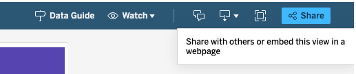
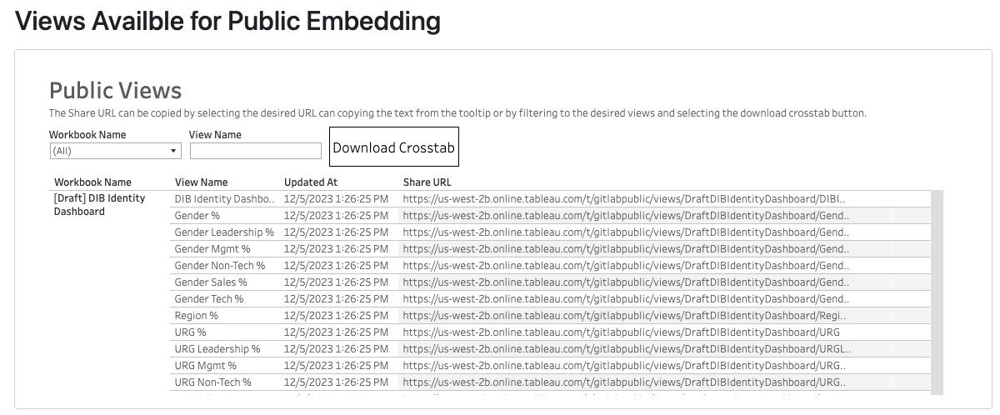

This is our Tableau embed demo page.  It is used to demonstrate how we can embed Tableau visualizations into the handbook and provide the URL for views that are available to be embedded publicly.  To facilitate uniform experience and presentation we use a [shortcode](https://handbook.gitlab.com/docs/shortcodes/#tableau-embeds) to embed Tableau charts and dashboards.

To view charts embedded in the handbook the browser will need to have third party cookies enabled. This is because the handbook site needs to connect to our public Tableau site, and uses cookies to do this.

## Embedding Straight Into the Handbook (No YML File)

### Viz from Public Tableau site

The source url for a view from the public Tableau site can be found by looking at a list of [views available for embedding](/handbook/business-technology/data-team/platform/tableau/embed-demo/#views-availble-for-public-embedding).

[A short video demonstrating how to do the embed.](https://youtu.be/Vry_yqUP2C8)

{}
Charts from the public Tableau site should only be embedded in the public Handbook.
{}

This chart should be visible to anyone who loads the page.




### Viz from Internal Tableau site

The source url for a view from the internal Tableau site can be found by navigating to the view and selecting the `Share` option at the top of the screen and then selecting the `Copy Link` option.




This chart should only require a log in to the Tableau site and only be visible to those that have a Tableau license. GitLab team members should login via OKTA SSO.




### Viz with Parameters and Filters and Height

This chart should be filtered to a pre-selected Severity and Subtype. The ability to use parameters and filters means that we can more flexibly use a single chart to display different cuts in different embeds if needed.


  
  


## Embedding Performance Indicators or Other Views Using YML Files

[Here is a video demonstrating the entire process of embedding PI's using yml files- public or internal views.](https://gitlab.zoom.us/rec/share/rK5olD88X0ZEzbbSmVFXB-jsMYfaD7V9j_ALTL89WJ4JZM1m_CugxAp_T1C5m87n.XK69XZAoRmndQglk?startTime=1706031218000)
Passcode: 6yz?njYI

There are a few extra steps to embed any views using a yml file, because you do not add the shortcodes right into the handbook page where the actual view shows up. Here is the process.

1. First. decide if the views you are using are public, or internal. For public views in the public handbook (no sign in needed), make sure that you follow these steps first to tag the workbook as public, get it moved over to the public Tableau site, and get the URL from the list of publicly embeddable workbooks. Our license and viewer agreement requires that those public views are coming from the "public" version of our Tableau cloud. Note the process takes about 24hrs.

    1. To do this, go to the workbook, select the "..." for more settings, and select "Tag". Then add "Public". Here is an example of a workbook that has the Public tag and is available for embedding.
    1. You will need to make the data source an "extract" instead of "live" connection for the process to work correctly. If your extract is over 10 million rows or does not follow [the guidelines for extracts](/handbook/business-technology/data-team/platform/tableau/tableau-developer-guide/#guidelines-for-publishing-extracts-to-production-and-ad-hoc-projects), reach out to the data team to use the service account's credentials to on the workbook so that you can use a live connection.
    1. It will show up in [this list](/handbook/business-technology/data-team/platform/tableau/embed-demo/#views-availble-for-public-embedding) once it is migrated and ready. Use the share URL from here in your embedding information. [Here](/handbook/business-technology/data-team/platform/tableau/embed-demo/#views-availble-for-public-embedding) is where to find the URL's that are available to embed from the public site. 

2. If you the view is Internal (requires sign-on), you can use the normal URL of the view in Tableau. Make sure that you get the URL by navigating to the specific view you want to embed and clicking "share" and copying that URL - the URL from the top of the page in the normal URL bar may not work.

3. Now you are ready to update your yml file. Go to the handbook page you want to update the PI's for, and edit the page. There you will find the name of the file that you are looking to update. It will look something like this:

    ```md
      
    ```

4. Go to the [Gitlab.com repository](https://gitlab.com/gitlab-com/www-gitlab-com) and search "find file" for that file name, it should be a yml file.

5. Update the yml file according to [these guidelines for the performance indicators YML files](/handbook/business-technology/data-team/platform/tableau/tableau-developer-guide/#performance-indicators-yml) using a Merge Request.

#### Example MR's

[Here is an MR](https://gitlab.com/gitlab-com/www-gitlab-com/-/merge_requests/132288) that demonstrates changing the Sisense codes to Tableau codes. And [here is the MR](https://gitlab.com/gitlab-com/www-gitlab-com/-/merge_requests/132528) that was submitted to update the URL's in the file from internal URL's to ones from the public site.

When the first MR was submitted the assignees accidentally forgot that the views needed to be public, so they used URL's from the internal site, so the second MR was submitted to correct that error once the workbook had been tagged as Public and was available in the list of publicly available workbooks/URL's.

#### Workflow Recap

For private charts that require sign-in: From the handbook page, find the file name -> Search the repository for the yml file -> update the yml file to point to the Tableau workbook. Watch out for your tabs and spaces, they need to match the formatting exactly!

For public charts in the public handbook: Tag the affected workbooks as "Public" -> Get their URL from the list of publicly embeddable views -> Find the file name -> Search the repository for the yml file -> Update the YML file with an MR.

## Views Availble for Public Embedding



