---

title: "Tableau Developer Guide"
description: "GitLab's Tableau Developer guide"
---
## Quick Links

- [Tips and Tricks](/handbook/business-technology/data-team/platform/tableau/tableau-developer-guide/tips-and-tricks-for-developers/)

## Data Source Approach

In general, our recommended approach to creating data sources in Tableau is to create all joins in dbt/Snowflake to materialize a final mart and/or rpt table that can be directly consumed by Tableau for the dashboard with no further joins, relationships, or calculations required in the BI layer.

During the Tableau implementation, we experimented with the approach of bringing fct & dim tables into Tableau and creating the joins and relationships there. However, we prefer to create the data structures in dbt/Snowflake where possible for the following reasons:

- By keeping business logic in the enterprise data warehouse as a rule and simply publishing the final mart/rpt tables for consumption, we avoid applying contradictory business logic in custom SQL across Tableau data sources.
- This approach keeps all joins & reporting logic under version control via the dbt/git integration.
- This approach makes the final data source query-able using SQL; this makes it easier for an Analyst to compare the results in the dashboard and the final dataset against upstream tables, and makes it more accessible for an Analyst to troubleshoot logic when a dashboard is showing unexpected results.
- This enables the same dataset to easily be used in a Tableau dashboard as well as an ad-hoc query, one-off export/analysis, or pulled into another downstream tool if needed (i.e. a Jupyter notebook).

For the same reasons, our approach to creating calculated fields is to create them in dbt/Snowflake rather than in Tableau when possible. One notable exception is for ratio metrics (for example, gross profit % would be calculated in Tableau so that it could be dynamically weighted as filters are applied to that metric; however, the numerator & denominator should both be defined in dbt/Snowflake with only the simple division occuring in Tableau).

This approach is intended to fulfill the majority of data source use cases, and Tableau developers are encouraged to try this approach first rather than creating joins & relationships in Tableau. If you find an instance that this approach does not support, please submit an MR to update this handbook guidance to share the scenarios where an alternate approach would be better.

## Connection Types in Workbooks

When you are publishing a workbook or data source, there are a few Authentication options. The default options will allow you to publish your work, but you will soon be getting:

1. Messages from users that the OAuth token has expired and they are unable to access a workbook
1. If you schedule an extract, you will get emails that the extract has failed.

The way to make sure users can always access the data within a workbook, is to choose the non-default authentication option.

<details markdown=1>

<summary><b> In Desktop </b></summary>

**Publishing a Data Source From Desktop**

If you are publishing a data source from Desktop to the Cloud/Online to be a Tableau Published Data Source, you will get the following window:

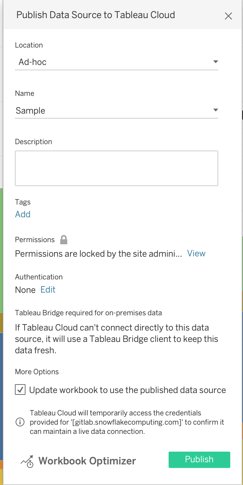

Select the "Edit" button under "Authentication". It will bring you to the following pop-up. Choose your <rolename> to embed.

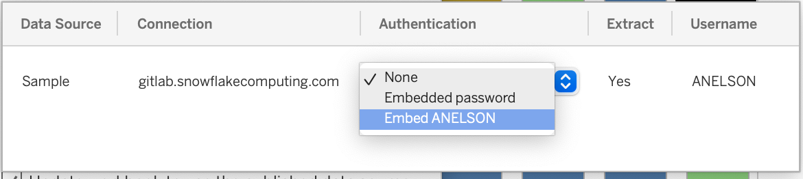

**Publishing a Workbook With a Local Connection**

A workbook with a local connection is one whose data source is living inside of the workbook, and is not a separately published Tableau Data Source which you can search Tableau Online for. When you try to publish a workbook with a local connection, you will see the following window:

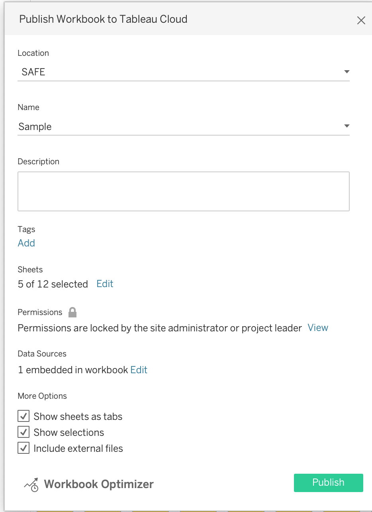

Select "Edit" under "Data Sources" and find "Authentication". Choose to embed your <rolename>.

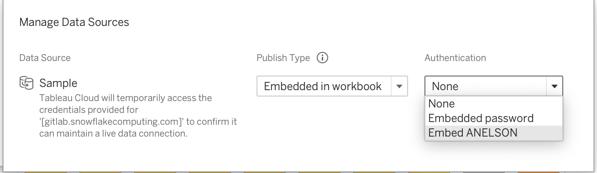

</details>

<details markdown=1>

<summary><b> In Cloud/Online </b></summary>

**Publishing in Cloud/Online**

If you are editing a data source in Cloud/ Tableau Online/ your web browser (all the same thing), in order to make sure your credentials are embedded, find "Publish As":

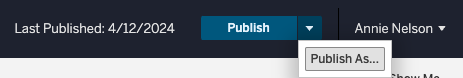

In the following window, be sure to check the box for 'Embed Credentials'.

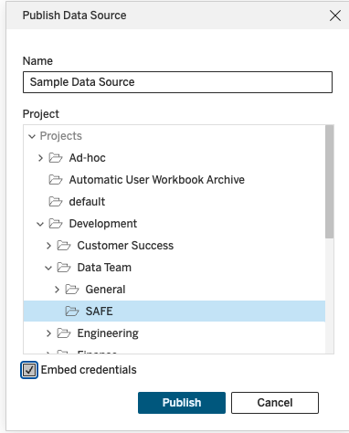

</details>

## Embedding in the Handbook

In order for views from workbooks to be embedded and viewable in the handbook, public or internal, the workbook and their data sources must be prepared in a specific way. To be embedded in the public handbook the workbook and relevant datasource must be copied from the [internal GitLab Tableau](https://10az.online.tableau.com/#/site/gitlab) site to the [public GitLab Tableau](https://us-west-2b.online.tableau.com/#/site/gitlabpublic) site. To facilitate correct viewing of embedded views and the synchronization of content to the public site, workbooks must be set up in a specific way and given a specific tag.  Views that are meant to be embedded on the internal site do not need to be in a specific project, but should still meet the set up guidelines.

Instructions for how to embed a Tableau chart can be found on the [Handbook Embedding Demonstration](/handbook/business-technology/data-team/platform/tableau/embed-demo/) page.

### Workbook Set Up

For embedding in the handbook, views will embed better than dashboards will, so each view that is meant to be embedded should be designed to function without user selected inputs.  Filters and parameters can be preset during the embedding process, but will not be changeable by the viewer. Additionally, the view must meet the following criteria:

- The view cannot be hidden
- For embedding in the public handbook each datasource must connect to Snowflake with a Data Team Service Account username and password or use an extract
- For embedding in the public handbook each workbook must have the `Public` tag.

#### Data Source

If you are not using an extract, like when your extract is going to be over 10 million rows, then you will need to use the Data Team Service Account's credentials. Reach out to the data team to get set up with those credentials.

Be mindful when you are embedding your credentials in the data source while publishing either internal or external views. Using an extract with your role embedded will be the clearest way to make sure that users can always view the data and will not experience an authorization expiration error.

Make sure that if you do use the Data Team's credentials to publish the workbook, when you make any changes to the workbook it retains those credentials. You will need to embed passwords in the data source for the views to show correctly. This box may come unchecked when you are making changes. 

#### Public Tag

If your view is public and embedded in the public handbook (aka, people do not need to sign-in to view it), then it needs to be on the Public GitLab Tableau Cloud site due to the viewer license agreements. To tag a workbook as public, click on the workbook. On the main page for the workbook where you can see each of the views, next to the name, there is a "more settings" option '...'. Select that, and find "Tag...". Here, you can add "Public" as a tag.

It will take about a day for the URL to show up in [this list](/handbook/business-technology/data-team/platform/tableau/embed-demo/#views-availble-for-public-embedding). Once it does, copy that URL and use it in the embedding information. If your view has not shown up after a day or so, it is likely because one of your data sources is not following the guidelines of A\) being an extracted connection or B\) using the data team's service account's credentials.

### Workbook Synchronization

Each workbook with views that are meant to be embedded in the public handbook must be tagged with the `Public` tag. This will ensure that the workbook, and their datasources are copied to the public GitLab Tableau site.  Only Creators and Explorers who can access the workbook can tag the workbook, see the Tableau [documentation](https://help.tableau.com/current/pro/desktop/en-us/tags.htm#add-tags) for more information.  The individual tagging must understand if the data should be shared publicly and if there is any question please work with the BI team to check and apply the tag.  Removing this tag from a workbook will delete the workbook from the public GitLab Tableau site, this will cause handbook pages trying to load a view from that workbook to display an error. It should be noted that it can currently take up to 48 hours for the synchronized workbook to show up in the list of [views available for embedding](/handbook/business-technology/data-team/platform/tableau/embed-demo/#views-availble-for-public-embedding).

### Workbook Naming Convention

When publishing workbooks to our Tableau Cloud site for the first time please name the workbook with their intended / official title, so that the resulting URL will capture just this title (this will allow us to keep the same URL when the workbook is published to the Ad-hoc or Production spaces):

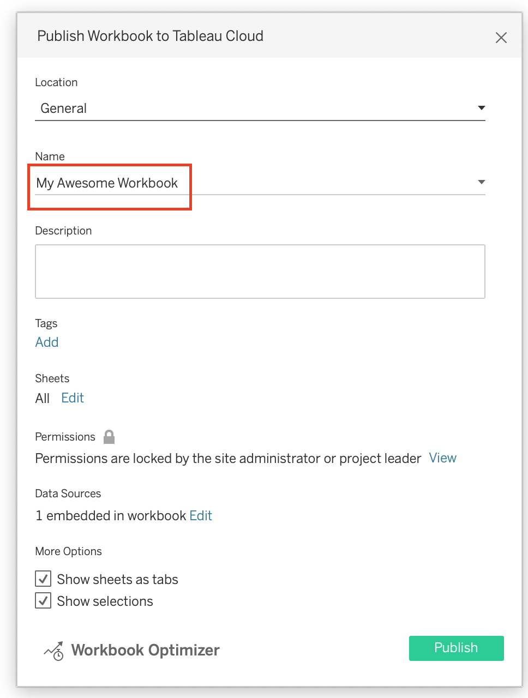


Publishing to the [Development](https://10az.online.tableau.com/#/site/gitlab/projects/300844) project:

All workbooks published to the Development project will be attached the *Draft* and their department tags to indicate that they are in development mode and not a workbook that has been peer reviewed and intended to serve as the single source of truth (SSOT) for a use case. The BI team will leverage the Tags functionality available in Tableau Cloud to better organize workbooks by department and publishing status. For example, this workbook below is assigned the *Draft* and *Data Team* tags:


To add tags to the workbook select on the ellipse symbol to the right of that workbook and click on *Tag...*:

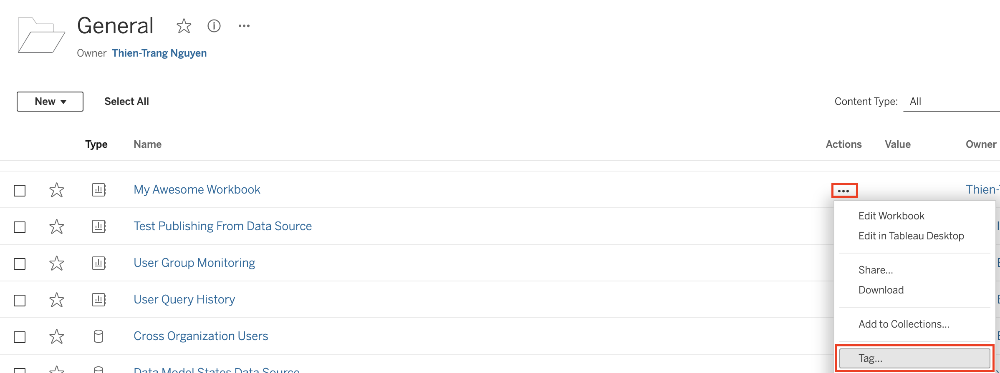

Once in the Tag window, add in the *Draft* and department tags for the workbook:

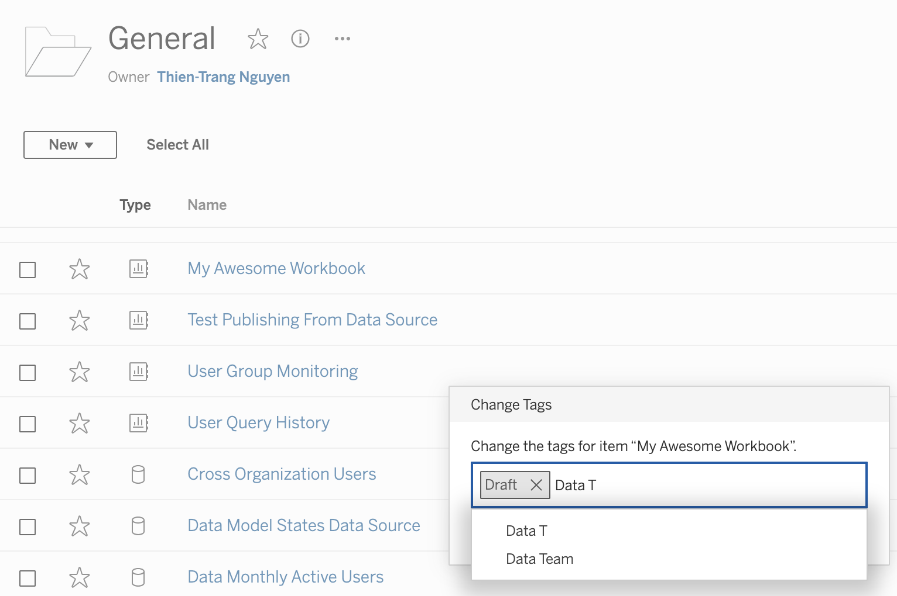

Publishing to the [Ad-hoc](https://10az.online.tableau.com/#/site/gitlab/projects/361929) or [Production](https://10az.online.tableau.com/#/site/gitlab/projects/361859) project:

When publishing workbooks to the Ad-hoc or Production project, if the workbook is being published for the first time, please select **Move** and then remove the *Draft* by navigating to the ellipse to the right of the workbook, select *Tag...* and then clicking on the *X* within the tag label. If publishing over / updating a workbook that is already in Ad-hoc or Production with a newer version from Development in Tableau Cloud, then select **Edit Workbook**, click on **Publish As**. Please make sure to name the workbook JUST AS it is currently named:

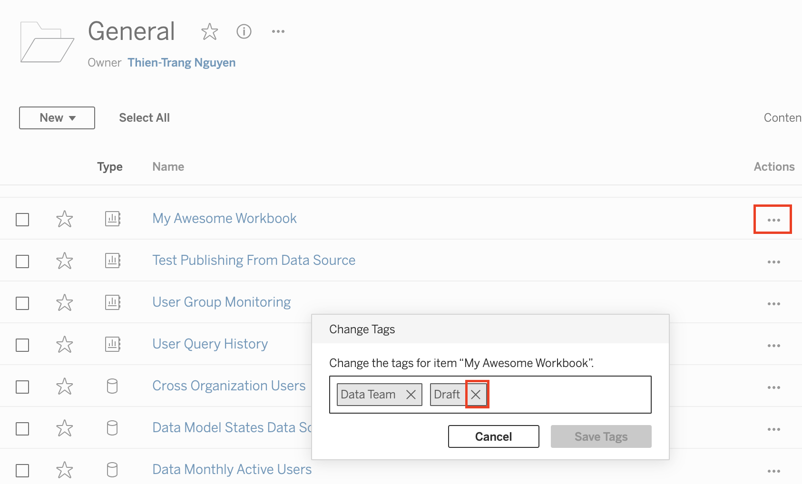

Applying tags allows us to provide more information on the workbook, so that we can easily discern them by their business function / department and distinguish draft content that is still in development. To filter workbooks by their tags, please click on the search box in the upper right-hand corner of the project. Under **Content types** select **Workbooks**:

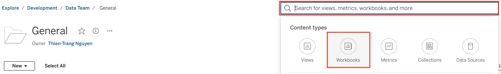

Once in the Workbooks section, click on the **Tags** dropdown to filter content by tags:

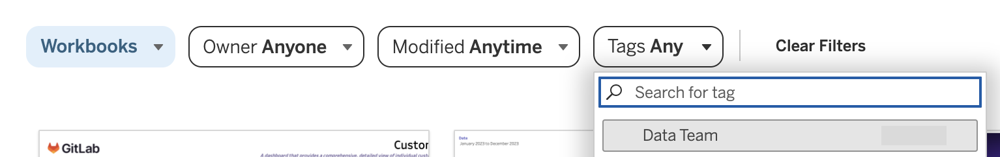

### Performance Indicators

The full code for embedding performance indicators into the handbook is typcially not found on the same page as where the actual indicators are displayed. Instead, you might find something like this:

```Performance Indicator Shortcode
{{/% performance-indicators "developer_relations_department" /%}}
```

In order to update the performance indicator, you need to find the yml file which is associated with the performance indicators seen, and you can update from there. In order to locate the yml file, look at the name of the file that you see in the shortcode. In the example above, you would be looking for developer_relations_department, which is the title contained within " ".

To find this file, you are going to go to the GitLab-com repository, which is a repo "for the public-facing marketing website of GitLab, including improvements to the docs and the handbook". From [the repository](https://gitlab.com/gitlab-com/www-gitlab-com), find "Find File" and then paste in the name of the file you are looking for. In this example, you would paste developer_relations_department.

This will bring you to the yml file which you are looking for. From here, you can follow the instructions below to modify the file to include the Tableau view (dashboard or sheet) which you are looking for. Be sure to follow the [Embedding Instructions](/handbook/business-technology/data-team/platform/tableau/tableau-developer-guide/#embedding-in-the-handbook) when embedding views.

Two reminders, first - *make sure that any public views (does not need login access) that are embedded into the public handbook are coming from the public Tableau site*. This means that the workbook they come from has been tagged "Public", and you are getting the URL from the [views available for embedding](/handbook/business-technology/data-team/platform/tableau/embed-demo/#views-availble-for-public-embedding) page. More information on this process can be found on the [Handbook Embedding Demonstration Page](/handbook/business-technology/data-team/platform/tableau/embed-demo/).

Second, *if you are embedding a non-public view (requires login), make sure to copy the URL from the "share" button on the top right of the view, not the URL at the top of the page*.

#### YML

The `data/performance_indicators.yml` file in the handbook repositories is the basis for a system that automatically generates handbook pages with performance indicator content on them.  The structure can take a list of charts and each chart can take a list of filters and parameters.  Only charts not tagged as public should be included on internal handbook pages. The following is an example of how to add the needed information to the data file:

```yml
- name: MR Rate
  description: MR Rate is a monthly evaluation of how MRs on average an Development engineer performs.
  tableau_data:
    charts:
      - url: https://us-west-2b.online.tableau.com/t/gitlabpublic/views/OKR4_7EngKPITest/PastDueSecurityIssues
        height: 300px
        toolbar: hidden
        hide_tabs: true
        filters:
          - field: Subtype Label
            value: bug::vulnerability
        parameters:
          - name: Severity Select
            value: S2
  is_key: true
```

For additional clarity, the exact syntax of this code block is very important so that it can be read like JSON data. Sometimes you might be updating an existing handbook yml file with everything filled out, except the chart is currently a Sisense chart. To replace the Sisense chart, replace the lines of code which point to the Sisense chart. You can leave everything else in the file as-is.

If you just want to embed a chart without any height, filter, or parameter specifications you would use the following:

```yml
  tableau_data:
    charts:
      - url:
```

Which, in plain English, is:

```yml
(tab)tableau_data:
(tab)(tab)charts:
(tab)(tab)(tab)-(space)url:
```

Please note, a tab is two spaces.

## Row Level Security

To use Row Level Security within Tableau the developer will need to use an entitlement table, found in `prod.entitlement`.  The entitlement table will be joined with the appropriate source table using the Tableau Data Modeling interface; this ensures that the tables can be properly filtered at query time and will allow for extracts to properly implement row level security.  Once the entitlement table is joined to its corresponding source table, a data source filter needs to be added to ensure the rows are correctly filtered to the current user.

### Example

Find the correct entitlement table for the table you are using.  The entitlement table should be named similar to the table you wish to join it to.

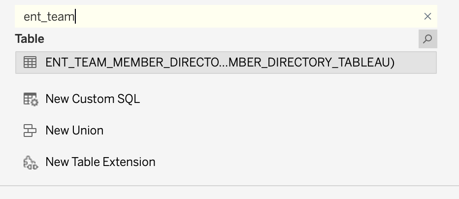

Perform a direct inner join, not a relationship, between the source table and the entitlement table.

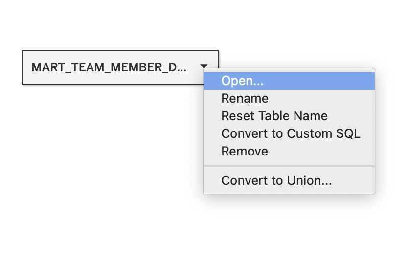

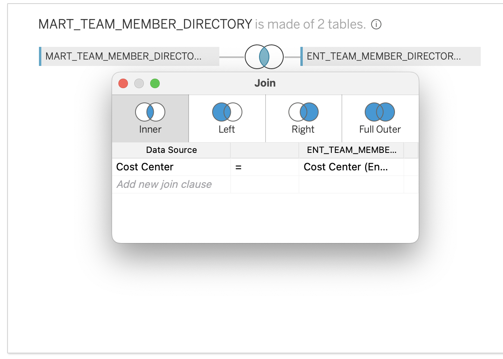

Create a Data Source filter using the `USERNAME()` function and the `tableau_user` field in the entitlement table.  This is the step that will ensure that only rows visible to the current user will be retrieved.

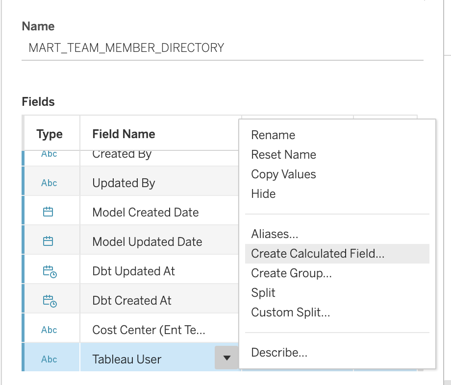

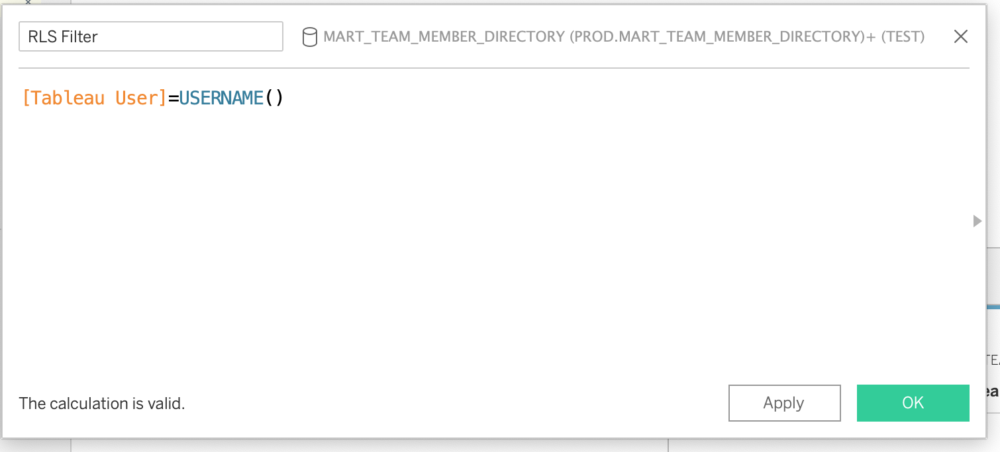

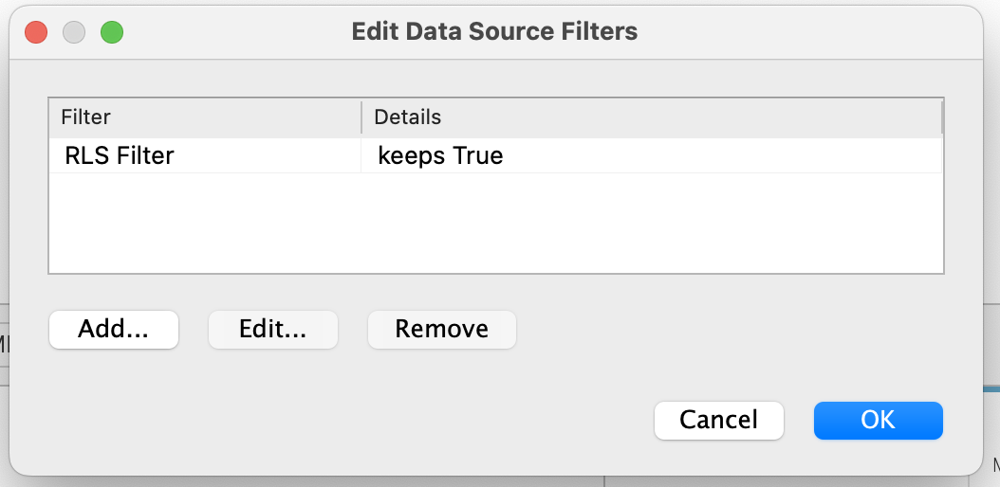

## Guidelines for Publishing Extracts to Production and Ad-Hoc Projects

1. ~1 GB Storage Limit per published extract. This is ~10 million rows of data.
2. Scheduled extract refreshes should run between 18:00 and 05:00 UTC
3. Extracts are a performance management tool and should not be used by default. Live Connections should be the default selection and Extracts should only be considered when dashboard performance becomes an issue (i.e. most visualizations still aren't loading after one minute and performance optimizers have been applied)
4. We currently have 200 GBs of storage on the Tableau Online site and have dedicated 100 GBs of that storage space for extracts
5. After an extract is published to the Production or Ad-Hoc Project, the extract in the development folder should be deleted
6. Extracts built directly from tables or marts can be published as a Datasource
7. Extracts built with Custom SQL must be embedded in a workbook.

## Improving Local Connection Timeouts

To reduce the number of times Tableau Desktop will ask to reconnect, the developer can set their local snowflake
driver to keep their session alive.
To do this the developer needs to edit the `odbc.ini` file
and set the `CLIENT_SESSION_KEEP_ALIVE` flag to `True`. Typical locations for the file can be found in the [Snowflake documentation](https://docs.snowflake.com/en/developer-guide/odbc/odbc-mac#step-2-configure-the-odbc-driver)

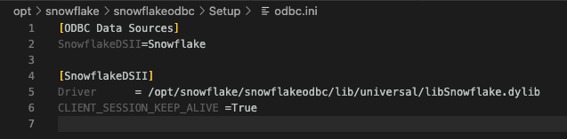

## Replacing Datasources in Tableau Desktop

The steps are as follows:

1. Edit the workbook in Tableau Desktop (this is needed for a specific tool that is used)
1. Add the datasource to swap to as a new datasource in the workbook.
1. Navigate to a sheet that uses datasource to be replaced.
1. Right click on datasource to be replaced and select `Replace Data Source...`
1. In the dialog box ensure that datasource to be replaced is selected as
Current and select new datasource for the Replacement and select ok
1. Check that the all of the fields swapped over to the new datasource are working and not showing an error- some may have a `!` next to them and require replacing.  Any manual field aliases may also need to be reapplied.
1. Right click on the datasource to be replaced and select close (to reduce un-needed clutter).
1. Publish the workbook.

## Testing Tables from MR Databases in Tableau Prior to Merging

If you are working in Tableau using a report table from snowflake (created in DBT), you will likely need to update your table at some point. It is in your best interest to test these changes in Tableau prior to merging your MR, so that you can catch any problems with the updates before going through the process of formally requesting to merge the changes, and waiting for the data to be available.

There are some key lessons that the Data Team learned about testing our MR databases in Tableau, which we will share below.

### Workflow

1. The author of the MR shares the MR database with you.
2. Open up a development copy of the workbook or data source you want to test the changes on.
   1. ***Make sure you are using a development copy and not working on the published data source!*** This is important because at some point in the future, when the MR is merged, you will no longer be able to access the data source that points to the MR db - even to update it to repoint to PROD. Hence it is important that you leave the original data source untouched to avoid this issue.
3. Open up the data connections pane.
4. Find the MR database in the left-hand connections window/dropdown.
5. Replace the PROD tables with the MR database tables.
6. Test your changes.
7. Close and exit without saving your changes, or un-do the changes to revert the dashboard back to it's original state and data source.
8. Merge the MR when you are satisfied with the changes - the MR database will disappear.

### Forming a Connection

Once you have a local development copy of the data source, open up the data source connection pane where you would normally edit a data source.

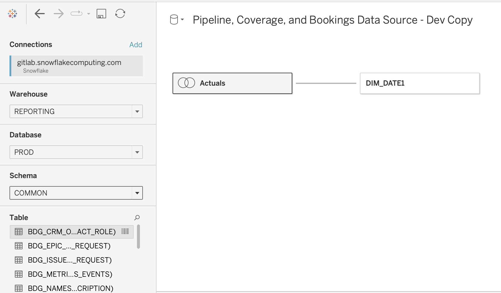

On the left side is where you add new connections, and in the middle is where the tables that make up the workbook are visualized.

If you have been granted access to query the MR database which is attached to the merge request you are looking for, then you will be able to see it as an option under the dropdown for "**Database**".

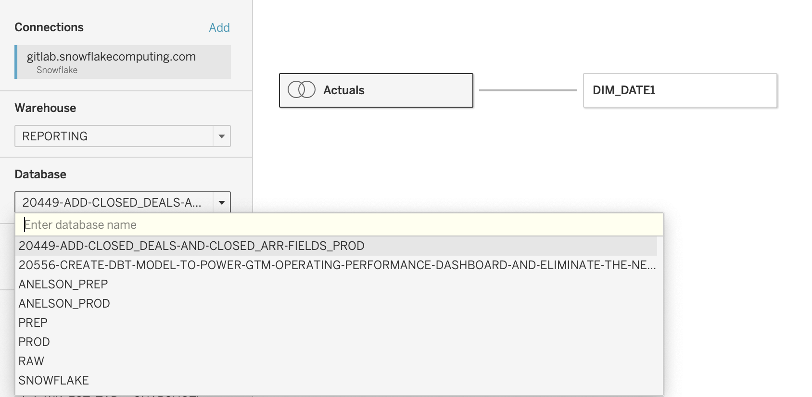

Search this MR database for your desired tables. Create your data source as you normally would - either replacing exiting tables with a test version, or bringing out new tables into the model and creating a join or relationship.

You can now test the tables that the MR would build right in your Tableau workbook, to make sure all of the changes will have the desired effect.

### Saving Changes

You cannot save these changes that you are testing, because once the MR gets merged, the MR database you are using will disappear.

It is recommended you only test the logic and totals of the columns being added/changed, and not make any time-consuming dashboard changes that will not be able to be saved.

If you try saving the development copy that is pointing to your development data source, you will be unable to access that data source.

### Avoiding Errors

To repeat: once your Merge Request gets merged, any Tableau Data Source which is trying to connect to that MR database will become inaccessible. You will not be able to even open the data source to edit it - in Cloud, Desktop, a duplicate version, or via any other method.

This is why it is recommended to work on a development copy of the data source only, and not in the published/production version of the data source at all.

*Even if you are 'searching for' the MR database (pictured below) but not using this connection for any of the tables in the workbook, you will encounter errors.*

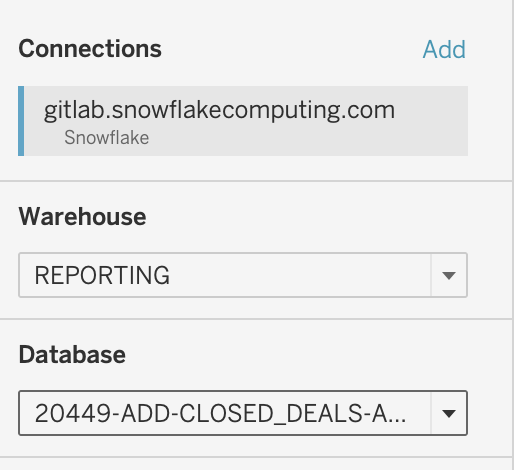

Below is the error you will get if any leftover connections to the dropped database still exist in your data source. There is no workaround for this, you will need to replace the data source with an identical data source or, if you do not have an identical version, you will need to rebuild it and then 'Replace References' on most of the fields.

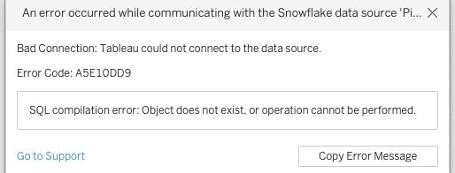

### Final Testing Notes

Testing MR databases is a useful way to test changes before they get merged into production and save time. The use cases that work best for this are:

- Business logic changes that would affect a total number
- Quick changes to fields that would affect the view

It is not efficient to extensively test changes that would require many changes to the dashboard/ calculated fields, because you will not be able to save those changes for use with the updated table once the MR goes through.

Make sure to open a local, development copy of the workbook/data source prior to testing the MR database.
