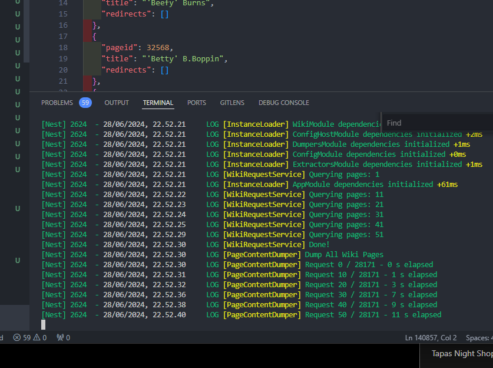
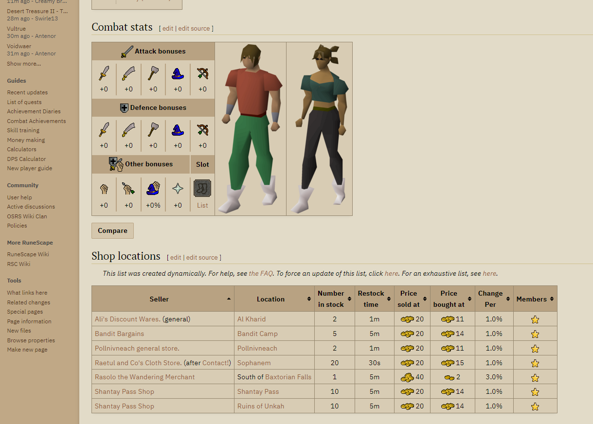

# 29.05

Models are trained on a specific set of data, and they have a knowledge cutoff date, so often they don't know specifics.

RAG, which stands for Retrieval, Augmentation, and Generation, can be quite helpful addressing this problem by inserting likely relevant, up-to-date text as context during inference time to go along with the question/instruction. It does this by storing the relevant documents in a vector database, and during inference time, querying it to find similar texts.

There are a lot of open-source libraries for this, which I'll probably be using, since this is only a 5-credit course. However, building my own framework could be an extremely rewarding experience, that no doubt would teach me a lot, and I could continue using and refining it for my personal projects. I might begin with building my own, and if that proves too challenging, switch to a library.

From the last project I learned that good planning is an important part of any project.

Possible datasets I could try RAG on:

- Old School Runescape Wiki
- KAMK Intra articles (english ones)
- O'Reilly's textbooks
- GitLab Handbook (https://gitlab.com/gitlab-com/content-sites/handbook)

The handbook repo includes the entire GitLab handbook in .md files, and it's all formatted nicely.
This could be a good subset to start: https://gitlab.com/gitlab-com/content-sites/handbook/-/tree/main/content/handbook/business-technology/data-team?ref_type=heads

It's the handbook section of the Data team. This should be fairly easy, since all of the text is nicely formatted in Markdown.

# 28.06

Scratch all that, I'm going all-in on the OSRS Wiki. Trying to scrape the pages has been a challenge, since the wiki-team does not provide dumps like wikipedia does. I have been successful in downloading the pages in their wikitext format, and parsing through them with mwparserfromhell library, however seems like the OSRS Wiki uses some custom templates that do not get picked up.

I paid 2€ to the wiki-team patreon (https://www.patreon.com/runescapewiki/posts) to get access to their discord, and wouldn't you know it, after searching for "dump" I almost immediately found this: https://github.com/Flipping-Utilities/parsed-osrs/

An open-source project for specifically scraping the OSRS wiki, and then extracting data from the HTML. With 1 star.

**Figure 1:** Downloading 28500 wiki-pages.

## 07.07

I've been having some trouble with collecting the data.

First, I ran into trouble, where I hit the rate limits on the OSRS wiki API. This lead me to getting "only" 6000 pages out of 28000. I had to modify the osrs-parser to wait if it got a 429 error, which was pretty ass since it's written in TypeScript.

Second, I had to figure out a way to convert the .json files into readable MarkDown. I managed to do this with the following:

- read the .json files "content" key that houses the raw HTML
- read that to a BeautifulSoup object (html parser)
- convert that into markdown with the "markdownify" library

This was pretty much the only combo where I managed to keep weird formatting of the wiki. The formatting is called "wikitext", and it happens to be the same that Wikipedia uses. Normally, I could've just queried the wiki API straight up, but that did not include the tables in the wiki pages, since those are dynamically linked. This is why I had to get the raw HTML, and get the info that way.

**Figure 2:** Most articles in the wiki contain tables with valuable information.

I found a really cool looking library: https://github.com/e-p-armstrong/augmentoolkit

It essentially automates the creation of synthetic datasets for finetuning language models. I really want to give it a try. My plan right now goes something like this:

- create a validation question-answer pair from the wiki articles
- probably around 200 questions and answers, made with LLM calls
- this is the dataset that will be used to check if my RAG implementation/finetuning actually helps. This will too be automated with LLM calls.

- create a basic RAG implementation, and benchmark it
- try to make RAG better, for as long as I have the motivation
- keep the test results out of every iteration to see what helps

- if I have the time/motivation, create a synthetic dataset using the augmentoolkit library
- release that as open source on huggingface
- figure out finetuning, which might take A LONG TIME. I don't know if I can finetune the 70B models with the 48Gb VRAM limit that I have
- try different finetuning approaches, and benchmark all of them

## 10.07

I was really contemplating just using a library for this, but in the end I decided to go with kind of a similar method than in my previous project, which is just a self-hosted FastAPI server with the model, however I'm going to keep it a lot simpler this time.

Good write-up on quants: https://gist.github.com/Artefact2/b5f810600771265fc1e39442288e8ec9

